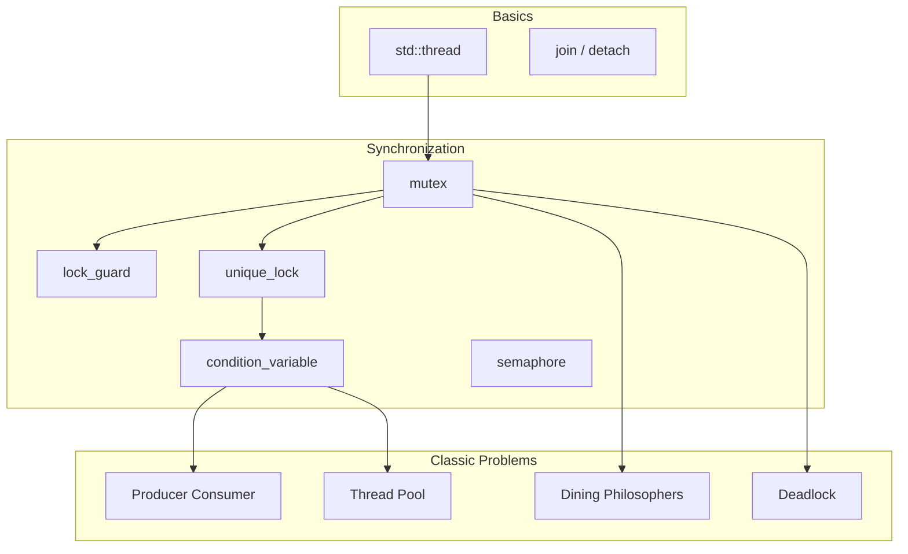

# Multi-Threading C++ — Learning Module

Educational C++ concurrency snippets for **threads, locks, synchronization, and classic problems**.  
Har file ek alag topic cover karti hai — compile karke run karo, output se flow samjho.

> **Related LLD projects:** [LRU Cache (thread-safe)](../LRU_Cache_LLD/) · [Concurrent HashMap](../Concurrent_HashMap_LLD/) · [TTL Cache](../Thread_Safe_Cache_with_TTL_LLD/) · [Rate Limiter](../Rate_Limiter_LLD/) · [Root README](../README.md#multi-threading-module)

## Subfolders — quick navigation

| Area | Folder | README | COMPLETE guide |
|------|--------|--------|----------------|
| **Patterns (hub)** | [`Concurrency_Patterns/`](./Concurrency_Patterns/) | [README](./Concurrency_Patterns/README.md) | — |
| → Signaling | [`Signaling_Pattern/`](./Concurrency_Patterns/Signaling_Pattern/) | [README](./Concurrency_Patterns/Signaling_Pattern/README.md) | [COMPLETE](./Concurrency_Patterns/Signaling_Pattern/SIGNALING_PATTERN_COMPLETE.md) |
| → Thread Pool | [`Thread_Pool_Pattern/`](./Concurrency_Patterns/Thread_Pool_Pattern/) | [README](./Concurrency_Patterns/Thread_Pool_Pattern/README.md) | [COMPLETE](./Concurrency_Patterns/Thread_Pool_Pattern/THREAD_POOL_PATTERN_COMPLETE.md) |
| → Producer-Consumer | [`Producer_Consumer_Pattern/`](./Concurrency_Patterns/Producer_Consumer_Pattern/) | [README](./Concurrency_Patterns/Producer_Consumer_Pattern/README.md) | [COMPLETE](./Concurrency_Patterns/Producer_Consumer_Pattern/PRODUCER_CONSUMER_PATTERN_COMPLETE.md) |
| → Reader-Writer | [`Reader_Writer_Pattern/`](./Concurrency_Patterns/Reader_Writer_Pattern/) | [README](./Concurrency_Patterns/Reader_Writer_Pattern/README.md) | [COMPLETE](./Concurrency_Patterns/Reader_Writer_Pattern/READER_WRITER_PATTERN_COMPLETE.md) |
| **Challenges (hub)** | [`Concurrency_Challenges/`](./Concurrency_Challenges/) | [README](./Concurrency_Challenges/README.md) | — |
| → Deadlock | [`Deadlock/`](./Concurrency_Challenges/Deadlock/) | [README](./Concurrency_Challenges/Deadlock/README.md) | [COMPLETE](./Concurrency_Challenges/Deadlock/DEADLOCK_COMPLETE.md) |
| → Livelock | [`Livelock/`](./Concurrency_Challenges/Livelock/) | [README](./Concurrency_Challenges/Livelock/README.md) | [COMPLETE](./Concurrency_Challenges/Livelock/LIVELOCK_COMPLETE.md) |
| **Fizz Buzz** | [`FIZZ_BUZZ_Problem/`](./FIZZ_BUZZ_Problem/) | [README](./FIZZ_BUZZ_Problem/README.md) | [COMPLETE](./FIZZ_BUZZ_Problem/Fizz_Buzz_Multithreaded/FIZZ_BUZZ_MULTITHREADED_COMPLETE.md) |
| → demos | [`Fizz_Buzz_Multithreaded/`](./FIZZ_BUZZ_Problem/Fizz_Buzz_Multithreaded/) | [README](./FIZZ_BUZZ_Problem/Fizz_Buzz_Multithreaded/README.md) | ↑ |
| **Merge Sort** | [`Multi_threaded_Merge_Sort/`](./Multi_threaded_Merge_Sort/) | [README](./Multi_threaded_Merge_Sort/README.md) | [COMPLETE](./Multi_threaded_Merge_Sort/MULTI_THREADED_MERGE_SORT_COMPLETE.md) |

### Build all highlights

```bash
cd Concurrency_Patterns/Signaling_Pattern && ./compile.sh && ./bin/01_condition_variable_basics
cd Concurrency_Patterns/Thread_Pool_Pattern && ./compile.sh && ./bin/01_basic_thread_pool
cd Concurrency_Patterns/Producer_Consumer_Pattern && ./compile.sh && ./bin/01_single_producer_single_consumer
cd Concurrency_Patterns/Reader_Writer_Pattern && ./compile.sh && ./bin/01_std_shared_mutex_basics
cd Concurrency_Challenges/Deadlock && ./compile.sh && ./bin/01_coffman_four_conditions
cd Concurrency_Challenges/Livelock && ./compile.sh && ./bin/01_what_is_livelock
cd FIZZ_BUZZ_Problem/Fizz_Buzz_Multithreaded && ./compile.sh && ./bin/04_condition_variable
cd Multi_threaded_Merge_Sort && ./compile.sh && ./bin/06_compare_timings
```

---

## Prerequisites

- **C++17** compiler (`g++` / `clang++`)
- **pthread** flag on Linux/macOS

```bash
g++ -std=c++17 -pthread <file>.cpp -o <output>
./<output>
```

---

## Recommended Learning Order

| Step | File | Topic |
|------|------|-------|
| 1 | `lessson_1_join.cpp` | `std::thread`, `join`, `detach`, thread id |
| 2 | `race_condition_and_synchronization.cpp` | Race condition problem & fixes |
| 3 | `lesson_2_locks_and_mutex.cpp` | Mutex introduction |
| 4 | `types_of_locks.cpp` | `lock_guard`, `unique_lock`, `defer_lock`, `try_lock` |
| 5 | `lock_mechanism.cpp` | Lock patterns + `std::lock()` deadlock fix |
| 6 | `lesson_3.cpp` | `condition_variable` — ordered tasks |
| 7 | `producer_consumer.cpp` | Producer–consumer with CV |
| 7b | [`Concurrency_Patterns/Signaling_Pattern/`](./Concurrency_Patterns/Signaling_Pattern/) | **Signaling pattern** — 6 demos + docs |
| 7c | [`Concurrency_Patterns/Thread_Pool_Pattern/`](./Concurrency_Patterns/Thread_Pool_Pattern/) | **Thread pool pattern** — 6 demos + `ThreadPool.h` |
| 7d | [`Concurrency_Patterns/Producer_Consumer_Pattern/`](./Concurrency_Patterns/Producer_Consumer_Pattern/) | **Producer-consumer** — 6 demos + `BoundedBuffer.h` |
| 7e | [`Concurrency_Patterns/Reader_Writer_Pattern/`](./Concurrency_Patterns/Reader_Writer_Pattern/) | **Reader-writer** — `shared_mutex` + custom RW lock |
| 8 | `semaphor.cpp` | Custom semaphore + connection pool |
| 9 | `deadlock_and_protection.cpp` | Deadlock demos (see also [`Concurrency_Challenges/Deadlock/`](./Concurrency_Challenges/Deadlock/)) |
| 10 | **`dining_philosophers.cpp`** | **Classic DP — 4 solutions** |
| 11 | `thread_pool.cpp` | Worker pool pattern |
| 12 | `DCLP.cpp` | Double-checked locking |
| 13 | `Thread_Safe_Injection.cpp` | Thread-safe dependency injection |
| 14 | `execution_time_of_code.cpp` | Measure execution time |
| 15 | [LRU_Cache_LLD](../LRU_Cache_LLD/) | Apply mutex in real LLD |

---

## File Index

| File | What you learn |
|------|----------------|
| `lessson_1_join.cpp` | Thread lifecycle, join vs detach, sleep, `get_id()` |
| `lesson_2_locks_and_mutex.cpp` | Basic mutex protecting shared counter |
| `lesson_3.cpp` | Turn-based execution with `condition_variable` |
| `race_condition_and_synchronization.cpp` | Data race → mutex fix |
| `lock_mechanism.cpp` | RAII locks, intentional deadlock, `std::lock` |
| `types_of_locks.cpp` | All lock types side-by-side comparison |
| `semaphor.cpp` | Counting/binary semaphore, DB pool analogy |
| `producer_consumer.cpp` | Bounded buffer with two condition variables |
| `deadlock_and_protection.cpp` | 2-mutex deadlock + multiple fixes |
| **`dining_philosophers.cpp`** | **5 philosophers, forks, 4 solution strategies** |
| `thread_pool.cpp` | Fixed worker threads + task queue |
| `DCLP.cpp` | Thread-safe lazy singleton pattern |
| `Thread_Safe_Injection.cpp` | Safe shared resource injection |
| `execution_time_of_code.cpp` | `chrono` benchmarking |

---

## Dining Philosophers (New)

**Compile & run:**

```bash
g++ -std=c++17 -pthread dining_philosophers.cpp -o dining_philosophers
./dining_philosophers
```

| Version | Approach | Deadlock? |
|---------|----------|-----------|
| 1 — Naive | Left fork → right fork | Yes (commented out in `main`) |
| 2 — Ordered forks | Always lock `min` then `max` index | No |
| 3 — Waiter | At most **N−1** philosophers at table | No |
| 4 — Try-lock | `try_lock` + random backoff | No (starvation rare) |

**Interview one-liner:**  
*"Circular wait on forks causes deadlock; break it with total ordering of mutexes, limit concurrent diners to N−1, or use try-lock with backoff."*

---

## Quick Compile Commands

```bash
cd Multi_threading_C++

g++ -std=c++17 -pthread lessson_1_join.cpp -o lesson1 && ./lesson1
g++ -std=c++17 -pthread producer_consumer.cpp -o pc && ./pc
g++ -std=c++17 -pthread thread_pool.cpp -o pool && ./pool
g++ -std=c++17 -pthread dining_philosophers.cpp -o dp && ./dp
g++ -std=c++17 -pthread deadlock_and_protection.cpp -o deadlock && ./deadlock
```

> **Note:** `deadlock_and_protection.cpp` me kuch demos intentionally hang kar sakte hain — file ke comments padho.

---

## Concept Map



---

## Interview Checklist

- [ ] Race condition vs data race vs deadlock
- [ ] `lock_guard` vs `unique_lock` — kab kaunsa?
- [ ] Why `condition_variable` needs `unique_lock`
- [ ] `notify_one` vs `notify_all`
- [ ] Producer–consumer bounded buffer
- [ ] Dining philosophers — 2+ solutions
- [ ] Thread pool — why reuse threads?
- [ ] DCLP — why double-checked locking is tricky
- [ ] LRU cache — why `get()` needs mutex (mutates order)

---

## Known Notes

- Filename typo: `lessson_1_join.cpp` (double **s**) — path change mat karo agar bookmarks ho.
- `bits/stdc++.h` kuch files me hai — macOS par explicit headers prefer karo (see `LRU_Cache_LLD`).
- Yeh folder **standalone LLD system nahi** hai — learning labs hain.

---

## Future Additions (optional)

- `atomic` + memory order demo
- `std::async` / `future` / `promise`
- `shared_mutex` reader–writer lock
