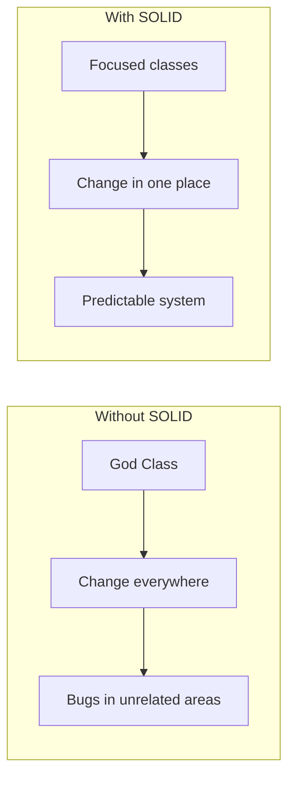
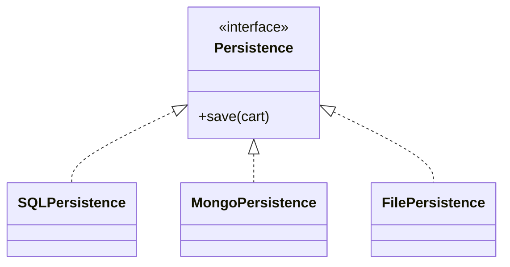
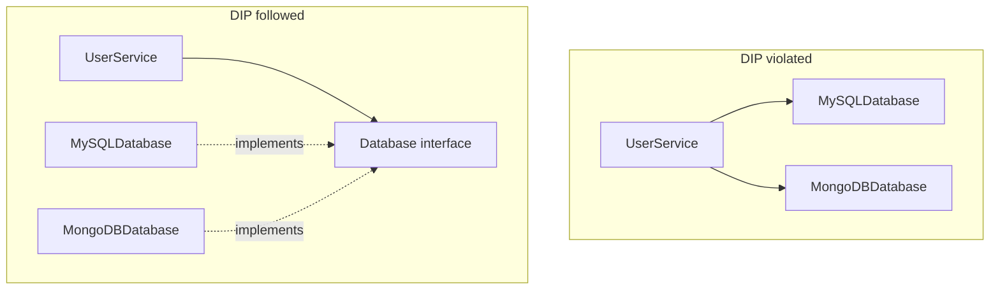
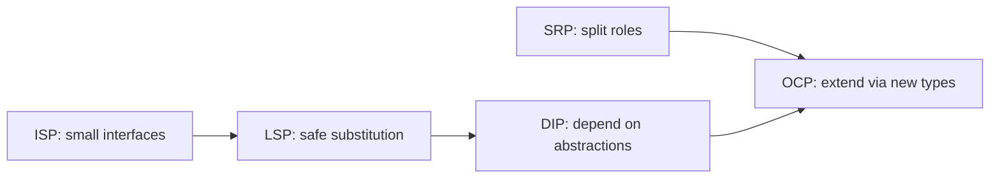

# SOLID Design Principles — Complete Guide

> **File:** `SOLID.md` — SOLID principles deep dive for this repo  
> **Author of principles:** Robert C. Martin (“Uncle Bob”)  
> **Code references:** [`L5 SOLID_1`](./L5%20SOLID_1/) · [`L6 SOLID_2`](./L6%20SOLID_2/)

---

## Table of Contents

1. [Why SOLID Exists](#1-why-solid-exists)
2. [What SOLID Stands For](#2-what-solid-stands-for)
3. [S — Single Responsibility Principle](#3-s--single-responsibility-principle-srp)
4. [O — Open/Closed Principle](#4-o--openclosed-principle-ocp)
5. [L — Liskov Substitution Principle](#5-l--liskov-substitution-principle-lsp)
6. [I — Interface Segregation Principle](#6-i--interface-segregation-principle-isp)
7. [D — Dependency Inversion Principle](#7-d--dependency-inversion-principle-dip)
8. [How SOLID Principles Work Together](#8-how-solid-principles-work-together)
9. [SOLID in LLD Interviews](#9-solid-in-lld-interviews)
10. [Quick Cheat Sheet](#10-quick-cheat-sheet)
11. [Compile & Run Lesson Code](#11-compile--run-lesson-code)

---

## 1. Why SOLID Exists

Real systems grow to **hundreds of classes** and **lakhs of lines**. Without guiding rules, code becomes:

| Problem | What happens |
|--------|----------------|
| **Tight coupling** | Changing one class breaks unrelated modules |
| **Low cohesion** | One class does unrelated jobs (DB + print + business logic) |
| **Hard to extend** | Every new feature needs editing old, tested code |
| **Hard to onboard** | New engineers cannot predict side effects of a change |
| **Fragile tests** | Small change → many test failures |

**SOLID** is not syntax — it is a set of **design heuristics** that push you toward:

- **High cohesion** — related behaviour stays together  
- **Loose coupling** — modules depend on abstractions, not concrete details  
- **Safe extension** — add behaviour without rewriting stable code  



---

## 2. What SOLID Stands For

| Letter | Principle | One-line meaning |
|--------|-----------|------------------|
| **S** | Single Responsibility | A class should have **one reason to change** |
| **O** | Open/Closed | **Open for extension**, **closed for modification** |
| **L** | Liskov Substitution | Subtypes must be **substitutable** for their base types |
| **I** | Interface Segregation | Clients should not depend on **methods they do not use** |
| **D** | Dependency Inversion | Depend on **abstractions**, not concretions |

> **Mnemonic (Hindi):** *“SOLID se code solid banta hai — ek kaam, extend karo, substitute safe, chhote interface, abstraction pe depend.”*

---

## 3. S — Single Responsibility Principle (SRP)

### 3.1 Definition

> **A class should have only one reason to change** — i.e. one **responsibility** or one **axis of change**.

This is **not** “one method only” or “one line of code”. It means:

- If **invoice format** changes → only printer/report class should change  
- If **database** changes → only persistence class should change  
- If **cart rules** change → only cart domain class should change  

### 3.2 Violation — God `ShoppingCart`

**File:** [`L5 SOLID_1/C++ Code/SRP/SRP_violated.cpp`](./L5%20SOLID_1/C%2B%2B%20Code/SRP/SRP_violated.cpp)

`ShoppingCart` does **three jobs**:

1. Cart business logic (`addProduct`, `calculateTotal`)
2. Printing invoice (`printInvoice`)
3. Persistence (`saveToDatabase`)

```cpp
class ShoppingCart {
    void addProduct(Product* p);
    double calculateTotal();
    void printInvoice();      // ❌ presentation concern
    void saveToDatabase();    // ❌ persistence concern
};
```

**Why it hurts:**

- Marketing asks for PDF invoice → you edit `ShoppingCart` (risk cart logic)
- DBA moves from SQL to Mongo → again `ShoppingCart`
- Unit testing cart math requires mocking DB and console output

### 3.3 Fix — Split responsibilities

**File:** [`L5 SOLID_1/C++ Code/SRP/SRP_followed.cpp`](./L5%20SOLID_1/C%2B%2B%20Code/SRP/SRP_followed.cpp)

| Class | Responsibility | Reason to change |
|-------|----------------|------------------|
| `ShoppingCart` | Items + total | Cart rules |
| `ShoppingCartPrinter` | Invoice output | Format/layout |
| `ShoppingCartStorage` | Save cart | Storage technology |

```cpp
ShoppingCart* cart = new ShoppingCart();
cart->addProduct(new Product("Laptop", 50000));

ShoppingCartPrinter* printer = new ShoppingCartPrinter(cart);
printer->printInvoice();

ShoppingCartStorage* db = new ShoppingCartStorage(cart);
db->saveToDatabase();
```

### 3.4 SRP vs “one function per class”

| Myth | Reality |
|------|---------|
| “SRP = one method” | A cohesive class may have many methods for **one job** |
| “SRP kills reuse” | Reuse happens via **composition**, not dumping unrelated code in one class |
| “SRP always means more files” | Yes, slightly more files — but **far fewer merge conflicts** |

### 3.5 Interview one-liner

> *“I split `ShoppingCart` so cart math, invoice printing, and DB persistence each have a single reason to change.”*

---

## 4. O — Open/Closed Principle (OCP)

### 4.1 Definition

> **Software entities should be open for extension but closed for modification.**

- **Open for extension** — add new behaviour via **new types** (subclasses, strategies)  
- **Closed for modification** — **stable, tested code** should not need edits for every new variant  

### 4.2 Violation — `if/else` explosion for persistence

**File:** [`L5 SOLID_1/C++ Code/OCP/OCP_violated.cpp`](./L5%20SOLID_1/C%2B%2B%20Code/OCP/OCP_violated.cpp)

After SRP, `ShoppingCartStorage` still **modifies** itself for every new backend:

```cpp
class ShoppingCartStorage {
    void saveToSQLDatabase();
    void saveToMongoDatabase();
    void saveToFile();
    // Next week: saveToRedis() → edit this class again ❌
};
```

Every new storage type **reopens** a class that was already working.

### 4.3 Fix — Abstract `Persistence` + polymorphism

**File:** [`L5 SOLID_1/C++ Code/OCP/OCP_followed.cpp`](./L5%20SOLID_1/C%2B%2B%20Code/OCP/OCP_followed.cpp)

```cpp
class Persistence {
public:
    virtual void save(ShoppingCart* cart) = 0;
};

class SQLPersistence : public Persistence { /* ... */ };
class MongoPersistence : public Persistence { /* ... */ };
class FilePersistence : public Persistence { /* ... */ };
```

**Client code:**

```cpp
Persistence* db = new SQLPersistence();
db->save(cart);
```

Adding **Redis** = new `RedisPersistence` class — **no change** to `ShoppingCart` or `ShoppingCartPrinter`.



### 4.4 OCP mechanisms in practice

| Technique | Example in repo / LLD |
|-----------|------------------------|
| **Strategy** | Discount strategies in L24 |
| **Factory** | `DeviceFactory`, `GatewayFactory` |
| **Template method** | Logger levels |
| **Decorator** | Rate limiter wrappers |

### 4.5 OCP does NOT mean

- Never edit any file ever — bug fixes and real contract changes are fine  
- Abstract everything on day one — **YAGNI**; introduce abstraction when variants appear  
- Inheritance only — **composition** often follows OCP better than deep trees  

### 4.6 Interview one-liner

> *“New storage backends extend `Persistence`; I don’t touch `ShoppingCart` or existing SQL/Mongo classes.”*

---

## 5. L — Liskov Substitution Principle (LSP)

### 5.1 Definition

> **Objects of a superclass should be replaceable with objects of a subclass without breaking the correctness of the program.**

If client code is written for `Account*`, then **any** `Account` subtype must honour what the client **expects** — not just compile.

Formal rules (Barbara Liskov + Robert Martin) are covered in **L6** under signature, method, and property rules.

### 5.2 Classic violation — `FixedTermAccount` under `Account`

**File:** [`L5 SOLID_1/C++ Code/LSP/LSP_violated.cpp`](./L5%20SOLID_1/C%2B%2B%20Code/LSP/LSP_violated.cpp)

```cpp
class Account {
    virtual void deposit(double amount) = 0;
    virtual void withdraw(double amount) = 0;  // contract: withdraw exists
};

class FixedTermAccount : public Account {
    void withdraw(double amount) override {
        throw logic_error("Withdrawal not allowed!");  // ❌ breaks substitute
    }
};
```

**Client:**

```cpp
for (Account* acc : accounts) {
    acc->deposit(1000);
    acc->withdraw(500);  // expects success or "insufficient funds", not "not allowed"
}
```

`FixedTermAccount` **is-a** `Account` in syntax but **not in behaviour**.

### 5.3 Wrong “fix” — `typeid` checks (still violates spirit)

**File:** [`L5 SOLID_1/C++ Code/LSP/LSP_followed_wrongly.cpp`](./L5%20SOLID_1/C%2B%2B%20Code/LSP/LSP_followed_wrongly.cpp)

```cpp
if (typeid(*acc) == typeid(FixedTermAccount)) {
    cout << "Skipping withdrawal...\n";
} else {
    acc->withdraw(500);
}
```

Problems:

- Client must **know concrete subtypes** — defeats polymorphism  
- Every new account type → more `if/else`  
- OCP and LSP both suffer  

### 5.4 Correct fix — Split interfaces (ISP + LSP)

**File:** [`L5 SOLID_1/C++ Code/LSP/LSP_followed.cpp`](./L5%20SOLID_1/C%2B%2B%20Code/LSP/LSP_followed.cpp)

```cpp
class DepositOnlyAccount {
    virtual void deposit(double amount) = 0;
};

class WithdrawableAccount : public DepositOnlyAccount {
    virtual void withdraw(double amount) = 0;
};

class FixedTermAccount : public DepositOnlyAccount { /* deposit only */ };
class SavingAccount : public WithdrawableAccount { /* deposit + withdraw */ };
```

**Client uses the right abstraction:**

```cpp
vector<WithdrawableAccount*> withdrawable = { savings, current };
vector<DepositOnlyAccount*> depositOnly = { fixedTerm };
```

No exception, no `typeid`, no surprise.

---

### 5.5 LSP Rules (L6 deep dive)

#### 5.5.1 Signature rules

| Rule | Subtype must… | C++ note |
|------|---------------|----------|
| **Method arguments** | Accept same or **wider** inputs | C++ keeps signature **identical** on override |
| **Return type** | Return same or **narrower** (covariance) | `Animal*` → `Dog*` in override is OK if `Dog` is `Animal` |
| **Exceptions** | Throw **fewer/narrower**, not broader | **Not enforced** by compiler — discipline required |

**Examples:**

- [`MethodArgumentRule.cpp`](./L6%20SOLID_2/C%2B%2B%20Code/LSP-Rules/SingatureRules/MethodArgumentRule.cpp) — child `print(string)` substitutable for parent  
- [`ReturnTypeRule.cpp`](./L6%20SOLID_2/C%2B%2B%20Code/LSP-Rules/SingatureRules/ReturnTypeRule.cpp) — return `Dog` where parent returns `Animal`  
- [`ExceptionRule.cpp`](./L6%20SOLID_2/C%2B%2B%20Code/LSP-Rules/SingatureRules/ExceptionRule.cpp) — child throws `out_of_range` (subclass of `logic_error`) — OK; `runtime_error` — **not OK** if client catches `logic_error` only  

#### 5.5.2 Method rules (pre/post conditions)

| Rule | Subtype may… |
|------|----------------|
| **Preconditions** | **Weaken** (accept more) — e.g. password min 6 instead of 8 |
| **Preconditions** | **Must NOT strengthen** — reject inputs parent allowed |
| **Postconditions** | **Strengthen** (guarantee more) — e.g. brake also charges battery |
| **Postconditions** | **Must NOT weaken** — do less than parent promised |

**Files:**

- [`PreConditions.cpp`](./L6%20SOLID_2/C%2B%2B%20Code/LSP-Rules/MethodRules/PreConditions.cpp) — `AdminUser::setPassword` allows 6 chars; base required 8 → **weaker precondition** ✅  
- [`PostConditions.cpp`](./L6%20SOLID_2/C%2B%2B%20Code/LSP-Rules/MethodRules/PostConditions.cpp) — `HybridCar::brake` still reduces speed **and** adds charge → **stronger postcondition** ✅  

#### 5.5.3 Property rules

| Rule | Meaning |
|------|---------|
| **Class invariants** | Child must **preserve or strengthen** invariants (e.g. balance ≥ 0) |
| **History constraint** | Child must not forbid state changes parent allowed (e.g. withdraw after deposit workflow) |

**Violations:**

- [`ClassInvariants.cpp`](./L6%20SOLID_2/C%2B%2B%20Code/LSP-Rules/PropertiesRules/ClassInvariants.cpp) — `CheatAccount` allows negative balance ❌  
- [`HistoryConstraint.cpp`](./L6%20SOLID_2/C%2B%2B%20Code/LSP-Rules/PropertiesRules/HistoryConstraint.cpp) — `FixedDepositAccount::withdraw` always fails though parent promised withdraw path ❌  

#### 5.5.4 `final` keyword (immutability note)

From [`L6 .../notes.txt`](./L6%20SOLID_2/C%2B%2B%20Code/LSP-Rules/PropertiesRules/notes.txt):

- `final class` — cannot be inherited  
- `final` method — cannot be overridden  

Use when you **intentionally** freeze behaviour (not a substitute for good LSP design).

---

### 5.6 LSP summary diagram


### 5.7 Interview one-liner

> *“Fixed deposit isn’t a withdrawable account — I model `DepositOnlyAccount` vs `WithdrawableAccount` so substitution never surprises the client.”*

---

## 6. I — Interface Segregation Principle (ISP)

### 6.1 Definition

> **Clients should not be forced to depend on interfaces they do not use.**

Fat interfaces cause:

- **Dummy implementations** (`throw not implemented`)  
- **Recompilation** when unrelated methods change  
- **LSP pressure** — subclasses “implement” nonsense methods  

### 6.2 Violation — fat `Shape` with `volume()`

**File:** [`L6 SOLID_2/C++ Code/ISP/ISP_violated.cpp`](./L6%20SOLID_2/C%2B%2B%20Code/ISP/ISP_violated.cpp)

```cpp
class Shape {
    virtual double area() = 0;
    virtual double volume() = 0;  // forces 2D shapes to implement volume
};

class Square : public Shape {
    double volume() override {
        throw logic_error("Volume not applicable");  // ❌ smell
    }
};
```

`Square` **must** know about volume even though it is **2D only**.

### 6.3 Fix — segregated interfaces

**File:** [`L6 SOLID_2/C++ Code/ISP/ISP_followed.cpp`](./L6%20SOLID_2/C%2B%2B%20Code/ISP/ISP_followed.cpp)

```cpp
class Two_Dimensional_Shape {
    virtual double area() = 0;
};

class Three_Dimensional_Shape {
    virtual double area() = 0;
    virtual double volume() = 0;
};

class Square : public Two_Dimensional_Shape { /* area only */ };
class Cube : public Three_Dimensional_Shape { /* area + volume */ };
```

No fake methods, no exceptions for “not applicable”.

### 6.4 ISP in real LLD systems

| Fat interface smell | Segregated approach |
|---------------------|---------------------|
| `IWorker` with `work()`, `eat()`, `sleep()` | `IWorkable`, `IFeedable` — robot implements only `IWorkable` |
| `IPayment` with charge + refund + EMI + crypto | Split by capability per client |
| God `Repository` with 40 CRUD methods | Role-specific repos or query objects |

### 6.5 ISP ↔ LSP ↔ SRP

- **ISP** prevents wrong inheritance  
- **LSP** ensures subtypes behave  
- **SRP** keeps each interface **cohesive**  

### 6.6 Interview one-liner

> *“2D shapes implement `Two_Dimensional_Shape`; only 3D shapes see `volume()` — clients depend on the smallest interface they need.”*

---

## 7. D — Dependency Inversion Principle (DIP)

### 7.1 Definition (two parts)

1. **High-level modules should not depend on low-level modules.** Both should depend on **abstractions**.  
2. **Abstractions should not depend on details.** Details should depend on abstractions.

**In plain language:** `UserService` should not `new MySQLDatabase()` inside itself — it should depend on `Database*` (interface).

### 7.2 Violation — high-level tied to MySQL/Mongo

**File:** [`L6 SOLID_2/C++ Code/DIP/DIP_violated.cpp`](./L6%20SOLID_2/C%2B%2B%20Code/DIP/DIP_violated.cpp)

```cpp
class UserService {
    MySQLDatabase* sqlDb;      // ❌ concrete
    MongoDBDatabase* mongoDb;  // ❌ concrete
    void storeUserToSQL(string user) { sqlDb->saveToSQL(user); }
    void storeUserToMongo(string user) { mongoDb->saveToMongo(user); }
};
```

Problems:

- Cannot test `UserService` without real DB classes  
- Switching DB means editing `UserService`  
- Violates **OCP** as well  

### 7.3 Fix — inject abstraction

**File:** [`L6 SOLID_2/C++ Code/DIP/DIP_followed.cpp`](./L6%20SOLID_2/C%2B%2B%20Code/DIP/DIP_followed.cpp)

```cpp
class Database {
public:
    virtual void save(string data) = 0;
    virtual ~Database() {}
};

class UserService {
    Database* db;
public:
    UserService(Database* db) : db(db) {}  // constructor injection
    void storeUser(string user) { db->save(user); }
};
```

**Main wires concrete implementations:**

```cpp
UserService service1(new MySQLDatabase());
UserService service2(new MongoDBDatabase());
```

### 7.4 Modern C++ — `unique_ptr` ownership

**File:** [`L6 SOLID_2/C++ Code/DIP/DIP_followed_new_pointer_style.cpp`](./L6%20SOLID_2/C%2B%2B%20Code/DIP/DIP_followed_new_pointer_style.cpp)

```cpp
class UserService {
    unique_ptr<Database> db;
public:
    UserService(unique_ptr<Database> database)
        : db(std::move(database)) {}
    void setDatabase(unique_ptr<Database> newDb) {
        db = std::move(newDb);
    }
};
```

Benefits: clear ownership, no manual `delete`, RAII-friendly.

### 7.5 DIP vs Dependency Injection (DI)

| Term | What it is |
|------|------------|
| **DIP** | **Design principle** — depend on abstractions |
| **DI** | **Technique** — pass dependencies in (constructor, setter, interface) |
| **IoC container** | Framework that auto-wires DI (Spring, etc.) |

DIP says **what** to depend on; DI says **how** to supply it.



### 7.6 Interview one-liner

> *“`UserService` depends on `Database` interface; MySQL/Mongo are injected at composition root — easy to mock and swap.”*

---

## 8. How SOLID Principles Work Together



| Scenario | Principles involved |
|----------|---------------------|
| E-commerce cart + invoice + DB | SRP → OCP (`Persistence`) |
| Bank accounts (FD vs savings) | LSP + ISP (split interfaces) |
| Payment gateway (Paytm/Razorpay) | DIP + OCP + Strategy |
| 2D/3D shapes | ISP |
| Discount engine coupons | SRP + Strategy + Chain |

**Order to learn:** S → O → L → I → D (matches L5 → L6 in this repo).

---

## 9. SOLID in LLD Interviews

### 9.1 What interviewers want

- Name the principle **and** show **one concrete violation + fix**  
- Tie to **your design** (“`CouponManager` only registers coupons — SRP for cart vs coupons”)  
- Mention **trade-offs** (more classes, indirection)  

### 9.2 Common mistakes candidates make

| Mistake | Better answer |
|---------|----------------|
| “SOLID = use interfaces everywhere” | Use abstractions when **variation** exists |
| “LSP = inheritance is bad” | Inheritance is fine when **behaviour matches contract** |
| “SRP = one method” | **One reason to change** |
| “DIP = only constructor injection” | Any injection + **program to interface** |

### 9.3 Map to repo LLD projects

| Principle | Project example in repo |
|-----------|-------------------------|
| SRP | Split `ShoppingCart` (L5); managers in Spotify L18 |
| OCP | `Persistence` hierarchy (L5); pricing strategies OYO |
| LSP | Bank accounts (L5); parking spot types |
| ISP | Shapes (L6); segregate device interfaces |
| DIP | `Database` + `UserService` (L6); `GatewayFactory` L23 |

---

## 10. Quick Cheat Sheet

| Principle | Violation smell | Fix pattern |
|-----------|-----------------|-------------|
| **SRP** | God class, “and also saves to DB” | Split by responsibility |
| **OCP** | `switch(type)` / edit old class for new variant | Strategy, abstract factory, new subclass |
| **LSP** | `throw not implemented`, `typeid` checks | Smaller interfaces, composition |
| **ISP** | Fat interface, empty/stub overrides | Role-specific interfaces |
| **DIP** | `new Concrete()` inside service | Interface + injection |

---

## 11. Compile & Run Lesson Code

### L5 SOLID_1

```bash
cd "L5 SOLID_1/C++ Code/SRP"
g++ -std=c++17 SRP_violated.cpp -o srp_bad && ./srp_bad
g++ -std=c++17 SRP_followed.cpp -o srp_good && ./srp_good

cd "../OCP"
g++ -std=c++17 OCP_violated.cpp -o ocp_bad && ./ocp_bad
g++ -std=c++17 OCP_followed.cpp -o ocp_good && ./ocp_good

cd "../LSP"
g++ -std=c++17 LSP_violated.cpp -o lsp_bad && ./lsp_bad
g++ -std=c++17 LSP_followed.cpp -o lsp_good && ./lsp_good
g++ -std=c++17 LSP_followed_wrongly.cpp -o lsp_wrong && ./lsp_wrong
```

### L6 SOLID_2

```bash
cd "L6 SOLID_2/C++ Code/ISP"
g++ -std=c++17 ISP_violated.cpp -o isp_bad && ./isp_bad
g++ -std=c++17 ISP_followed.cpp -o isp_good && ./isp_good

cd "../DIP"
g++ -std=c++17 DIP_violated.cpp -o dip_bad && ./dip_bad
g++ -std=c++17 DIP_followed.cpp -o dip_good && ./dip_good
g++ -std=c++17 DIP_followed_new_pointer_style.cpp -o dip_modern && ./dip_modern

cd "../LSP-Rules/MethodRules"
g++ -std=c++17 PreConditions.cpp -o pre && ./pre
g++ -std=c++17 PostConditions.cpp -o post && ./post
```

---

## Further Reading

- Robert C. Martin — *Agile Software Development, Principles, Patterns, and Practices*  
- [`L5 SOLID_1/C++ Code/summary.txt`](./L5%20SOLID_1/C%2B%2B%20Code/summary.txt) — Hindi/English lesson notes from video  
- [`README.md`](./README.md) — full LLD repo index  

---

*Last updated: aligned with `L5 SOLID_1` and `L6 SOLID_2` lesson code in this repository.*
