# System Projects — Class Diagrams & Sequence Diagrams

<p align="center">
  
</p>

<p align="center">
  
  
  
  
</p>

<p align="center">
  
  
  
</p>

> **20 LLD system projects** ka complete UML reference — har project ke liye **Class Diagram** aur **2–3 Sequence Diagrams** (actual code ke class/method names ke saath).  
> GitHub / VS Code / Cursor me **Markdown Preview** se Mermaid diagrams render honge.

---

## Maintenance Status

| Item | Status |
| ---- | ------ |
| **Projects covered** | 20 / 20 standalone systems (incl. LRU, LFU, LeetCode) |
| **Last aligned with code** | Repo `main` — class/method names match headers |
| **LeetCode (§20)** | Online judge + HARD DP problem |
| **LFU Cache (§19)** | Mirrors `LFU_Cache_LLD/` structure |
| **Lesson modules (L1–L40)** | Not in this file — system projects only |
| **How to verify** | Code change → update matching Mermaid block in same section |

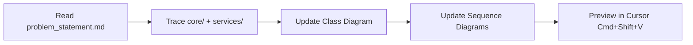
```mermaid
flowchart LR
    A[Read problem_statement.md] --> B[Trace core/ + services/]
    B --> C[Update Class Diagram]
    C --> D[Update Sequence Diagrams]
    D --> E[Preview in Cursor Cmd+Shift+V]
```

**Pair with:** [`README.md`](./README.md) (study guide) · per-project `compile.sh` (run demos)

---

## Table of Contents

| # | Project | Folder |
|---|---------|--------|
| 1 | [ATM](#1-atm) | `ATM_LLD/` |
| 2 | [Car Rental](#2-car-rental) | `Car_Rental_System_LLD/` |
| 3 | [Elevator](#3-elevator) | `Elevator_System_LLD/` |
| 4 | [JSON Parser](#4-json-parser) | `JSON_Parser_LLD/` |
| 5 | [Library Management](#5-library-management) | `Library_Management_System_LLD/` |
| 6 | [LinkedIn](#6-linkedin) | `Linkedin_LLD/` |
| 7 | [Load Balancer](#7-load-balancer) | `LoadBalancer_LLD/` |
| 8 | [Logger](#8-logger) | `Logger_LLD/` |
| 9 | [Movie Ticket Booking](#9-movie-ticket-booking) | `Movie_Ticket_Booking_System/` |
| 10 | [Parking Lot](#10-parking-lot) | `Parking_lot_system_LLD/` |
| 11 | [Rate Limiter](#11-rate-limiter) | `Rate_Limiter_LLD/` |
| 12 | [Ride Sharing](#12-ride-sharing) | `Ride_sharing_app_LLD/` |
| 13 | [Uber](#13-uber) | `Uber_LLD/` |
| 14 | [URL Shortener](#14-url-shortener) | `URL_Shortner_LLD/` |
| 15 | [Vending Machine](#15-vending-machine) | `vending_machine_LLD/` |
| 16 | [WhatsApp](#16-whatsapp) | `WhatsApp_LLD/` |
| 17 | [Insta/YouTube Reels](#17-instayoutube-reels) | `Insta_reel_LLD/yt reel architecture/` |
| 18 | [Thread-Safe LRU Cache](#18-thread-safe-lru-cache) | `LRU_Cache_LLD/` |
| 19 | [Thread-Safe LFU Cache](#19-thread-safe-lfu-cache) | `LFU_Cache_LLD/` |
| 20 | [LeetCode Online Judge](#20-leetcode-online-judge) | `LeetCode_LLD/` |

---

## Diagram Legend

| Symbol | Meaning |
|--------|---------|
| `<<abstract>>` | Abstract class / interface |
| `--\|>` | Inheritance |
| `*--` | Composition (owns lifecycle) |
| `o--` | Aggregation |
| `-->` | Dependency / uses |
| `+` | public method |
| `-` | private attribute |

---

## 1. ATM

**Namespace:** `atm_lld`  
**Facade:** `ATMSystem`

### Class Diagram

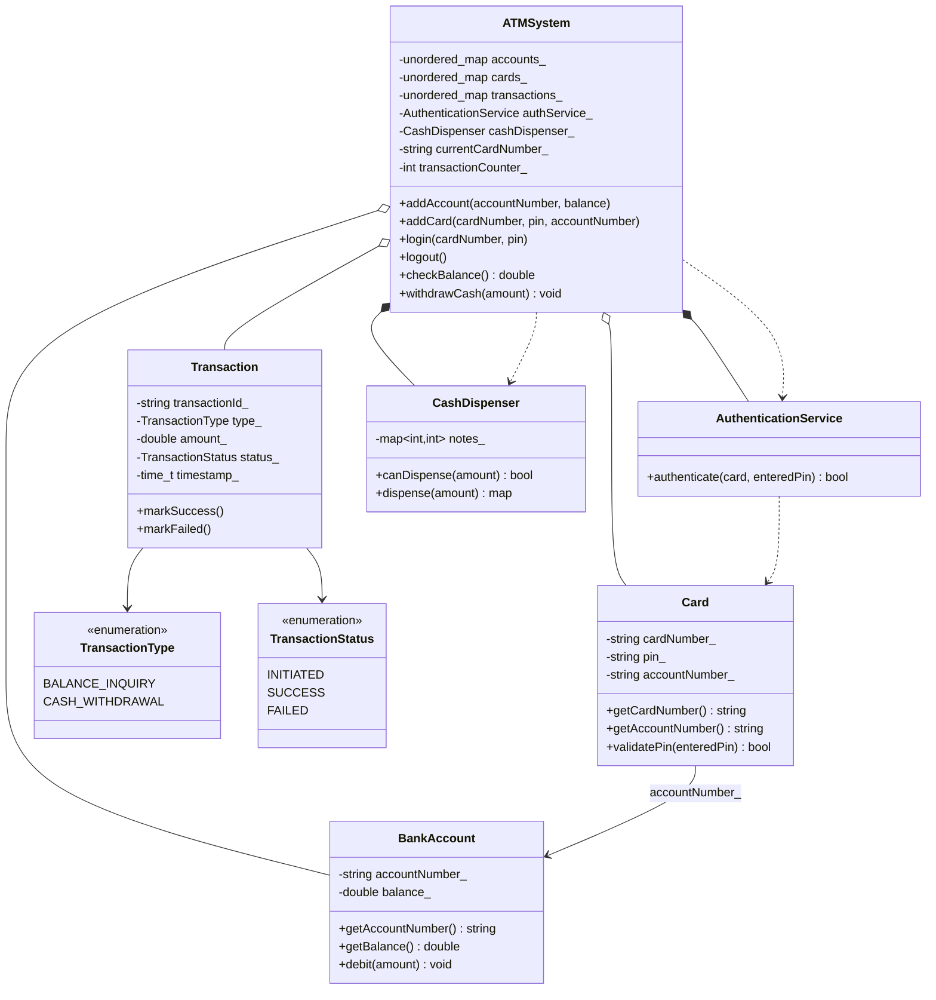
```mermaid
classDiagram
    direction TB

    class ATMSystem {
        -unordered_map accounts_
        -unordered_map cards_
        -unordered_map transactions_
        -AuthenticationService authService_
        -CashDispenser cashDispenser_
        -string currentCardNumber_
        -int transactionCounter_
        +addAccount(accountNumber, balance)
        +addCard(cardNumber, pin, accountNumber)
        +login(cardNumber, pin)
        +logout()
        +checkBalance() double
        +withdrawCash(amount) void
    }

    class BankAccount {
        -string accountNumber_
        -double balance_
        +getAccountNumber() string
        +getBalance() double
        +debit(amount) void
    }

    class Card {
        -string cardNumber_
        -string pin_
        -string accountNumber_
        +getCardNumber() string
        +getAccountNumber() string
        +validatePin(enteredPin) bool
    }

    class Transaction {
        -string transactionId_
        -TransactionType type_
        -double amount_
        -TransactionStatus status_
        -time_t timestamp_
        +markSuccess()
        +markFailed()
    }

    class AuthenticationService {
        +authenticate(card, enteredPin) bool
    }

    class CashDispenser {
        -map~int,int~ notes_
        +canDispense(amount) bool
        +dispense(amount) map
    }

  class TransactionType {
        <<enumeration>>
        BALANCE_INQUIRY
        CASH_WITHDRAWAL
    }

    class TransactionStatus {
        <<enumeration>>
        INITIATED
        SUCCESS
        FAILED
    }

    ATMSystem *-- AuthenticationService
    ATMSystem *-- CashDispenser
    ATMSystem o-- BankAccount
    ATMSystem o-- Card
    ATMSystem o-- Transaction
    Card --> BankAccount : accountNumber_
    Transaction --> TransactionType
    Transaction --> TransactionStatus
    AuthenticationService ..> Card
    ATMSystem ..> AuthenticationService
    ATMSystem ..> CashDispenser
```

### Sequence Diagram — Login

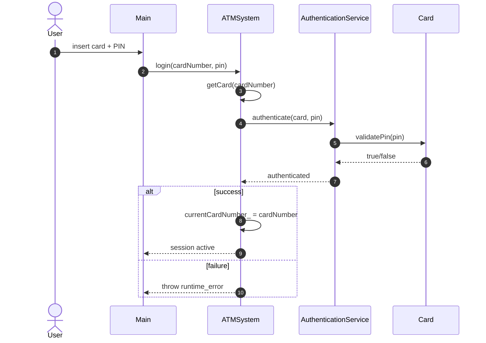
```mermaid
sequenceDiagram
    autonumber
    actor User
    participant Main
    participant ATMSystem
    participant AuthService as AuthenticationService
    participant Card

    User->>Main: insert card + PIN
    Main->>ATMSystem: login(cardNumber, pin)
    ATMSystem->>ATMSystem: getCard(cardNumber)
    ATMSystem->>AuthService: authenticate(card, pin)
    AuthService->>Card: validatePin(pin)
    Card-->>AuthService: true/false
    AuthService-->>ATMSystem: authenticated
    alt success
        ATMSystem->>ATMSystem: currentCardNumber_ = cardNumber
        ATMSystem-->>Main: session active
    else failure
        ATMSystem-->>Main: throw runtime_error
    end
```

### Sequence Diagram — Cash Withdrawal

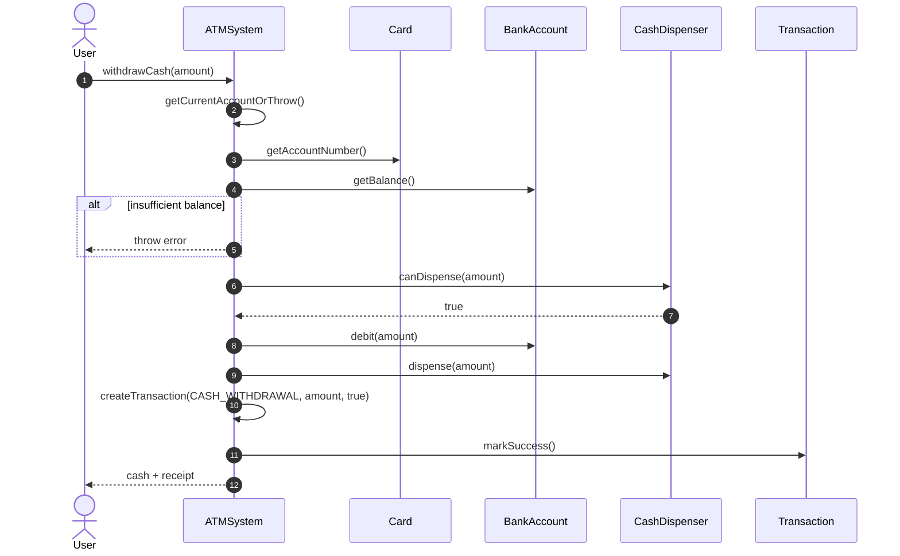
```mermaid
sequenceDiagram
    autonumber
    actor User
    participant ATMSystem
    participant Card
    participant BankAccount
    participant CashDispenser
    participant Transaction

    User->>ATMSystem: withdrawCash(amount)
    ATMSystem->>ATMSystem: getCurrentAccountOrThrow()
    ATMSystem->>Card: getAccountNumber()
    ATMSystem->>BankAccount: getBalance()
    alt insufficient balance
        ATMSystem-->>User: throw error
    end
    ATMSystem->>CashDispenser: canDispense(amount)
    CashDispenser-->>ATMSystem: true
    ATMSystem->>BankAccount: debit(amount)
    ATMSystem->>CashDispenser: dispense(amount)
    ATMSystem->>ATMSystem: createTransaction(CASH_WITHDRAWAL, amount, true)
    ATMSystem->>Transaction: markSuccess()
    ATMSystem-->>User: cash + receipt
```

### Sequence Diagram — Balance Inquiry

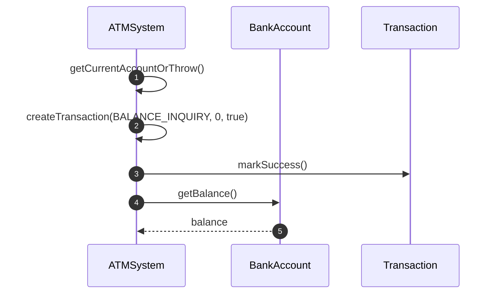
```mermaid
sequenceDiagram
    autonumber
    participant ATMSystem
    participant BankAccount
    participant Transaction

    ATMSystem->>ATMSystem: getCurrentAccountOrThrow()
    ATMSystem->>ATMSystem: createTransaction(BALANCE_INQUIRY, 0, true)
    ATMSystem->>Transaction: markSuccess()
    ATMSystem->>BankAccount: getBalance()
    BankAccount-->>ATMSystem: balance
```

---

## 2. Car Rental

**Namespace:** `car_rental_lld`  
**Facade:** `CarRentalSystem`

### Class Diagram

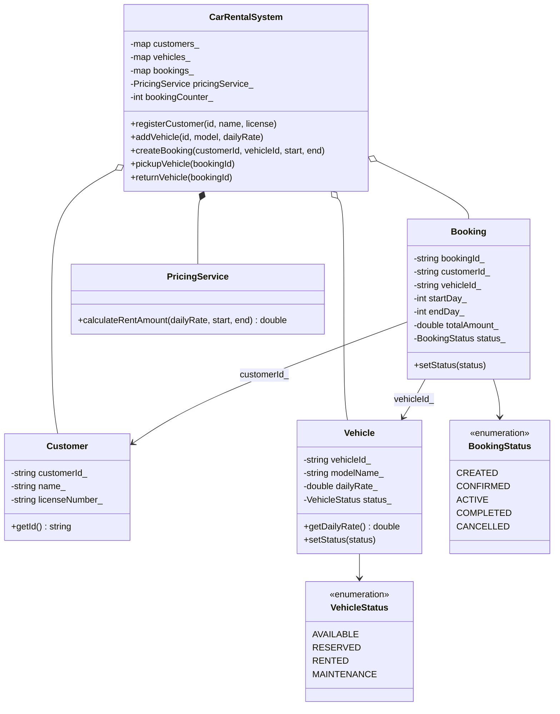
```mermaid
classDiagram
    direction TB

    class CarRentalSystem {
        -map customers_
        -map vehicles_
        -map bookings_
        -PricingService pricingService_
        -int bookingCounter_
        +registerCustomer(id, name, license)
        +addVehicle(id, model, dailyRate)
        +createBooking(customerId, vehicleId, start, end)
        +pickupVehicle(bookingId)
        +returnVehicle(bookingId)
    }

    class Customer {
        -string customerId_
        -string name_
        -string licenseNumber_
        +getId() string
    }

    class Vehicle {
        -string vehicleId_
        -string modelName_
        -double dailyRate_
        -VehicleStatus status_
        +getDailyRate() double
        +setStatus(status)
    }

    class Booking {
        -string bookingId_
        -string customerId_
        -string vehicleId_
        -int startDay_
        -int endDay_
        -double totalAmount_
        -BookingStatus status_
        +setStatus(status)
    }

    class PricingService {
        +calculateRentAmount(dailyRate, start, end) double
    }

    class VehicleStatus {
        <<enumeration>>
        AVAILABLE
        RESERVED
        RENTED
        MAINTENANCE
    }

    class BookingStatus {
        <<enumeration>>
        CREATED
        CONFIRMED
        ACTIVE
        COMPLETED
        CANCELLED
    }

    CarRentalSystem *-- PricingService
    CarRentalSystem o-- Customer
    CarRentalSystem o-- Vehicle
    CarRentalSystem o-- Booking
    Booking --> Customer : customerId_
    Booking --> Vehicle : vehicleId_
    Vehicle --> VehicleStatus
    Booking --> BookingStatus
```

### Sequence Diagram — Create Booking

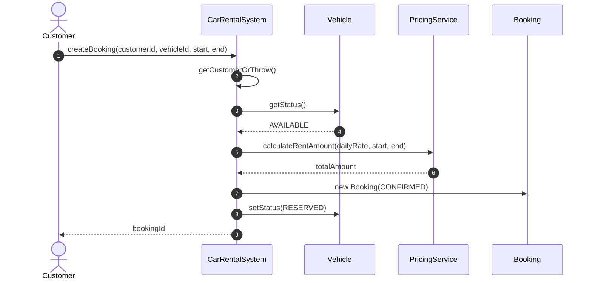
```mermaid
sequenceDiagram
    autonumber
    actor Customer
    participant CarRentalSystem
    participant Vehicle
    participant PricingService
    participant Booking

    Customer->>CarRentalSystem: createBooking(customerId, vehicleId, start, end)
    CarRentalSystem->>CarRentalSystem: getCustomerOrThrow()
    CarRentalSystem->>Vehicle: getStatus()
    Vehicle-->>CarRentalSystem: AVAILABLE
    CarRentalSystem->>PricingService: calculateRentAmount(dailyRate, start, end)
    PricingService-->>CarRentalSystem: totalAmount
    CarRentalSystem->>Booking: new Booking(CONFIRMED)
    CarRentalSystem->>Vehicle: setStatus(RESERVED)
    CarRentalSystem-->>Customer: bookingId
```

### Sequence Diagram — Pickup & Return

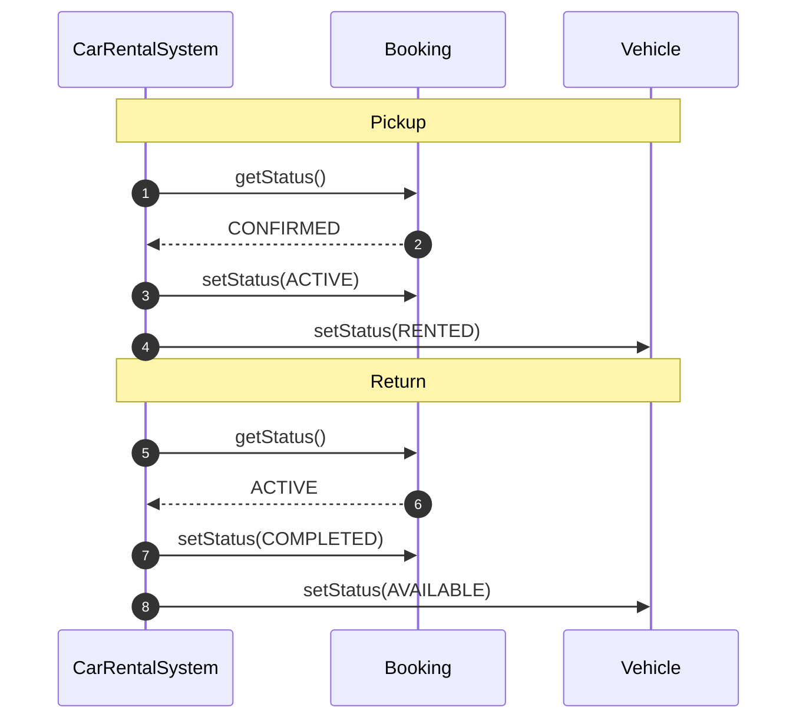
```mermaid
sequenceDiagram
    autonumber
    participant CarRentalSystem
    participant Booking
    participant Vehicle

    Note over CarRentalSystem,Vehicle: Pickup
    CarRentalSystem->>Booking: getStatus()
    Booking-->>CarRentalSystem: CONFIRMED
    CarRentalSystem->>Booking: setStatus(ACTIVE)
    CarRentalSystem->>Vehicle: setStatus(RENTED)

    Note over CarRentalSystem,Vehicle: Return
    CarRentalSystem->>Booking: getStatus()
    Booking-->>CarRentalSystem: ACTIVE
    CarRentalSystem->>Booking: setStatus(COMPLETED)
    CarRentalSystem->>Vehicle: setStatus(AVAILABLE)
```

---

## 3. Elevator

**Namespace:** `elevator_lld`  
**Facade:** `ElevatorSystemController`

### Class Diagram

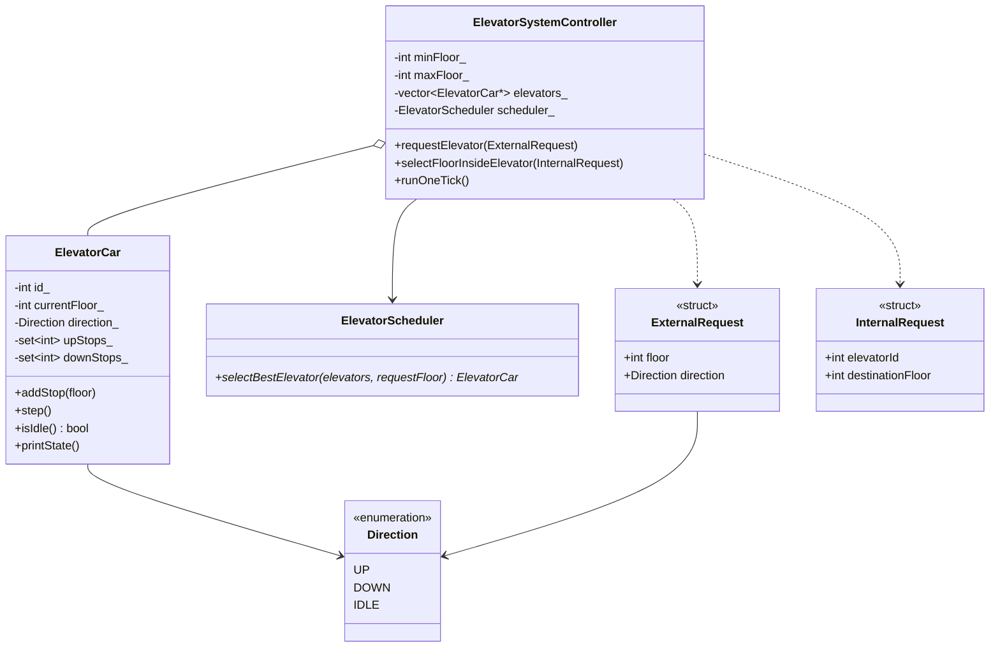
```mermaid
classDiagram
    direction TB

    class ElevatorSystemController {
        -int minFloor_
        -int maxFloor_
        -vector~ElevatorCar*~ elevators_
        -ElevatorScheduler scheduler_
        +requestElevator(ExternalRequest)
        +selectFloorInsideElevator(InternalRequest)
        +runOneTick()
    }

    class ElevatorCar {
        -int id_
        -int currentFloor_
        -Direction direction_
        -set~int~ upStops_
        -set~int~ downStops_
        +addStop(floor)
        +step()
        +isIdle() bool
        +printState()
    }

    class ElevatorScheduler {
        +selectBestElevator(elevators, requestFloor) ElevatorCar*
    }

    class ExternalRequest {
        <<struct>>
        +int floor
        +Direction direction
    }

    class InternalRequest {
        <<struct>>
        +int elevatorId
        +int destinationFloor
    }

    class Direction {
        <<enumeration>>
        UP
        DOWN
        IDLE
    }

    ElevatorSystemController o-- ElevatorCar
    ElevatorSystemController --> ElevatorScheduler
    ElevatorSystemController ..> ExternalRequest
    ElevatorSystemController ..> InternalRequest
    ElevatorCar --> Direction
    ExternalRequest --> Direction
```

### Sequence Diagram — External Request

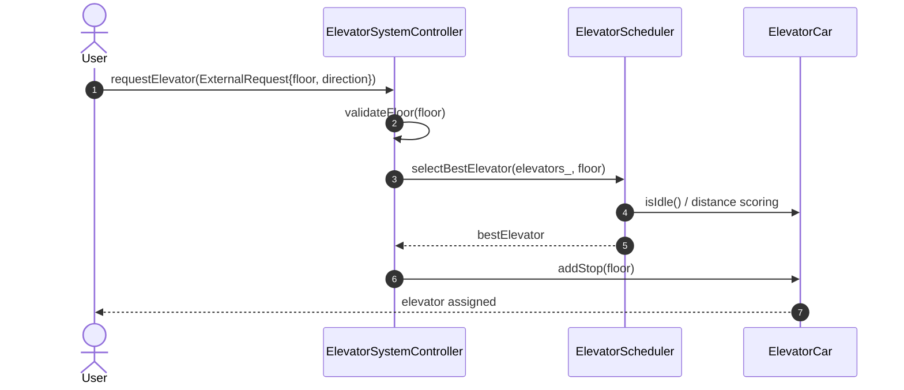
```mermaid
sequenceDiagram
    autonumber
    actor User
    participant Controller as ElevatorSystemController
    participant Scheduler as ElevatorScheduler
    participant Car as ElevatorCar

    User->>Controller: requestElevator(ExternalRequest{floor, direction})
    Controller->>Controller: validateFloor(floor)
    Controller->>Scheduler: selectBestElevator(elevators_, floor)
    Scheduler->>Car: isIdle() / distance scoring
    Scheduler-->>Controller: bestElevator
    Controller->>Car: addStop(floor)
    Car-->>User: elevator assigned
```

### Sequence Diagram — Simulation Tick

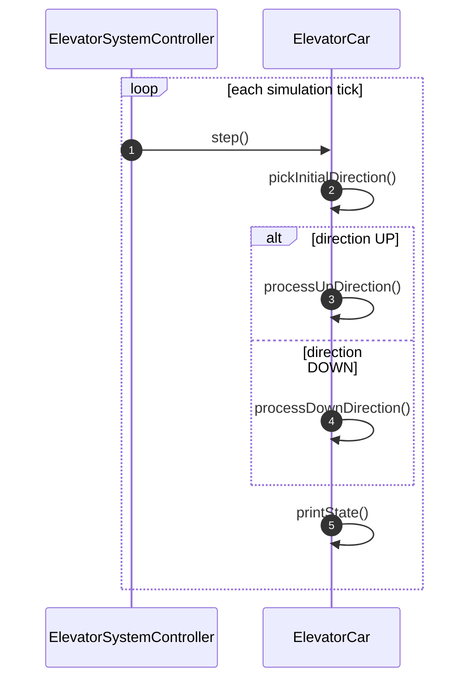
```mermaid
sequenceDiagram
    autonumber
    participant Controller as ElevatorSystemController
    participant Car as ElevatorCar

    loop each simulation tick
        Controller->>Car: step()
        Car->>Car: pickInitialDirection()
        alt direction UP
            Car->>Car: processUpDirection()
        else direction DOWN
            Car->>Car: processDownDirection()
        end
        Car->>Car: printState()
    end
```

### Sequence Diagram — Internal Floor Selection

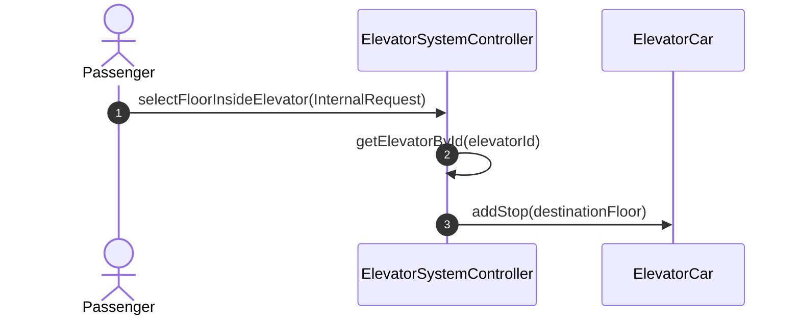
```mermaid
sequenceDiagram
    autonumber
    actor Passenger
    participant Controller as ElevatorSystemController
    participant Car as ElevatorCar

    Passenger->>Controller: selectFloorInsideElevator(InternalRequest)
    Controller->>Controller: getElevatorById(elevatorId)
    Controller->>Car: addStop(destinationFloor)
```

---

## 4. JSON Parser

**Namespace:** `json_parser_lld`  
**Pattern:** Composite + Recursive Descent Parser

### Class Diagram

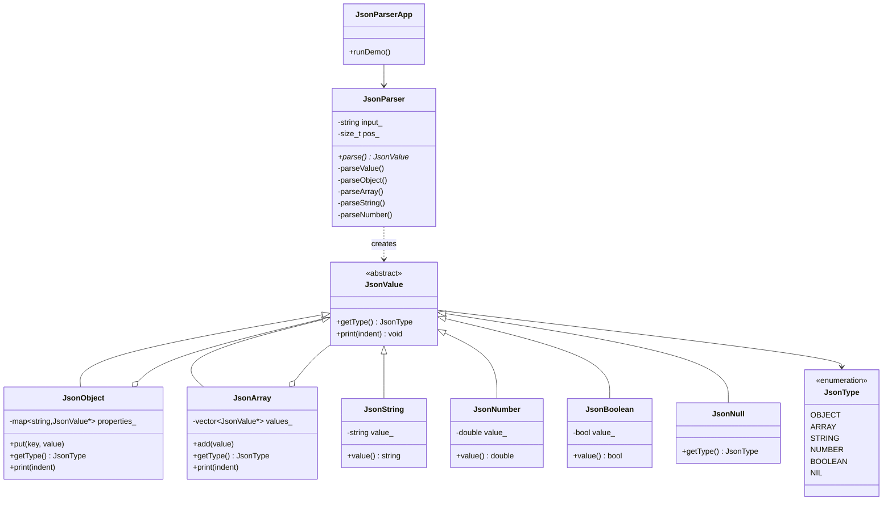
```mermaid
classDiagram
    direction TB

    class JsonValue {
        <<abstract>>
        +getType() JsonType
        +print(indent) void
    }

    class JsonObject {
        -map~string,JsonValue*~ properties_
        +put(key, value)
        +getType() JsonType
        +print(indent)
    }

    class JsonArray {
        -vector~JsonValue*~ values_
        +add(value)
        +getType() JsonType
        +print(indent)
    }

    class JsonString {
        -string value_
        +value() string
    }

    class JsonNumber {
        -double value_
        +value() double
    }

    class JsonBoolean {
        -bool value_
        +value() bool
    }

    class JsonNull {
        +getType() JsonType
    }

    class JsonParser {
        -string input_
        -size_t pos_
        +parse() JsonValue*
        -parseValue()
        -parseObject()
        -parseArray()
        -parseString()
        -parseNumber()
    }

    class JsonParserApp {
        +runDemo()
    }

    class JsonType {
        <<enumeration>>
        OBJECT
        ARRAY
        STRING
        NUMBER
        BOOLEAN
        NIL
    }

    JsonValue <|-- JsonObject
    JsonValue <|-- JsonArray
    JsonValue <|-- JsonString
    JsonValue <|-- JsonNumber
    JsonValue <|-- JsonBoolean
    JsonValue <|-- JsonNull
    JsonObject o-- JsonValue
    JsonArray o-- JsonValue
    JsonParser ..> JsonValue : creates
    JsonParserApp --> JsonParser
    JsonValue --> JsonType
```

### Sequence Diagram — Parse Full JSON

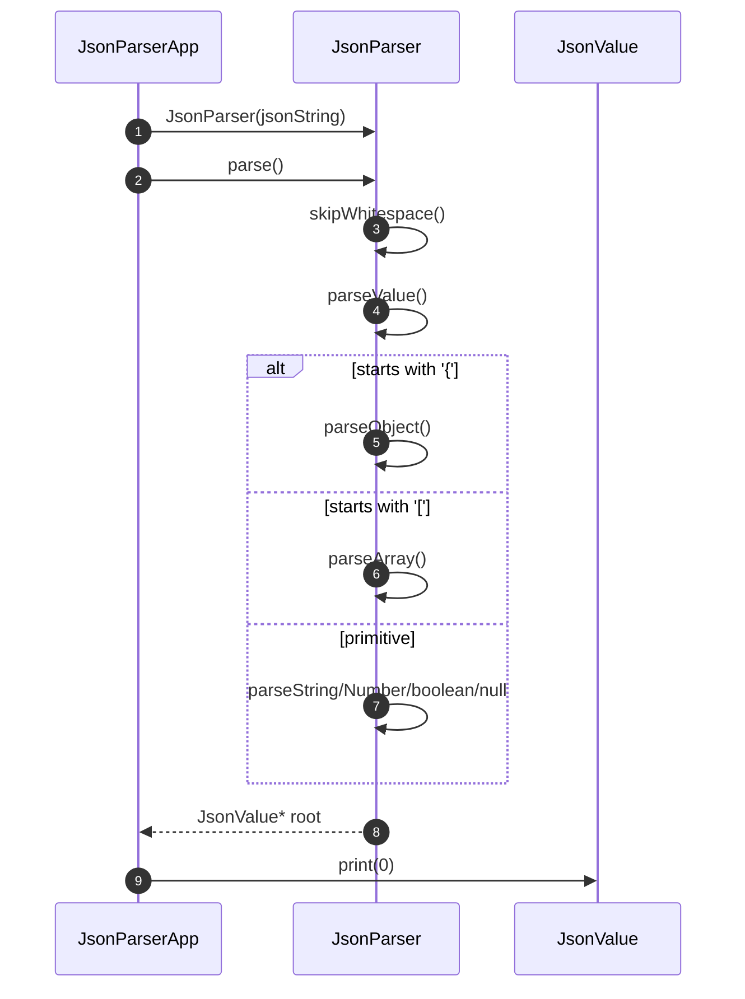
```mermaid
sequenceDiagram
    autonumber
    participant App as JsonParserApp
    participant Parser as JsonParser
    participant Value as JsonValue

    App->>Parser: JsonParser(jsonString)
    App->>Parser: parse()
    Parser->>Parser: skipWhitespace()
    Parser->>Parser: parseValue()
    alt starts with '{'
        Parser->>Parser: parseObject()
    else starts with '['
        Parser->>Parser: parseArray()
    else primitive
        Parser->>Parser: parseString/Number/boolean/null
    end
    Parser-->>App: JsonValue* root
    App->>Value: print(0)
```

### Sequence Diagram — Parse Object

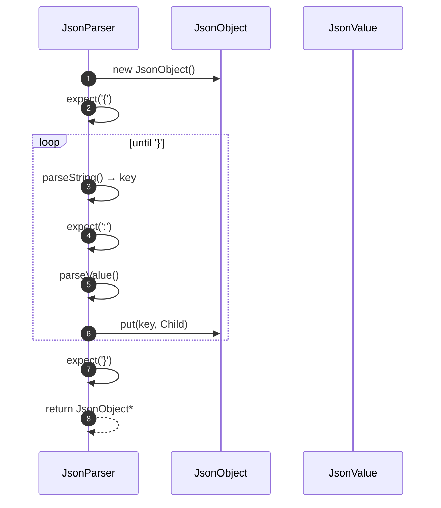
```mermaid
sequenceDiagram
    autonumber
    participant Parser as JsonParser
    participant Obj as JsonObject
    participant Child as JsonValue

    Parser->>Obj: new JsonObject()
    Parser->>Parser: expect('{')
    loop until '}'
        Parser->>Parser: parseString() → key
        Parser->>Parser: expect(':')
        Parser->>Parser: parseValue()
        Parser->>Obj: put(key, Child)
    end
    Parser->>Parser: expect('}')
    Parser-->>Parser: return JsonObject*
```

---

## 5. Library Management

**Namespace:** `library_mgmt`  
**Facade:** `LibraryManagementSystem`

### Class Diagram

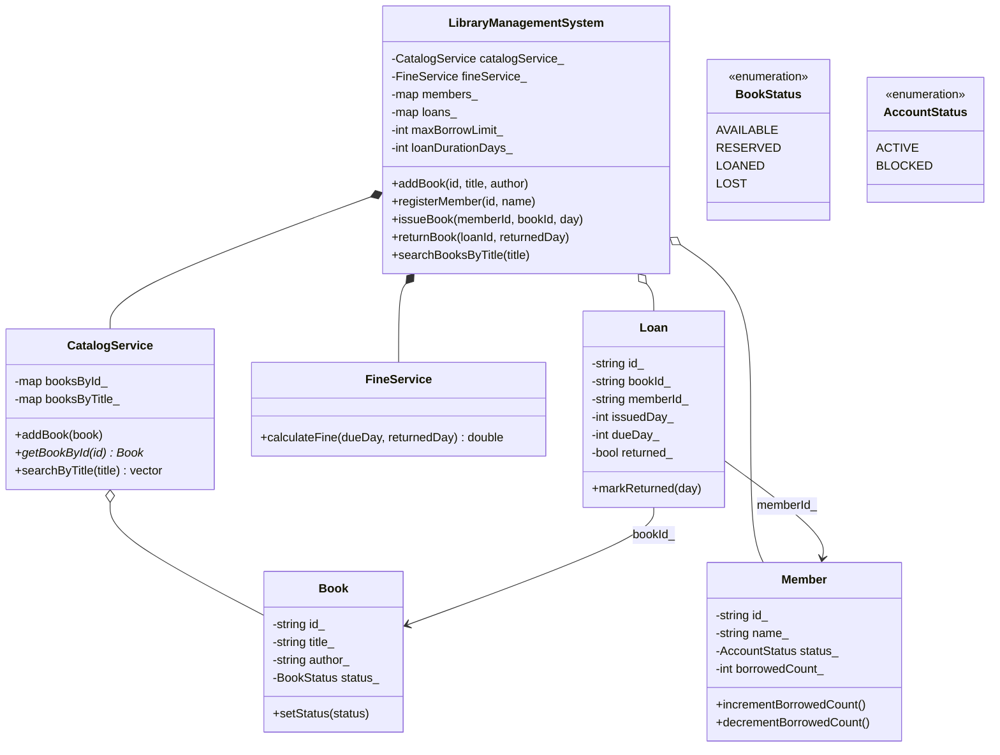
```mermaid
classDiagram
    direction TB

    class LibraryManagementSystem {
        -CatalogService catalogService_
        -FineService fineService_
        -map members_
        -map loans_
        -int maxBorrowLimit_
        -int loanDurationDays_
        +addBook(id, title, author)
        +registerMember(id, name)
        +issueBook(memberId, bookId, day)
        +returnBook(loanId, returnedDay)
        +searchBooksByTitle(title)
    }

    class CatalogService {
        -map booksById_
        -map booksByTitle_
        +addBook(book)
        +getBookById(id) Book*
        +searchByTitle(title) vector
    }

    class FineService {
        +calculateFine(dueDay, returnedDay) double
    }

    class Book {
        -string id_
        -string title_
        -string author_
        -BookStatus status_
        +setStatus(status)
    }

    class Member {
        -string id_
        -string name_
        -AccountStatus status_
        -int borrowedCount_
        +incrementBorrowedCount()
        +decrementBorrowedCount()
    }

    class Loan {
        -string id_
        -string bookId_
        -string memberId_
        -int issuedDay_
        -int dueDay_
        -bool returned_
        +markReturned(day)
    }

    class BookStatus {
        <<enumeration>>
        AVAILABLE
        RESERVED
        LOANED
        LOST
    }

    class AccountStatus {
        <<enumeration>>
        ACTIVE
        BLOCKED
    }

    LibraryManagementSystem *-- CatalogService
    LibraryManagementSystem *-- FineService
    LibraryManagementSystem o-- Member
    LibraryManagementSystem o-- Loan
    CatalogService o-- Book
    Loan --> Book : bookId_
    Loan --> Member : memberId_
```

### Sequence Diagram — Issue Book

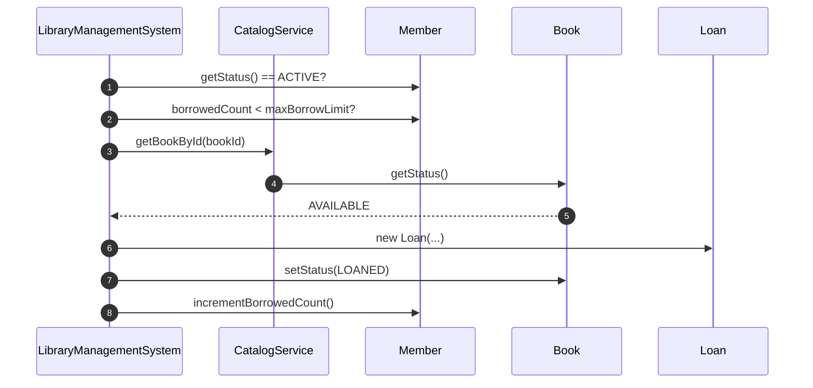
```mermaid
sequenceDiagram
    autonumber
    participant LMS as LibraryManagementSystem
    participant Catalog as CatalogService
    participant Member
    participant Book
    participant Loan

    LMS->>Member: getStatus() == ACTIVE?
    LMS->>Member: borrowedCount < maxBorrowLimit?
    LMS->>Catalog: getBookById(bookId)
    Catalog->>Book: getStatus()
    Book-->>LMS: AVAILABLE
    LMS->>Loan: new Loan(...)
    LMS->>Book: setStatus(LOANED)
    LMS->>Member: incrementBorrowedCount()
```

### Sequence Diagram — Return Book + Fine

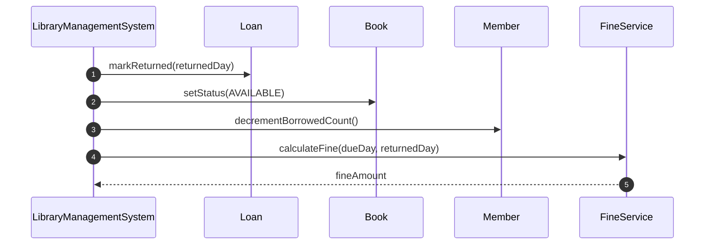
```mermaid
sequenceDiagram
    autonumber
    participant LMS as LibraryManagementSystem
    participant Loan
    participant Book
    participant Member
    participant Fine as FineService

    LMS->>Loan: markReturned(returnedDay)
    LMS->>Book: setStatus(AVAILABLE)
    LMS->>Member: decrementBorrowedCount()
    LMS->>Fine: calculateFine(dueDay, returnedDay)
    Fine-->>LMS: fineAmount
```

---

## 6. LinkedIn

**Namespace:** `linkedin_lld`  
**Facade:** `LinkedinSystem`

### Class Diagram

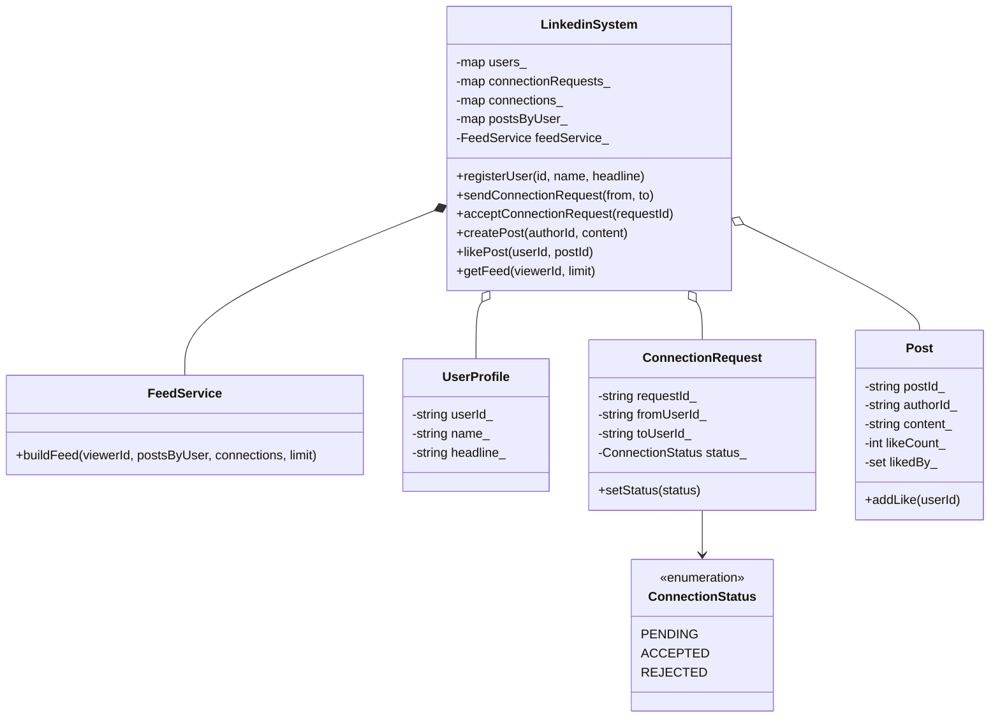
```mermaid
classDiagram
    direction TB

    class LinkedinSystem {
        -map users_
        -map connectionRequests_
        -map connections_
        -map postsByUser_
        -FeedService feedService_
        +registerUser(id, name, headline)
        +sendConnectionRequest(from, to)
        +acceptConnectionRequest(requestId)
        +createPost(authorId, content)
        +likePost(userId, postId)
        +getFeed(viewerId, limit)
    }

    class FeedService {
        +buildFeed(viewerId, postsByUser, connections, limit)
    }

    class UserProfile {
        -string userId_
        -string name_
        -string headline_
    }

    class ConnectionRequest {
        -string requestId_
        -string fromUserId_
        -string toUserId_
        -ConnectionStatus status_
        +setStatus(status)
    }

    class Post {
        -string postId_
        -string authorId_
        -string content_
        -int likeCount_
        -set likedBy_
        +addLike(userId)
    }

    class ConnectionStatus {
        <<enumeration>>
        PENDING
        ACCEPTED
        REJECTED
    }

    LinkedinSystem *-- FeedService
    LinkedinSystem o-- UserProfile
    LinkedinSystem o-- ConnectionRequest
    LinkedinSystem o-- Post
    ConnectionRequest --> ConnectionStatus
```

### Sequence Diagram — Connection Request & Accept

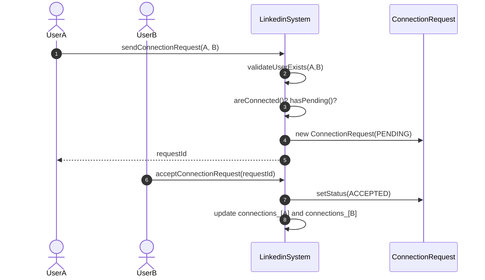
```mermaid
sequenceDiagram
    autonumber
    actor UserA
    actor UserB
    participant System as LinkedinSystem
    participant Request as ConnectionRequest

    UserA->>System: sendConnectionRequest(A, B)
    System->>System: validateUserExists(A,B)
    System->>System: areConnected()? hasPending()?
    System->>Request: new ConnectionRequest(PENDING)
    System-->>UserA: requestId

    UserB->>System: acceptConnectionRequest(requestId)
    System->>Request: setStatus(ACCEPTED)
    System->>System: update connections_[A] and connections_[B]
```

### Sequence Diagram — Feed Generation

```mermaid
sequenceDiagram
    autonumber
    actor Viewer
    participant System as LinkedinSystem
    participant Feed as FeedService
    participant Post

    Viewer->>System: getFeed(viewerId, limit)
    System->>System: validateUserExists(viewerId)
    System->>Feed: buildFeed(viewerId, postsByUser_, connections_, limit)
    Feed->>Feed: collect posts from connections + self
    Feed->>Feed: sort by likes / timestamp
  Feed->>Feed: resize(limit)
    Feed-->>System: vector~Post*~
    System-->>Viewer: personalized feed
```

---

## 7. Load Balancer

**Namespace:** `load_balancer_lld`  
**Pattern:** Strategy

### Class Diagram

```mermaid
classDiagram
    direction TB

    class LoadBalancer {
        -vector~Server*~ servers_
        -map serverById_
        -unique_ptr~LoadBalancingStrategy~ strategy_
        +addServer(id, host)
        +markServerStatus(id, status)
        +routeRequest() Server*
        +completeRequest(serverId)
        +setStrategy(strategy)
    }

    class LoadBalancingStrategy {
        <<abstract>>
        +selectServer(servers) Server*
    }

    class RoundRobinStrategy {
        -int nextIndex_
        +selectServer(servers) Server*
    }

    class LeastConnectionsStrategy {
        +selectServer(servers) Server*
    }

    class Server {
        -string serverId_
        -string host_
        -ServerStatus status_
        -int activeConnections_
        +isAvailable() bool
        +incrementConnections()
        +decrementConnections()
    }

    class ServerStatus {
        <<enumeration>>
        UP
        DOWN
    }

    LoadBalancingStrategy <|-- RoundRobinStrategy
    LoadBalancingStrategy <|-- LeastConnectionsStrategy
    LoadBalancer o-- Server
    LoadBalancer *-- LoadBalancingStrategy
    Server --> ServerStatus
```

### Sequence Diagram — Route Request (Round Robin)

```mermaid
sequenceDiagram
    autonumber
    participant Client
    participant LB as LoadBalancer
    participant Strategy as RoundRobinStrategy
    participant Server

    Client->>LB: routeRequest()
    LB->>Strategy: selectServer(servers_)
    loop find next available
        Strategy->>Server: isAvailable()
        Server-->>Strategy: true/false
    end
    Strategy-->>LB: selected Server*
    LB->>Server: incrementConnections()
    LB-->>Client: Server* (host)
```

### Sequence Diagram — Complete Request & Strategy Switch

```mermaid
sequenceDiagram
    autonumber
    participant Client
    participant LB as LoadBalancer
    participant LC as LeastConnectionsStrategy
    participant Server

    Client->>LB: setStrategy(LeastConnectionsStrategy)
    Client->>LB: routeRequest()
    LB->>LC: selectServer(servers_)
    LC->>Server: getActiveConnections() × N
    LC-->>LB: min-connections server
    LB->>Server: incrementConnections()

    Client->>LB: completeRequest(serverId)
    LB->>Server: decrementConnections()
```

---

## 8. Logger

**Namespace:** `logger_lld`  
**Patterns:** Singleton, Chain of Responsibility, Observer, Strategy

### Class Diagram

```mermaid
classDiagram
    direction TB

    class Logger {
        <<Singleton>>
        -LogHandler* handlerChain
        +getInstance() Logger&
        +debug(msg)
        +info(msg)
        +warn(msg)
        +error(msg)
        +fatal(msg)
        -log(level, msg)
    }

    class LogHandler {
        <<abstract>>
        #LogHandler* next
        #vector~LogAppender*~ appenders
        +setNext(handler)
        +subscribe(appender)
        +handle(message)
        #canHandle(level) bool
        #notifyObservers(message)
    }

    class DebugHandler {
        #canHandle(DEBUG)
    }
    class InfoHandler {
        #canHandle(INFO)
    }
    class WarnHandler {
        #canHandle(WARN)
    }
    class ErrorHandler {
        #canHandle(ERROR)
    }
    class FatalHandler {
        #canHandle(FATAL)
    }

    class LogAppender {
        <<abstract>>
        +append(message) void
    }

    class ConsoleAppender {
        -LogFormatter* formatter
        +append(message)
    }

    class FileAppender {
        -LogFormatter* formatter
        -ofstream fileStream
        +append(message)
    }

    class LogFormatter {
        <<abstract>>
        +format(message) string
    }

    class PlainTextFormatter {
        +format(message)
    }

    class JsonFormatter {
        +format(message)
    }

    class LogMessage {
        +LogLevel level
        +string message
        +long timestamp
    }

    class LogHandlerConfiguration {
        <<utility>>
        +build() LogHandler*
        +addAppenderForLevel(level, appender)
    }

    class LogLevel {
        <<enumeration>>
        TRACE
        DEBUG
        INFO
        WARN
        ERROR
        FATAL
    }

    LogHandler <|-- DebugHandler
    LogHandler <|-- InfoHandler
    LogHandler <|-- WarnHandler
    LogHandler <|-- ErrorHandler
    LogHandler <|-- FatalHandler
    LogAppender <|-- ConsoleAppender
    LogAppender <|-- FileAppender
    LogFormatter <|-- PlainTextFormatter
    LogFormatter <|-- JsonFormatter
    Logger --> LogHandler : handlerChain
    LogHandler o-- LogAppender : observers
    ConsoleAppender --> LogFormatter
    FileAppender --> LogFormatter
    LogHandlerConfiguration ..> LogHandler
```

### Sequence Diagram — Log INFO Message

```mermaid
sequenceDiagram
    autonumber
    participant App
    participant Logger
    participant Debug as DebugHandler
    participant Info as InfoHandler
    participant Console as ConsoleAppender
    participant Formatter as PlainTextFormatter

    App->>Logger: info("User logged in")
    Logger->>Logger: log(INFO, msg) → LogMessage
    Logger->>Debug: handle(message)
    Debug->>Debug: canHandle(INFO)? → false
    Debug->>Info: next->handle(message)
    Info->>Info: canHandle(INFO)? → true
    Info->>Info: notifyObservers(message)
    Info->>Console: append(message)
    Console->>Formatter: format(message)
    Formatter-->>Console: formatted string
    Console->>Console: cout
```

### Sequence Diagram — Logger Initialization

```mermaid
sequenceDiagram
    autonumber
    participant Main
    participant Logger
    participant Config as LogHandlerConfiguration
    participant Info as InfoHandler
    participant Console as ConsoleAppender
    participant File as FileAppender

    Main->>Logger: getInstance()
    Logger->>Config: build()
    Config->>Config: Debug→Info→Warn→Error→Fatal chain
    Main->>Config: addAppenderForLevel(INFO, ConsoleAppender)
    Config->>Info: subscribe(ConsoleAppender)
    Main->>Config: addAppenderForLevel(ERROR, FileAppender)
```

---

## 9. Movie Ticket Booking

**Namespace:** `movie_ticket_booking`  
**Facade:** `MovieTicketSystem`  
**Patterns:** Facade, Strategy, Factory

### Class Diagram

```mermaid
classDiagram
    direction TB

    class MovieTicketSystem {
        -PricingStrategy* pricingStrategy_
        -PaymentGateway* paymentGateway_
        -NotificationService* notificationService_
        -CatalogManager catalogManager_
        -ShowManager showManager_
        -BookingManager bookingManager_
    }

    class CatalogManager {
        -map movies_
        +addMovie(movie)
        +getMovieById(id)
    }

    class ShowManager {
        -map shows_
        +addShow(show)
        +getShowById(id)
    }

    class BookingManager {
        -PricingStrategy* pricingStrategy_
        -PaymentGateway* paymentGateway_
        -NotificationService* notificationService_
        -BookingFactory bookingFactory_
        -map bookings_
        +createBooking(user, show, seatIds)
    }

    class BookingFactory {
        +createBooking(...)
    }

    class PricingStrategy {
        <<abstract>>
        +getSeatPrice(SeatType) double
    }

    class StandardPricingStrategy {
        +getSeatPrice(SeatType)
    }

    class PaymentGateway {
        +processPayment(amount) bool
    }

    class NotificationService {
        +sendBookingConfirmation(email, bookingId)
    }

    class Movie { +movieId, title, durationMins }
    class Theater { +theaterId, name, screens }
    class Screen { +screenId, seats }
    class Show { +showId, movie, startTime, seats }
    class Seat { +seatId, seatType, booked }
    class User { +userId, name, email }
    class Booking { +bookingId, status, totalAmount }
    class KioskTerminal { +printSystemReady() }

    class SeatType {
        <<enumeration>>
        REGULAR
        PREMIUM
        RECLINER
    }

    class BookingStatus {
        <<enumeration>>
        CREATED
        CONFIRMED
        CANCELLED
    }

    PricingStrategy <|-- StandardPricingStrategy
    MovieTicketSystem *-- CatalogManager
    MovieTicketSystem *-- ShowManager
    MovieTicketSystem *-- BookingManager
    BookingManager --> PricingStrategy
    BookingManager --> PaymentGateway
    BookingManager --> NotificationService
    BookingManager --> BookingFactory
    Theater o-- Screen
    Screen o-- Seat
    Show o-- Movie
    Show o-- Seat
```

### Sequence Diagram — Create Booking (Happy Path)

```mermaid
sequenceDiagram
    autonumber
    actor User
    participant Kiosk as KioskTerminal
    participant System as MovieTicketSystem
    participant BM as BookingManager
    participant Show
    participant Seat
    participant Pricing as PricingStrategy
    participant Factory as BookingFactory
    participant Payment as PaymentGateway
    participant Notify as NotificationService

    User->>System: createBooking(user, show, seatIds)
    System->>BM: createBooking(user, show, seatIds)
    BM->>Show: getSeats()
    loop each seatId
        BM->>Seat: isBooked()
        BM->>Seat: markBooked()
        BM->>Pricing: getSeatPrice(seatType)
    end
    BM->>Factory: createBooking(...)
    BM->>Payment: processPayment(totalAmount)
    Payment-->>BM: success
    BM->>BM: Booking::setStatus(CONFIRMED)
    BM->>Notify: sendBookingConfirmation(email, bookingId)
    BM-->>User: booking confirmed
```

### Sequence Diagram — Payment Failure

```mermaid
sequenceDiagram
    autonumber
    participant BM as BookingManager
    participant Payment as PaymentGateway
    participant Booking
    participant Seat

    BM->>Payment: processPayment(amount)
    Payment-->>BM: false
    BM->>Booking: setStatus(CANCELLED)
    BM->>Seat: markAvailable() [rollback seats]
    BM-->>BM: throw runtime_error
```

---

## 10. Parking Lot

**Namespace:** `parking_lot_lld`  
**Pattern:** Strategy (pricing)

### Class Diagram

```mermaid
classDiagram
    direction TB

    class ParkingLot {
        -vector~ParkingSpot*~ spots_
        -map activeTickets_
        -PricingStrategy* pricingStrategy_
        +addSpot(spot)
        +parkVehicle(vehicle) Ticket*
        +unparkVehicle(ticketId) double
    }

    class ParkingSpot {
        -string spotId_
        -VehicleType supportedType_
        -bool occupied_
        +canFitVehicle(vehicle) bool
        +parkVehicle(vehicleNumber)
        +removeVehicle()
    }

    class Vehicle {
        -string number_
        -VehicleType type_
    }

    class Ticket {
        -string ticketId_
        -string vehicleNumber_
        -string spotId_
        -time_t entryTime_
    }

    class PricingStrategy {
        <<abstract>>
        +calculateFee(type, entry, exit) double
    }

    class HourlyPricingStrategy {
        +calculateFee(type, entry, exit)
    }

    class VehicleType {
        <<enumeration>>
        BIKE
        CAR
        TRUCK
    }

    PricingStrategy <|-- HourlyPricingStrategy
    ParkingLot o-- ParkingSpot
    ParkingLot o-- Ticket
    ParkingLot --> PricingStrategy
    ParkingSpot --> VehicleType
    Vehicle --> VehicleType
```

### Sequence Diagram — Park Vehicle

```mermaid
sequenceDiagram
    autonumber
    actor Driver
    participant Lot as ParkingLot
    participant Spot as ParkingSpot
    participant Ticket

    Driver->>Lot: parkVehicle(vehicle)
    Lot->>Lot: findAvailableSpot(vehicle)
    Lot->>Spot: canFitVehicle(vehicle)
    Spot-->>Lot: true
    Lot->>Spot: parkVehicle(vehicleNumber)
    Lot->>Ticket: new Ticket(id, vehicle, spot, entryTime)
    Lot->>Lot: activeTickets_[ticketId] = ticket
    Lot-->>Driver: Ticket*
```

### Sequence Diagram — Unpark & Calculate Fee

```mermaid
sequenceDiagram
    autonumber
    actor Driver
    participant Lot as ParkingLot
    participant Ticket
    participant Spot as ParkingSpot
    participant Pricing as HourlyPricingStrategy

    Driver->>Lot: unparkVehicle(ticketId)
    Lot->>Ticket: getEntryTime(), getSpotId()
    Lot->>Spot: removeVehicle()
    Lot->>Pricing: calculateFee(vehicleType, entry, exit)
    Pricing-->>Lot: fee
    Lot->>Lot: delete ticket from activeTickets_
    Lot-->>Driver: fee amount
```

---

## 11. Rate Limiter

**Namespace:** `rate_limiter_lld`  
**Patterns:** Strategy, Factory

### Class Diagram

```mermaid
classDiagram
    direction TB

    class RateLimiterService {
        -map~UserTier, unique_ptr~RateLimiter~~ rateLimiters
        +allowRequest(user) bool
    }

    class RateLimiter {
        <<abstract>>
        #RateLimitConfig config
        #RateLimitType type
        +allowRequest(userId) bool
    }

    class TokenBucketRateLimiter {
        -double tokens
        -time_t lastRefillTime
        -mutex mtx
        +allowRequest(userId)
        -refillTokens()
    }

    class FixedWindowRateLimiter {
        -int requestCount
        -time_t windowStart
        -mutex mtx
        +allowRequest(userId)
    }

    class SlidingWindowLogRateLimiter {
        -map~userId, queue~time~~ requestLog
        -mutex mtx
        +allowRequest(userId)
    }

    class RateLimiterFactory {
        +createRateLimiter(type, config)$ RateLimiter*
    }

    class User {
        -string userId
        -UserTier tier
    }

    class RateLimitConfig {
        -int maxRequests
        -int windowInSeconds
    }

    class UserTier {
        <<enumeration>>
        FREE
        PREMIUM
    }

    class RateLimitType {
        <<enumeration>>
        TOKEN_BUCKET
        FIXED_WINDOW
        SLIDING_WINDOW_LOG
    }

    RateLimiter <|-- TokenBucketRateLimiter
    RateLimiter <|-- FixedWindowRateLimiter
    RateLimiter <|-- SlidingWindowLogRateLimiter
    RateLimiterService o-- RateLimiter
    RateLimiterService ..> RateLimiterFactory
    RateLimiter *-- RateLimitConfig
    User --> UserTier
```

### Sequence Diagram — Allow Request

```mermaid
sequenceDiagram
    autonumber
    participant Client
    participant Service as RateLimiterService
    participant Limiter as TokenBucketRateLimiter
    participant User

    Client->>Service: allowRequest(user)
    Service->>User: getTier()
    Service->>Service: lookup rateLimiters[tier]
    Service->>Limiter: allowRequest(userId)
    Limiter->>Limiter: lock(mtx)
    Limiter->>Limiter: refillTokens()
    alt tokens > 0
        Limiter->>Limiter: tokens--
        Limiter-->>Service: true (allowed)
    else
        Limiter-->>Service: false (blocked)
    end
    Service-->>Client: bool
```

### Sequence Diagram — Factory Setup (Constructor)

```mermaid
sequenceDiagram
    autonumber
    participant Service as RateLimiterService
    participant Factory as RateLimiterFactory
    participant TB as TokenBucketRateLimiter
    participant FW as FixedWindowRateLimiter

    Service->>Factory: createRateLimiter(TOKEN_BUCKET, Config(10,60))
    Factory->>TB: new TokenBucketRateLimiter
    Service->>Factory: createRateLimiter(FIXED_WINDOW, Config(100,60))
    Factory->>FW: new FixedWindowRateLimiter
    Service->>Service: rateLimiters[FREE]=TB, rateLimiters[PREMIUM]=FW
```

---

## 12. Ride Sharing

**Namespace:** `ride_sharing`  
**Facade:** `RideSharingService`

### Class Diagram

```mermaid
classDiagram
    direction TB

    class RideSharingService {
        -map riders_
        -map drivers_
        -map rides_
        -map driverToActiveRide_
        -PricingService pricing_
        +registerRider(id, name)
        +registerDriver(id, name, location)
        +requestRide(riderId, pickup, drop)
        +startRide(rideId)
        +completeRide(rideId)
    }

    class Rider {
        -string riderId_
        -string name_
    }

    class Driver {
        -string driverId_
        -Location currentLocation_
        -DriverStatus status_
        +setLocation(loc)
        +setStatus(status)
    }

    class Ride {
        -string rideId_
        -string riderId_
        -string driverId_
        -Location pickup_
        -Location drop_
        -double fare_
        -RideStatus status_
    }

    class Location {
        <<struct>>
        +double x
        +double y
    }

    class PricingService {
        +calculateFare(pickup, drop) double
    }

    class GeoUtils {
        +calculateDistance(a, b)$ double
    }

    class DriverStatus {
        <<enumeration>>
        AVAILABLE
        ON_RIDE
        OFFLINE
    }

    class RideStatus {
        <<enumeration>>
        REQUESTED
        ACCEPTED
        STARTED
        COMPLETED
        CANCELLED
    }

    RideSharingService *-- PricingService
    RideSharingService o-- Rider
    RideSharingService o-- Driver
    RideSharingService o-- Ride
    Driver --> Location
    Ride --> Location
    PricingService ..> GeoUtils
```

### Sequence Diagram — Request Ride

```mermaid
sequenceDiagram
    autonumber
    actor Rider
    participant Service as RideSharingService
    participant Driver
    participant Pricing as PricingService
    participant Ride

    Rider->>Service: requestRide(riderId, pickup, drop)
    Service->>Service: getRiderOrThrow(riderId)
    Service->>Service: findNearestAvailableDriver(pickup)
    loop all drivers
        Service->>Driver: getStatus() == AVAILABLE?
        Service->>Service: calculateDistance(driver.loc, pickup)
    end
    Service->>Pricing: calculateFare(pickup, drop)
    Pricing-->>Service: fare
    Service->>Ride: new Ride(ACCEPTED)
    Service->>Driver: setStatus(ON_RIDE)
    Service-->>Rider: rideId
```

### Sequence Diagram — Complete Ride

```mermaid
sequenceDiagram
    autonumber
    participant Service as RideSharingService
    participant Ride
    participant Driver

    Service->>Ride: setStatus(COMPLETED)
    Service->>Driver: setStatus(AVAILABLE)
    Service->>Driver: setLocation(ride.drop)
```

---

## 13. Uber

**Namespace:** `uber_lld`  
**Facade:** `UberSystem` (extends Ride Sharing with OTP + Payment)

### Class Diagram

```mermaid
classDiagram
    direction TB

    class UberSystem {
        -map riders_, drivers_, rides_
        -DriverMatchingService matchingService_
        -FareService fareService_
        -OtpService otpService_
        -PaymentService paymentService_
        +registerRider(id, name, phone)
        +registerDriver(id, name, vehicle, loc)
        +requestRide(riderId, pickup, drop)
        +startRide(rideId, otp)
        +completeRide(rideId, paymentMethod)
        +cancelRide(rideId)
    }

    class DriverMatchingService {
        +findNearestAvailableDriver(drivers, pickup) Driver*
    }

    class FareService {
        +calculateFareDetails(pickup, drop) FareDetails
        +calculateFare(pickup, drop) double
    }

    class OtpService {
        -map otpByRide_
        +generateOtp(rideId) string
        +verifyOtp(rideId, otp) bool
    }

    class PaymentService {
        -map payments_
        +createPayment(rideId, amount, method) Payment*
        +processPayment(payment) bool
    }

    class Rider { +riderId, name, phone }
    class Driver { +driverId, vehicleNumber, location, status }
    class Ride { +rideId, fare, status }
    class Payment { +paymentId, amount, method, status }
    class FareDetails { +baseFare, distanceKm, totalFare }
    class Location { <<struct>> }

    class PaymentMethod {
        <<enumeration>>
        CASH
        UPI
        CARD
    }

    UberSystem *-- DriverMatchingService
    UberSystem *-- FareService
    UberSystem *-- OtpService
    UberSystem *-- PaymentService
    UberSystem o-- Ride
    UberSystem o-- Payment
```

### Sequence Diagram — Request Ride + OTP

```mermaid
sequenceDiagram
    autonumber
    actor Rider
    participant Uber as UberSystem
    participant Match as DriverMatchingService
    participant Fare as FareService
    participant OTP as OtpService
    participant Driver

    Rider->>Uber: requestRide(riderId, pickup, drop)
    Uber->>Match: findNearestAvailableDriver(drivers_, pickup)
    Match-->>Uber: Driver*
    Uber->>Fare: calculateFareDetails(pickup, drop)
    Fare-->>Uber: FareDetails
    Uber->>Uber: new Ride(ACCEPTED)
    Uber->>Driver: setStatus(ON_RIDE)
    Uber->>OTP: generateOtp(rideId)
    OTP-->>Rider: OTP sent
```

### Sequence Diagram — Start Ride (OTP Verify)

```mermaid
sequenceDiagram
    autonumber
    actor Rider
    actor Driver
    participant Uber as UberSystem
    participant OTP as OtpService
    participant Ride

    Driver->>Uber: startRide(rideId, otp)
    Uber->>OTP: verifyOtp(rideId, otp)
    alt valid OTP
        OTP-->>Uber: true
        Uber->>Ride: setStatus(STARTED)
    else invalid
        Uber-->>Driver: throw error
    end
```

### Sequence Diagram — Complete Ride + Payment

```mermaid
sequenceDiagram
    autonumber
    actor Rider
    participant Uber as UberSystem
    participant Pay as PaymentService
    participant Payment
    participant Ride
    participant Driver

    Rider->>Uber: completeRide(rideId, UPI)
    Uber->>Pay: createPayment(rideId, fare, UPI)
    Uber->>Pay: processPayment(payment)
    Pay->>Payment: markSuccess()
    Uber->>Ride: setStatus(COMPLETED)
    Uber->>Driver: setStatus(AVAILABLE)
    Uber->>Driver: setLocation(drop)
```

---

## 14. URL Shortener

**Namespace:** `url_shortner_lld`  
**Facade:** `UrlShortnerService`

### Class Diagram

```mermaid
classDiagram
    direction TB

    class UrlShortnerService {
        -map shortToEntry_
        -map longToShort_
        -long idCounter_
        -string baseDomain_
        +shortenUrl(longUrl) string
        +resolveShortUrl(shortUrl) string
        +printStats()
    }

    class UrlEntry {
        -string shortCode_
        -string longUrl_
        -time_t createdAt_
        -int clickCount_
        +incrementClickCount()
        +getLongUrl() string
    }

    class Base62Encoder {
        +encode(value)$ string
    }

    UrlShortnerService o-- UrlEntry
    UrlShortnerService ..> Base62Encoder
```

### Sequence Diagram — Shorten URL (with dedup)

```mermaid
sequenceDiagram
    autonumber
    actor User
    participant Service as UrlShortnerService
    participant Encoder as Base62Encoder
    participant Entry as UrlEntry

    User->>Service: shortenUrl(longUrl)
    Service->>Service: validateLongUrl(longUrl)
    alt already in longToShort_
        Service-->>User: existing short URL
    else new URL
        Service->>Encoder: encode(idCounter_++)
        Encoder-->>Service: shortCode
        Service->>Entry: new UrlEntry(shortCode, longUrl)
        Service->>Service: store in shortToEntry_ & longToShort_
        Service-->>User: baseDomain + shortCode
    end
```

### Sequence Diagram — Resolve Short URL

```mermaid
sequenceDiagram
    autonumber
    actor User
    participant Service as UrlShortnerService
    participant Entry as UrlEntry

    User->>Service: resolveShortUrl(shortUrl)
    Service->>Service: extractShortCode(shortUrl)
    Service->>Entry: get from shortToEntry_
    Service->>Entry: incrementClickCount()
    Entry-->>Service: longUrl
    Service-->>User: redirect to longUrl
```

---

## 15. Vending Machine

**Namespace:** `vending_machine_lld`  
**Facade:** `VendingMachine`

### Class Diagram

```mermaid
classDiagram
    direction TB

    class VendingMachine {
        -Inventory inventory_
        -MoneyManager moneyManager_
        -ItemType selectedItem_
        -bool itemSelected_
        +loadItem(type, item, qty)
        +selectItem(type)
        +insertMoney(amount)
        +dispense()
        +cancelAndRefund()
    }

    class Inventory {
        -map~ItemType, Item*~ items_
        -map~ItemType, int~ stock_
        +addItem(type, item, qty)
        +hasStock(type) bool
        +getItem(type) Item*
        +reduceStock(type)
    }

    class MoneyManager {
        -double currentBalance_
        +insertMoney(amount)
        +getCurrentBalance() double
        +resetBalance()
    }

    class Item {
        -string name_
        -double price_
        -ItemType type_
    }

    class ItemType {
        <<enumeration>>
        COKE
        PEPSI
        WATER
        JUICE
    }

    VendingMachine *-- Inventory
    VendingMachine *-- MoneyManager
    Inventory o-- Item
    Item --> ItemType
```

### Sequence Diagram — Purchase Flow

```mermaid
sequenceDiagram
    autonumber
    actor Customer
    participant VM as VendingMachine
    participant Inv as Inventory
    participant Money as MoneyManager
    participant Item

    Customer->>VM: selectItem(COKE)
    VM->>Inv: hasStock(COKE)
    VM->>Inv: getItem(COKE)
    Customer->>VM: insertMoney(50)
    VM->>Money: insertMoney(50)
    Customer->>VM: dispense()
    VM->>Money: getCurrentBalance()
    VM->>Item: getPrice()
    alt balance >= price
        VM->>Inv: reduceStock(COKE)
        VM->>Money: resetBalance()
        VM-->>Customer: item + change
    else insufficient
        VM-->>Customer: throw error
    end
```

### Sequence Diagram — Cancel & Refund

```mermaid
sequenceDiagram
    autonumber
    actor Customer
    participant VM as VendingMachine
    participant Money as MoneyManager

    Customer->>VM: cancelAndRefund()
    VM->>Money: getCurrentBalance()
    Money-->>Customer: refund amount
    VM->>Money: resetBalance()
    VM->>VM: itemSelected_ = false
```

---

## 16. WhatsApp

**Namespace:** `whatsapp_lld`  
**Facade:** `WhatsAppSystem`  
**Patterns:** Strategy (encryption), Decorator + Observer (notification engine)

### Class Diagram

```mermaid
classDiagram
    direction TB

    class WhatsAppSystem {
        -map users
        -ChatService chatService
        -NotificationService notificationService
        +registerUser(id, name, phone)
        +createDirectChat(userA, userB)
        +createGroup(name, adminId, members)
        +sendDirectMessage(chatId, msg, receiverId)
        +sendGroupMessage(chatId, msg)
        +configureEncryption(service)
    }

    class ChatService {
        -map directChats
        -map groups
        -EncryptionService* encryptionService
        +createDirectChat(u1, u2)
        +createGroup(name, admin, members)
        +sendDirectMessage(chatId, msg)
        +sendGroupMessage(chatId, msg)
        -getEncryptedMessage(plain) string
    }

    class Chat {
        -string chatId
        -vector participantIds
        -vector~Message~ messages
        -int nextSequenceNumber
        +addMessage(message)
    }

    class Group {
        -string groupName
        -string adminId
    }

    class User {
        -string userId, name, phone
        -bool online
        -time_t lastSeenAt
        +setOnline(bool)
    }

    class Message {
        -string messageId, senderId, content
        -int sequenceNumber
        -MessageType type
        -MessageStatus status
        +assignSequenceNumber(n)
        +updateStatus(status)
    }

    class EncryptionService {
        <<abstract>>
        +encrypt(plainText) string
    }

    class NoOpEncryptionService {
        +encrypt(plainText)
    }

    class NotificationService {
        +notifyUser(userId, message)
    }

    class NotificationHub {
        <<Singleton>>
        +getInstance()
        +sendNotification(INotification)
    }

    class INotificationStrategy {
        <<interface>>
        +send(notification)
    }

    class NotificationDecorator {
        <<abstract>>
        +send(notification)
    }

    Chat <|-- Group
    EncryptionService <|-- NoOpEncryptionService
    WhatsAppSystem *-- ChatService
    WhatsAppSystem *-- NotificationService
    ChatService o-- Chat
    ChatService o-- Group
    Chat o-- Message
    ChatService --> EncryptionService
    NotificationDecorator ..> INotificationStrategy
```

### Sequence Diagram — Send Direct Message

```mermaid
sequenceDiagram
    autonumber
    actor Sender
    participant WA as WhatsAppSystem
    participant ChatSvc as ChatService
    participant Encrypt as EncryptionService
    participant Chat
    participant Message
    participant Notify as NotificationService
    actor Receiver

    Sender->>WA: sendDirectMessage(chatId, msg, receiverId)
    WA->>ChatSvc: sendDirectMessage(chatId, msg)
    ChatSvc->>Encrypt: encrypt(plainText)
    Encrypt-->>ChatSvc: encryptedContent
    ChatSvc->>Message: new Message(encrypted)
    ChatSvc->>Chat: addMessage(message)
    Chat->>Message: assignSequenceNumber(n++)
    WA->>Notify: notifyUser(receiverId, preview)
    Notify-->>Receiver: push notification
```

### Sequence Diagram — Group Message

```mermaid
sequenceDiagram
    autonumber
    actor Sender
    participant WA as WhatsAppSystem
    participant ChatSvc as ChatService
    participant Group

    Sender->>WA: sendGroupMessage(chatId, msg)
    WA->>ChatSvc: sendGroupMessage(chatId, msg)
    ChatSvc->>ChatSvc: getEncryptedMessage(msg)
    ChatSvc->>Group: addMessage(message)
    Note over Group: all members receive<br/>via group participant list
```

### Sequence Diagram — Notification Hub (Decorator + Observer)

```mermaid
sequenceDiagram
    autonumber
    participant Main
    participant Hub as NotificationHub
    participant Observable as NotificationObservable
    participant Decorator as TimestampDecorator
    participant Engine as NotificationEngine
    participant Email as EmailStrategy

    Main->>Hub: getInstance()
    Main->>Decorator: wrap(SimpleNotification)
    Main->>Hub: sendNotification(decorated)
    Hub->>Observable: setNotification(decorated)
    Observable->>Observable: notifyObservers()
    Observable->>Engine: update()
    Engine->>Email: send(notification)
```

---

## 17. Insta/YouTube Reels

**Namespace:** `reel_platform_lld`  
**Path:** `Insta_reel_LLD/yt reel architecture/`  
**Facade:** `ReelPlatformService`

### Class Diagram

```mermaid
classDiagram
    direction TB

    class ReelPlatformService {
        -map~string,User*~ users_
        -map~string,Reel*~ reels_
        -map~string,vector~ reels userToReels_
        -int reelCounter_
        +registerUser(userId, name)
        +follow(followerId, followeeId)
        +uploadReel(ownerId, caption, duration) string
        +viewReel(viewerId, reelId)
        +likeReel(userId, reelId)
        +unlikeReel(userId, reelId)
        +commentOnReel(userId, reelId, text)
        +getFeed(userId, limit) vector
    }

    class User {
        -string id_
        -string name_
        -set~string~ following_
        +follow(userId)
        +isFollowing(userId) bool
    }

    class Reel {
        -string id_, ownerId_, caption_
        -int durationSec_, totalViews_, totalLikes_
        -set uniqueViewers_, likedBy_
        -vector~Comment~ comments_
        +addView(viewerId)
        +addLike(userId) bool
        +removeLike(userId) bool
        +addComment(userId, text)
        +printStats()
    }

    class Comment {
        <<struct>>
        +string userId
        +string text
        +long long timestamp
    }

    ReelPlatformService o-- User
    ReelPlatformService o-- Reel
    Reel *-- Comment
    User --> User : following graph
```

### Sequence Diagram — Upload Reel & Engage

```mermaid
sequenceDiagram
    autonumber
    actor Creator
    participant Service as ReelPlatformService
    participant User
    participant Reel

    Creator->>Service: registerUser(U2, Ananya)
    Creator->>Service: uploadReel(U2, caption, 24)
    Service->>User: getUserOrThrow(U2)
    Service->>Reel: new Reel(REEL_1, U2, caption, 24)
    Service->>Service: userToReels_[U2].push_back(reelId)
    Service-->>Creator: reelId

    actor Viewer
    Viewer->>Service: viewReel(U1, reelId)
    Service->>Reel: addView(U1)
    Viewer->>Service: likeReel(U1, reelId)
    Service->>Reel: addLike(U1)
    Viewer->>Service: commentOnReel(U1, reelId, text)
    Service->>Reel: addComment(U1, text)
```

### Sequence Diagram — Personalized Feed

```mermaid
sequenceDiagram
    autonumber
    actor User as Viewer U1
    participant Service as ReelPlatformService
    participant UserModel as User
    participant Reel

    User->>Service: getFeed(U1, limit=10)
    Service->>UserModel: getUserOrThrow(U1)
    loop all reels in reels_
        Service->>UserModel: isFollowing(reel.ownerId)?
        alt following OR own reel
            Service->>Service: feed.push_back(reel)
        end
    end
    Service->>Service: sort by views then likes
    Service->>Service: resize(limit)
    Service-->>User: vector~Reel*~
    loop each reel in feed
        User->>Reel: printStats()
    end
```

### Sequence Diagram — Follow User

```mermaid
sequenceDiagram
    autonumber
    actor U1 as Follower
    participant Service as ReelPlatformService
    participant Follower as User
    participant Followee as User

    U1->>Service: follow(U1, U2)
    Service->>Follower: getUserOrThrow(U1)
    Service->>Followee: getUserOrThrow(U2)
    Service->>Follower: follow(U2)
    Follower->>Follower: following_.insert(U2)
```

---

## 18. Thread-Safe LRU Cache

**Namespace:** `lru_cache_lld`  
**Path:** [`LRU_Cache_LLD/`](./LRU_Cache_LLD/)  
**Facade:** `CacheService`  
**Patterns:** Facade, Decorator (`ThreadSafeLRUCache`), interface segregation (`ICache`)

### Class Diagram

```mermaid
classDiagram
    direction TB

    class ICache~Key,Value~ {
        <<interface>>
        +get(key) optional~Value~
        +put(key, value)
        +contains(key) bool
        +remove(key) bool
        +clear()
        +size() size_t
        +capacity() size_t
    }

    class LRUCacheCore~Key,Value~ {
        -CacheConfig config_
        -list~CacheEntry~ order_
        -unordered_map lookup_
        -bool lastPutEvicted_
        +get(key) optional~Value~
        +put(key, value)
        +contains(key) bool
        +remove(key) bool
        +clear()
        -touch(iterator)
        -evictLeastRecentlyUsed()
    }

    class ThreadSafeLRUCache~Key,Value~ {
        -mutex mutex_
        -LRUCacheCore core_
        +get(key) optional~Value~
        +put(key, value)
        +didLastPutEvict() bool
    }

    class CacheService~Key,Value~ {
        -ThreadSafeLRUCache cache_
        -CacheStatistics statistics_
        +get(key) optional~Value~
        +put(key, value)
        +remove(key) bool
        +printStatistics()
        +executeAndDescribe(op, key, value)
    }

    class CacheConfig {
        -size_t capacity_
        +getCapacity() size_t
    }

    class CacheEntry~Key,Value~ {
        +Key key
        +Value value
    }

    class CacheStatistics {
        -atomic hits_, misses_, puts_
        -atomic evictions_, removes_
        +recordHit()
        +recordMiss()
        +recordEviction()
        +getHitRatio() double
        +print()
    }

    class CyclicBarrier {
        +arriveAndWait()
    }

    class CountDownLatch {
        +countDown()
        +await()
    }

    class CacheOperationType {
        <<enumeration>>
        GET
        PUT
        CONTAINS
        REMOVE
        CLEAR
    }

    ICache <|.. LRUCacheCore
    ICache <|.. ThreadSafeLRUCache
    ThreadSafeLRUCache *-- LRUCacheCore : decorates
    CacheService *-- ThreadSafeLRUCache
    CacheService *-- CacheStatistics
    LRUCacheCore *-- CacheConfig
    LRUCacheCore o-- CacheEntry
    CacheService ..> CacheOperationType
```

### Internal data structure (LRU order)

```mermaid
flowchart LR
    subgraph list_order ["std::list — MRU → LRU"]
        A["user:2 (MRU)"]
        B["user:5"]
        C["user:4 (LRU)"]
    end

    subgraph hash ["unordered_map — key → iterator"]
        K2["user:2"] --> A
        K5["user:5"] --> B
        K4["user:4"] --> C
    end
```

### Sequence Diagram — Put (new key + eviction)

```mermaid
sequenceDiagram
    autonumber
    actor Client
    participant Service as CacheService
    participant TS as ThreadSafeLRUCache
    participant Core as LRUCacheCore
    participant Stats as CacheStatistics

    Client->>Service: put(key, value)
    Service->>TS: put(key, value)
    TS->>TS: lock_guard(mutex_)
    TS->>Core: put(key, value)
    Core->>Core: lookup_.find(key)
    alt key not found
        Core->>Core: order_.push_front(CacheEntry)
        Core->>Core: lookup_[key] = order_.begin()
        alt size > capacity
            Core->>Core: evictLeastRecentlyUsed()
            Note over Core: pop_back + erase from map
        end
    else key exists
        Core->>Core: update value + touch(splice to front)
    end
    TS-->>Service: return
    Service->>Stats: recordPut()
    alt didLastPutEvict()
        Service->>TS: didLastPutEvict()
        Service->>Stats: recordEviction()
    end
```

### Sequence Diagram — Get (hit promotes to MRU)

```mermaid
sequenceDiagram
    autonumber
    actor Client
    participant Service as CacheService
    participant TS as ThreadSafeLRUCache
    participant Core as LRUCacheCore
    participant Stats as CacheStatistics

    Client->>Service: get(key)
    Service->>TS: get(key)
    TS->>TS: lock_guard(mutex_)
    TS->>Core: get(key)
    Core->>Core: lookup_.find(key)
    alt cache hit
        Core->>Core: touch(iterator)
        Note over Core: list::splice to front — O(1)
        Core-->>TS: optional(value)
        TS-->>Service: value
        Service->>Stats: recordHit()
    else cache miss
        Core-->>TS: nullopt
        TS-->>Service: nullopt
        Service->>Stats: recordMiss()
    end
    Service-->>Client: optional~Value~
```

### Sequence Diagram — Concurrent stress test

```mermaid
sequenceDiagram
    autonumber
    participant Main
    participant Barrier as CyclicBarrier
    participant T1 as Thread 1
    participant T2 as Thread N
    participant Service as CacheService

    Main->>Service: CacheService(capacity=100)
    par spawn workers
        Main->>T1: start
        Main->>T2: start
    end
    T1->>Barrier: arriveAndWait()
    T2->>Barrier: arriveAndWait()
    Note over T1,T2: all threads start together
    par concurrent ops
        loop 500 ops
            T1->>Service: put(key) or get(key)
        end
        loop 500 ops
            T2->>Service: put(key) or get(key)
        end
    end
    T1->>Main: join
    T2->>Main: join
    Main->>Service: printStatistics()
```

### Build

```bash
cd LRU_Cache_LLD && ./compile.sh && ./lru_cache_app
```

---

## 19. Thread-Safe LFU Cache

**Namespace:** `lfu_cache_lld`  
**Path:** [`LFU_Cache_LLD/`](./LFU_Cache_LLD/)  
**Facade:** `CacheService`  
**Patterns:** Facade, Decorator (`ThreadSafeLFUCache`), `ICache` interface  
**Eviction:** Lowest frequency first; tie → LRU within same frequency bucket (`list::pop_back`)

### Class Diagram

```mermaid
classDiagram
    direction TB

    class ICache~Key,Value~ {
        <<interface>>
        +get(key) optional~Value~
        +put(key, value)
        +contains(key) bool
        +remove(key) bool
        +clear()
        +size() size_t
        +capacity() size_t
    }

    class LFUCacheCore~Key,Value~ {
        -CacheConfig config_
        -unordered_map keyMap_
        -unordered_map freqBuckets_
        -int minFreq_
        -bool lastPutEvicted_
        +get(key) optional~Value~
        +put(key, value)
        +increaseFrequency(node)
        +evictLeastFrequentlyUsed()
        +insertWithFrequencyOne(node)
    }

    class ThreadSafeLFUCache~Key,Value~ {
        -mutex mutex_
        -LFUCacheCore core_
        +get(key) optional~Value~
        +put(key, value)
        +didLastPutEvict() bool
    }

    class CacheService~Key,Value~ {
        -ThreadSafeLFUCache cache_
        -CacheStatistics statistics_
        +get(key) optional~Value~
        +put(key, value)
        +getFrequency(key) optional~int~
        +printStatistics()
    }

    class LFUNode~Key,Value~ {
        +Key key
        +Value value
        +int frequency
        +list iterator
    }

    class CacheConfig {
        -size_t capacity_
        +getCapacity() size_t
    }

    class CacheStatistics {
        -atomic hits_, misses_, puts_
        -atomic evictions_, removes_
        +recordHit()
        +recordMiss()
        +recordEviction()
        +getHitRatio() double
    }

    class EvictionPolicyType {
        <<enumeration>>
        LFU
    }

    ICache <|.. LFUCacheCore
    ICache <|.. ThreadSafeLFUCache
    ThreadSafeLFUCache *-- LFUCacheCore : decorates
    CacheService *-- ThreadSafeLFUCache
    CacheService *-- CacheStatistics
    LFUCacheCore *-- CacheConfig
    LFUCacheCore o-- LFUNode
    LFUCacheCore ..> EvictionPolicyType
```

### Internal data structure (LFU frequency buckets)

```mermaid
flowchart TB
    subgraph keyMap ["keyMap_ — key → LFUNode"]
        KA["api:/users → freq 6"]
        KB["api:/orders → freq 3"]
    end

    subgraph buckets ["freqBuckets_ — freq → list of keys"]
        F1["freq=1 → [newest … oldest]"]
        F3["freq=3 → [api:/orders]"]
        F6["freq=6 → [api:/users]"]
    end

    min["minFreq_ = 1"]
    evict["evict: pop_back from minFreq bucket"]
    min --> F1
    F1 --> evict
```

### Sequence Diagram — Put (new key + LFU eviction)

```mermaid
sequenceDiagram
    autonumber
    actor Client
    participant Service as CacheService
    participant TS as ThreadSafeLFUCache
    participant Core as LFUCacheCore
    participant Stats as CacheStatistics

    Client->>Service: put(key, value)
    Service->>TS: put(key, value)
    TS->>TS: lock_guard(mutex_)
    TS->>Core: put(key, value)
    Core->>Core: keyMap_.find(key)
    alt key exists
        Core->>Core: update value + increaseFrequency()
    else new key
        alt size >= capacity
            Core->>Core: evictLeastFrequentlyUsed()
            Note over Core: pop_back from freqBuckets_[minFreq_]
        end
        Core->>Core: make_unique LFUNode + insertWithFrequencyOne()
        Core->>Core: keyMap_.emplace(key, node)
    end
    TS-->>Service: return
    Service->>Stats: recordPut()
    alt didLastPutEvict()
        Service->>Stats: recordEviction()
    end
```

### Sequence Diagram — Get (hit increases frequency)

```mermaid
sequenceDiagram
    autonumber
    actor Client
    participant Service as CacheService
    participant TS as ThreadSafeLFUCache
    participant Core as LFUCacheCore
    participant Stats as CacheStatistics

    Client->>Service: get(key)
    Service->>TS: get(key)
    TS->>TS: lock_guard(mutex_)
    TS->>Core: get(key)
    Core->>Core: keyMap_.find(key)
    alt hit
        Core->>Core: increaseFrequency(node)
        Note over Core: move to freq+1 bucket, update minFreq_
        Core-->>TS: optional(value)
        Service->>Stats: recordHit()
    else miss
        Core-->>TS: nullopt
        Service->>Stats: recordMiss()
    end
    Service-->>Client: optional~Value~
```

### Sequence Diagram — Concurrent stress test

```mermaid
sequenceDiagram
    autonumber
    participant Main
    participant Barrier as CyclicBarrier
    participant Workers as Thread pool
    participant Service as CacheService

    Main->>Service: CacheService(capacity=100)
    par 16 threads
        Workers->>Barrier: arriveAndWait()
    end
    Note over Workers: synchronized start
    par concurrent put/get
        Workers->>Service: put / get random keys
    end
    Workers->>Main: join
    Main->>Service: printStatistics()
```

### Build

```bash
cd LFU_Cache_LLD && ./compile.sh && ./lfu_cache_app
```

### LRU vs LFU (quick compare)

| Aspect | §18 LRU | §19 LFU |
| ------ | ------- | ------- |
| Eviction | Least recently **used** | Least frequently **used** |
| Core DS | `list` + `unordered_map` | Freq buckets + `keyMap_` |
| `get()` effect | Promotes to MRU | Increases frequency |
| Best for | Temporal locality | Hot-key / API caching |

---

## 20. LeetCode Online Judge

**Namespace:** `leetcode_lld`  
**Path:** [`LeetCode_LLD/`](./LeetCode_LLD/)  
**Facade:** `LeetCodeSystem`  
**Patterns:** Facade, Strategy (`ICodeRunner`), Service layer  
**HARD algo:** `MinCostDivideArraySolver` — [problem doc](./LeetCode_LLD/problems/MIN_COST_DIVIDE_ARRAY.md)

### Class Diagram

```mermaid
classDiagram
    direction TB

    class LeetCodeSystem {
        -MockCodeRunner codeRunner_
        -JudgeService judgeService_
        -ProblemCatalogService catalogService_
        -SubmissionService submissionService_
        -LeaderboardService leaderboardService_
        -unordered_map users_
        +registerUser(userId, displayName)
        +addProblem(problem)
        +searchProblemsByTag(tag)
        +searchProblemsByDifficulty(difficulty)
        +submitSolution(userId, problemId, language, code) Submission
        +getLeaderboard(limit)
        +seedDefaultProblems()
    }

    class ProblemCatalogService {
        -unordered_map problems_
        +addProblem(problem)
        +getProblem(problemId) Problem
        +searchByTag(tag)
        +searchByDifficulty(difficulty)
    }

    class SubmissionService {
        -ProblemCatalogService catalog_
        -JudgeService judge_
        -unordered_map submissions_
        +submit(...) Submission
        +getSubmissionsForUser(userId)
    }

    class JudgeService {
        -ICodeRunner codeRunner_
        +judge(submission, problem)
    }

    class ICodeRunner {
        <<interface>>
        +execute(problemId, code, language, input) string
    }

    class MockCodeRunner {
        +execute(...)
    }

    class LeaderboardService {
        +getTopUsersBySolvedCount(users, limit)
    }

    class Problem {
        -string problemId_
        -string title_
        -Difficulty difficulty_
        -vector tags_
        -vector testCases_
        +recordSubmission(accepted)
        +getAcceptanceRate() double
    }

    class Submission {
        -SubmissionStatus status_
        -string failedTestCaseId_
        +setResult(status, runtime, memory)
    }

    class User {
        -int solvedCount_
        +markProblemSolved(problemId)
    }

    class TestCase {
        -string input_
        -string expectedOutput_
    }

    class MinCostDivideArraySolver {
        <<utility>>
        +solve(nums, cost, k) long long
    }

    class Difficulty {
        <<enumeration>>
        EASY MEDIUM HARD
    }

    class SubmissionStatus {
        <<enumeration>>
        PENDING ACCEPTED WRONG_ANSWER TLE RUNTIME_ERROR COMPILE_ERROR
    }

    LeetCodeSystem *-- ProblemCatalogService
    LeetCodeSystem *-- SubmissionService
    LeetCodeSystem *-- LeaderboardService
    LeetCodeSystem *-- MockCodeRunner
    SubmissionService --> JudgeService
    SubmissionService --> ProblemCatalogService
    JudgeService --> ICodeRunner
    ICodeRunner <|.. MockCodeRunner
    Problem o-- TestCase
    MockCodeRunner ..> MinCostDivideArraySolver : MIN_COST_DIVIDE_ARRAY
```

### Sequence Diagram — Submit solution & judge

```mermaid
sequenceDiagram
    autonumber
    actor User
    participant System as LeetCodeSystem
    participant SubSvc as SubmissionService
    participant Catalog as ProblemCatalogService
    participant Judge as JudgeService
    participant Runner as MockCodeRunner
    participant Stats as Problem/User stats

    User->>System: submitSolution(userId, problemId, language, code)
    System->>SubSvc: submit(...)
    SubSvc->>Catalog: getProblem(problemId)
    SubSvc->>SubSvc: create Submission (PENDING)
    SubSvc->>Judge: judge(submission, problem)
    loop each TestCase
        Judge->>Runner: execute(problemId, code, language, input)
        Runner-->>Judge: actualOutput
        alt output != expected
            Judge->>SubSvc: setResult(WRONG_ANSWER, failedTcId)
        end
    end
    Judge->>SubSvc: setResult(ACCEPTED)
    SubSvc->>Stats: problem.recordSubmission + user.markProblemSolved
    SubSvc-->>System: Submission
    System-->>User: final status + runtime
```

### Sequence Diagram — Search problems by tag

```mermaid
sequenceDiagram
    autonumber
    actor User
    participant System as LeetCodeSystem
    participant Catalog as ProblemCatalogService

    User->>System: searchProblemsByTag("dynamic-programming")
    System->>Catalog: searchByTag(tag)
    Catalog->>Catalog: filter problems_.hasTag(tag)
    Catalog-->>System: vector Problem*
    System-->>User: matching problems list
```

### Sequence Diagram — HARD: Min cost divide array (judge path)

```mermaid
sequenceDiagram
    autonumber
    participant Runner as MockCodeRunner
    participant Parser as TestInputParser
    participant Solver as MinCostDivideArraySolver

    Note over Runner: code contains SOLUTION_MIN_COST_DIVIDE
    Runner->>Parser: parseMinCostDivideInput(input)
    Parser-->>Runner: nums, cost, k
    Runner->>Solver: solve(nums, cost, k)
    Note over Solver: dp[i] O(n^2) optimized DP
    Solver-->>Runner: minTotalCost (e.g. 110, 985)
    Runner-->>Runner: return to_string(cost)
```

### Build

```bash
cd LeetCode_LLD && ./compile.sh && ./leetcode_app
```

---

## Cross-Project Pattern Summary

```mermaid
graph LR
    subgraph Facades
        ATM[ATMSystem]
        Parking[ParkingLot]
        Uber[UberSystem]
        WA[WhatsAppSystem]
        LRU[CacheService LRU]
        LFU[CacheService LFU]
        LC[LeetCodeSystem]
    end

    subgraph Strategy
        Pricing[PricingStrategy]
        LB[LoadBalancingStrategy]
        RL[RateLimiter]
        Encrypt[EncryptionService]
        Runner[ICodeRunner]
    end

    subgraph CoR
        Logger[LogHandler Chain]
    end

    subgraph Composite
        JSON[JsonValue Tree]
    end

    subgraph Decorator
        TS_LRU[ThreadSafeLRUCache]
        TS_LFU[ThreadSafeLFUCache]
    end

    Parking --> Pricing
    LB --> RoundRobin
    RL --> TokenBucket
    WA --> Encrypt
    TS_LRU --> LRU
    TS_LFU --> LFU
    LC --> Runner
    Runner --> MockCodeRunner
```

| Project | Facade | Primary Pattern(s) |
|---------|--------|-------------------|
| ATM | `ATMSystem` | Facade, Service Layer |
| Car Rental | `CarRentalSystem` | Service (Pricing) |
| Elevator | `ElevatorSystemController` | Scheduler Strategy |
| JSON Parser | `JsonParserApp` | Composite, Recursive Descent |
| Library | `LibraryManagementSystem` | Facade, Services |
| LinkedIn | `LinkedinSystem` | Facade, Feed Service |
| Load Balancer | `LoadBalancer` | Strategy |
| Logger | `Logger` | Singleton, Chain of Responsibility, Observer |
| Movie Ticket | `MovieTicketSystem` | Facade, Strategy, Factory |
| Parking Lot | `ParkingLot` | Strategy |
| Rate Limiter | `RateLimiterService` | Strategy, Factory |
| Ride Sharing | `RideSharingService` | Facade, Services |
| Uber | `UberSystem` | Facade, Multi-Service |
| URL Shortener | `UrlShortnerService` | Service, Encoder utility |
| Vending Machine | `VendingMachine` | Composition |
| WhatsApp | `WhatsAppSystem` | Strategy, Decorator, Observer |
| Reels | `ReelPlatformService` | Facade, Feed ranking |
| LRU Cache | `CacheService` | Facade, Decorator, `ICache` interface |
| LFU Cache | `CacheService` | Facade, Decorator, frequency buckets + `minFreq` |
| LeetCode | `LeetCodeSystem` | Facade, Strategy (`ICodeRunner`), Judge pipeline |

---

## How To View Diagrams

1. **GitHub** — is file ko repo me push karo; Mermaid auto-render hoga
2. **VS Code / Cursor** — Markdown Preview (`Cmd+Shift+V`)
3. **Online** — [mermaid.live](https://mermaid.live) par code paste karo
4. **Export PNG** — mermaid.live se SVG/PNG download

---

## Related Files

| File | Purpose |
|------|---------|
| [`README.md`](./README.md) | Full repository guide |
| [`LRU_Cache_LLD/README.md`](./LRU_Cache_LLD/README.md) | LRU project guide + inline diagrams |
| [`LFU_Cache_LLD/README.md`](./LFU_Cache_LLD/README.md) | LFU project guide + compile notes |
| [`LeetCode_LLD/README.md`](./LeetCode_LLD/README.md) | Online judge + HARD DP problem |
| [`LeetCode_LLD/problems/MIN_COST_DIVIDE_ARRAY.md`](./LeetCode_LLD/problems/MIN_COST_DIVIDE_ARRAY.md) | Hard problem statement |
| [`Design_Pattern_types.md`](./Design_Pattern_types.md) | Pattern taxonomy |
| Per-project `problem_statement.md` | Ground-truth requirements |

---

<p align="center">
  
</p>

<p align="center">
  <b>20 Systems × Class + Sequence Diagrams — Code-Accurate UML Reference</b><br/>
  <sub>Maintained alongside <code>README.md</code> and per-project headers</sub>
</p>
