# Project ↔ Design Pattern Map

<p align="center">
  <b>67+ Projects × 23+ GoF Patterns</b><br/>
  <sub>Pattern map · live Mermaid · interview quick lines</sub>
</p>

<p align="center">
  
  
  
</p>

> **Yeh file batati hai:** is repo ke **har project / lesson** mein **kaunsa kaunsa design pattern** use hua hai — interview mein “patterns in my project” bolne ke liye.  
> **Detail padhne ke liye:** [`Design_Patterns.md`](Design_Patterns.md) · [`SOLID.md`](SOLID.md)  
> **Cheat sheets:** [`Design_Pattern_Sheet_1.webp`](../assets/sheets/Design_Pattern_Sheet_1.webp) · [`Design_Pattern_Sheet_2.webp`](../assets/sheets/Design_Pattern_Sheet_2.webp)

---

## Table of Contents

1. [Visual Overview (Diagrams)](#0-visual-overview-diagrams)
2. [Master Table — Ek Nazar Mein](#1-master-table--ek-nazar-mein)
3. [Lesson Projects (L7 – L40)](#2-lesson-projects-l7--l40)
4. [Standalone System Projects](#3-standalone-system-projects)
5. [Concurrency Modules — Multi_threading_C++](#31-concurrency-modules-multi_threading_c)
6. [Pattern → Projects (Reverse Index)](#4-pattern--projects-reverse-index)
7. [Animated Flow Walkthroughs](#6-animated-flow-walkthroughs-top-projects)
8. [Interview Quick Lines + Follow-ups](#7-interview-quick-lines)
9. [Deep Dive — Kyun Kaunsa Pattern?](#8-deep-dive--kyun-kaunsa-pattern)
10. [Pattern Combinations Matrix](#9-pattern-combinations-matrix)

---

## 0. Visual Overview (Diagrams)

> GitHub / VS Code preview mein Mermaid diagrams **render** hoti hain — flow samajhne ke liye step-by-step arrows follow karo.

### 0.1 Repo structure — Lessons vs Systems

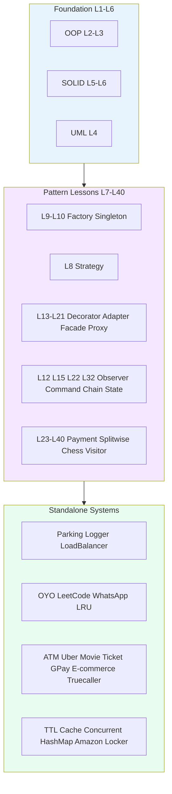
```mermaid
flowchart TB
    subgraph foundation [Foundation L1-L6]
        OOP[OOP L2-L3]
        SOLID[SOLID L5-L6]
        UML[UML L4]
    end

    subgraph lessons [Pattern Lessons L7-L40]
        CRE[L9-L10 Factory Singleton]
        STR[L8 Strategy]
        STRUCT[L13-L21 Decorator Adapter Facade Proxy]
        BEH[L12 L15 L22 L32 Observer Command Chain State]
        ADV[L23-L40 Payment Splitwise Chess Visitor]
    end

    subgraph systems [Standalone Systems]
        CORE[Parking Logger LoadBalancer]
        APP[OYO LeetCode WhatsApp LRU]
        DOMAIN[ATM Uber Movie Ticket GPay E-commerce Truecaller]
        INFRA[TTL Cache Concurrent HashMap Amazon Locker]
    end

    foundation --> lessons
    lessons --> systems

    style foundation fill:#e8f4fd
    style lessons fill:#f3e8ff
    style systems fill:#e8fdf0
```

### 0.2 Kaunsa pattern kitni baar use hua? (frequency)

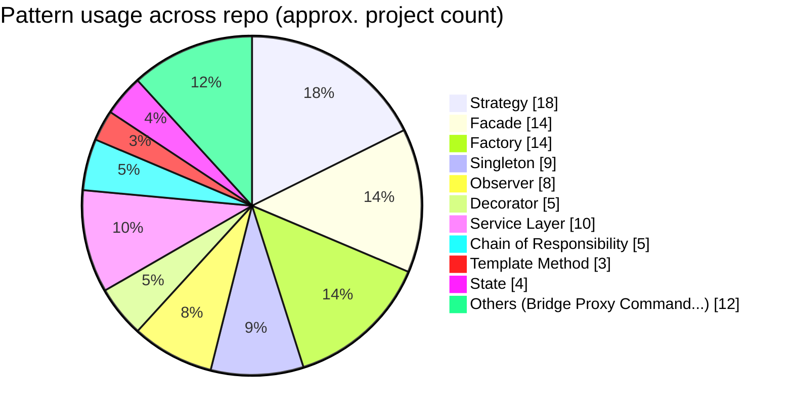
```mermaid
pie showData
    title Pattern usage across repo (approx. project count)
    "Strategy" : 18
    "Facade" : 14
    "Factory" : 14
    "Singleton" : 9
    "Observer" : 8
    "Decorator" : 5
    "Service Layer" : 10
    "Chain of Responsibility" : 5
    "Template Method" : 3
    "State" : 4
    "Others (Bridge Proxy Command...)" : 12
```

### 0.3 Pattern taxonomy → tumhare projects

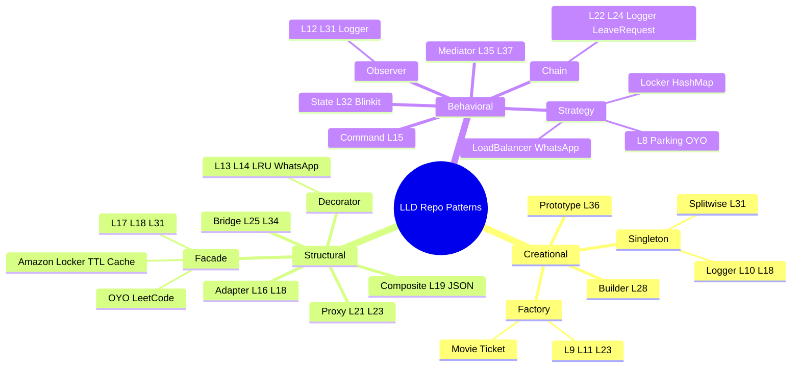
```mermaid
mindmap
  root((LLD Repo Patterns))
    Creational
      Singleton
        Logger L10 L18
        Splitwise L31
      Factory
        L9 L11 L23
        Movie Ticket
      Builder L28
      Prototype L36
    Structural
      Facade
        L17 L18 L31
        OYO LeetCode
        Amazon Locker TTL Cache
      Decorator
        L13 L14 LRU WhatsApp
      Adapter L16 L18
      Bridge L25 L34
      Proxy L21 L23
      Composite L19 JSON
    Behavioral
      Strategy
        L8 Parking OYO
        LoadBalancer WhatsApp
        Locker HashMap
      Observer
        L12 L31 Logger
      Chain
        L22 L24 Logger LeaveRequest
      State L32 Blinkit
      Command L15
      Mediator L35 L37
```

### 0.4 Top 10 “pattern-heavy” projects (star map)

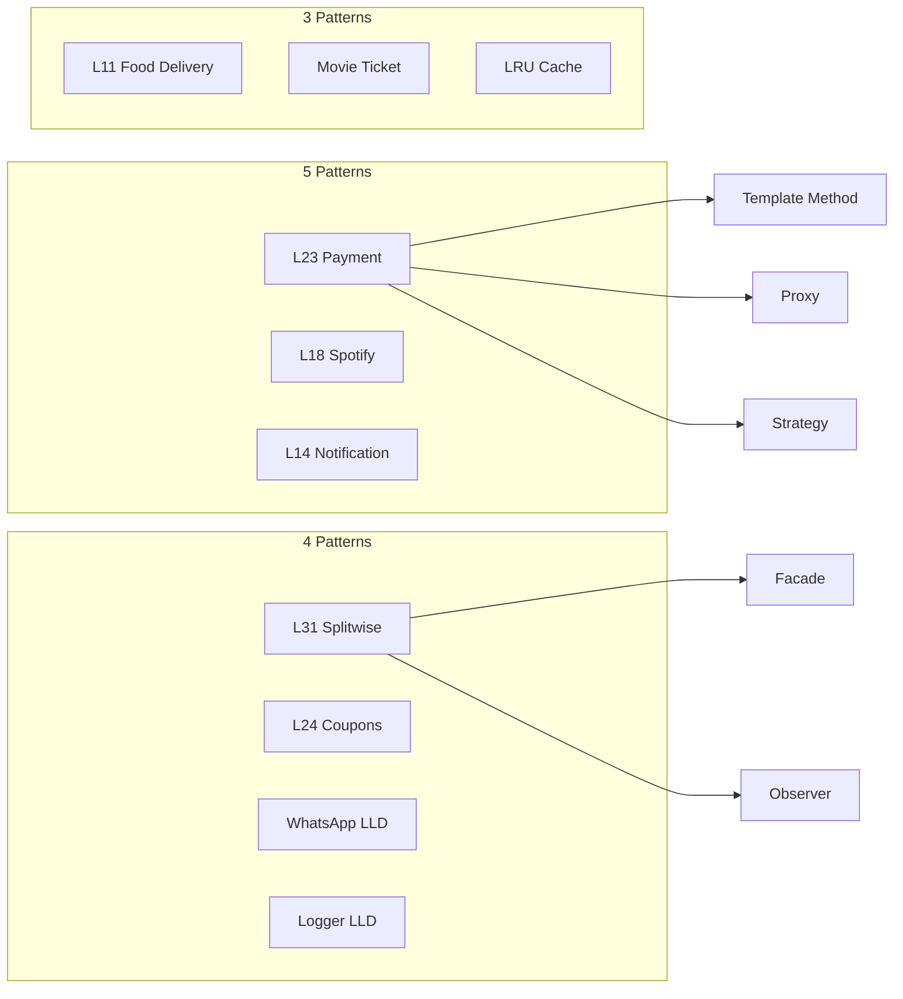
```mermaid
flowchart LR
    subgraph five_patterns [5 Patterns]
        L23[L23 Payment]
        L18[L18 Spotify]
        L14[L14 Notification]
    end

    subgraph four_patterns [4 Patterns]
        L31[L31 Splitwise]
        L24[L24 Coupons]
        WA[WhatsApp LLD]
        LOG[Logger LLD]
    end

    subgraph three_patterns [3 Patterns]
        L11[L11 Food Delivery]
        MT[Movie Ticket]
        LRU[LRU Cache]
    end

    L23 --> TM[Template Method]
    L23 --> PR[Proxy]
    L23 --> ST[Strategy]
    L31 --> FC[Facade]
    L31 --> OB[Observer]
```

### 0.5 Cheat sheet images (static visual)

| Sheet | Preview |
|-------|---------|
| Design patterns overview | 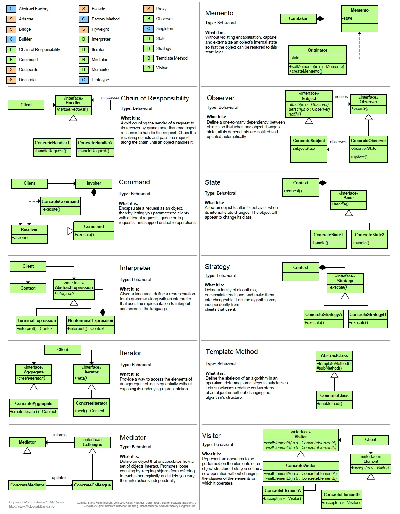 |
| Common problems → patterns | 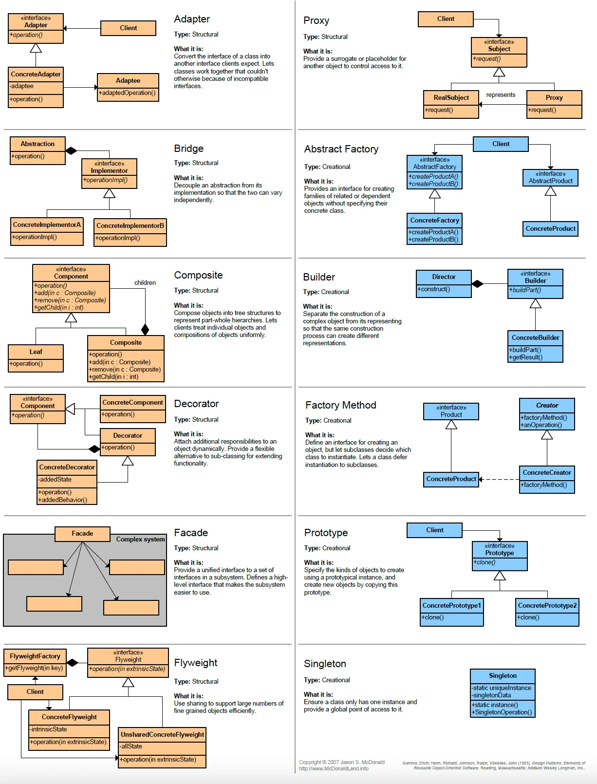 |

---

## 1. Master Table — Ek Nazar Mein

| # | Project / Lesson | Path | Design patterns used |
|---|------------------|------|----------------------|
| 1 | L7 Document Editor | [`L7 Document_Editor_LLD/`](../L7%20Document_Editor_LLD/) | **Strategy** (persistence), **Composite-like** (document elements) |
| 2 | L8 Strategy | [`L8 Strategy_Design_Patterns/`](../L8%20Strategy_Design_Patterns/) | **Strategy** |
| 3 | L9 Factory | [`L9 Factory_Design_Pattern/`](../L9%20Factory_Design_Pattern/) | **Simple Factory**, **Factory Method**, **Abstract Factory** |
| 4 | L10 Singleton | [`L10 Singleton_Design_Pattern/`](../L10%20Singleton_Design_Pattern/) | **Singleton** (naive, eager, mutex, DCLP) |
| 5 | L11 Food Delivery | [`L11 Food_Delivery_LLD/`](../L11%20Food_Delivery_LLD/) | **Facade**, **Factory**, **Strategy** |
| 6 | L12 Observer | [`L12 Observer_Design_Pattern/`](../L12%20Observer_Design_Pattern/) | **Observer** |
| 7 | L13 Decorator | [`L13 Decorator_Design_Pattern/`](../L13%20Decorator_Design_Pattern/) | **Decorator** |
| 8 | L14 Notification Engine | [`L14 Notification_Engine_LLD/`](../L14%20Notification_Engine_LLD/) | **Singleton**, **Decorator**, **Observer**, **Strategy** |
| 9 | L15 Command | [`L15 Command_Design_Pattern/`](../L15%20Command_Design_Pattern/) | **Command** |
| 10 | L16 Adapter | [`L16 Adapter_Design_Pattern/`](../L16%20Adapter_Design_Pattern/) | **Adapter** (object adapter) |
| 11 | L17 Facade | [`L17 Facade_Design_Pattern/`](../L17%20Facade_Design_Pattern/) | **Facade** |
| 12 | L18 Spotify | [`L18 Spotify_LLD/`](../L18%20Spotify_LLD/) | **Facade**, **Singleton**, **Strategy**, **Adapter**, **Factory** |
| 13 | L19 Composite | [`L19 Composite_Design_Pattern/`](../L19%20Composite_Design_Pattern/) | **Composite** |
| 14 | L20 Template Method | [`L20 Template_Method_Pattern/`](../L20%20Template_Method_Pattern/) | **Template Method** |
| 15 | L21 Proxy | [`L21 Proxy_Design_Pattern/`](../L21%20Proxy_Design_Pattern/) | **Proxy** (Virtual, Protection, Remote) |
| 16 | L22 Chain (ATM demo) | [`L22 Chain_of_responsiblity_patten(ATM LLD)/`](../L22%20Chain_of_responsiblity_patten(ATM%20LLD)/) | **Chain of Responsibility** |
| 17 | L23 Payment Gateway | [`L23 Payment_gateway_system_LLD/`](../L23%20Payment_gateway_system_LLD/) | **Template Method**, **Strategy**, **Proxy**, **Factory**, **Singleton** |
| 18 | L24 Discount Coupon | [`L24 Discount_coupon_engine_LLD/`](../L24%20Discount_coupon_engine_LLD/) | **Strategy**, **Chain of Responsibility**, **Singleton**, **Factory** |
| 19 | L25 Bridge | [`L25 Bridge_design_pattern/`](../L25%20Bridge_design_pattern/) | **Bridge** |
| 20 | L26 Blinkit | [`L26 Blinkit_LLD/`](../L26%20Blinkit_LLD/) | **Facade**, **Factory**, **Strategy**, order **State** (enum lifecycle) |
| 21 | L27 Tinder | [`L27 Tinder_LLD/`](../L27%20Tinder_LLD/) | **Facade**, **Service layer** |
| 22 | L28 Builder | [`L28 Builder_design_pattern/`](../L28%20Builder_design_pattern/) | **Builder** (+ Director, Step Builder) |
| 23 | L29 Iterator | [`L29 Iterator_design_pattern/`](../L29%20Iterator_design_pattern/) | **Iterator** |
| 24 | L30 Flyweight | [`L30 Flyweight_design_pattern/`](../L30%20Flyweight_design_pattern/) | **Flyweight** |
| 25 | L31 Splitwise | [`L31 Splitwise_LLD/`](../L31%20Splitwise_LLD/) | **Facade**, **Singleton**, **Strategy**, **Factory**, **Observer** |
| 26 | L32 State | [`L32 State_design_pattern/`](../L32%20State_design_pattern/) | **State** |
| 27 | L33 Tic-Tac-Toe | [`L33 Tic_Tac_Toe_LLD/`](../L33%20Tic_Tac_Toe_LLD/) | **Strategy**, **Observer**, **Factory** |
| 28 | L34 Snake & Ladder | [`L34 Snake_ladder_LLD/`](../L34%20Snake_ladder_LLD/) | **Bridge**, **Strategy**, **Factory**, **Observer** |
| 29 | L35 Mediator | [`L35 Mediator_design_pattern/`](../L35%20Mediator_design_pattern/) | **Mediator** |
| 30 | L36 Prototype | [`L36 Prototype_design_pattern/`](../L36%20Prototype_design_pattern/) | **Prototype** |
| 31 | L37 Chess | [`L37 Chess_LLD/`](../L37%20Chess_LLD/) | **Singleton**, **Strategy**, **Mediator**, **Factory** |
| 32 | L38 Visitor | [`L38 Visitor_design_pattern/`](../L38%20Visitor_design_pattern/) | **Visitor** |
| 33 | L39 Memento | [`L39 Memento_design_pattern/`](../L39%20Memento_design_pattern/) | **Memento** |
| 34 | L40 Null Object | [`L40 Null_object_pattern_and_Antipatterns/`](../L40%20Null_object_pattern_and_Antipatterns/) | **Null Object**, Antipatterns (notes) |
| 35 | ATM | [`ATM_LLD/`](../ATM_LLD/) | **Facade** (`ATMSystem`), **Service layer** |
| 36 | Car Rental | [`Car_Rental_System_LLD/`](../Car_Rental_System_LLD/) | **Service layer**, vehicle **State** (enum) |
| 37 | Elevator | [`Elevator_System_LLD/`](../Elevator_System_LLD/) | **Service layer**, scheduler (Facade-like) |
| 38 | JSON Parser | [`JSON_Parser_LLD/`](../JSON_Parser_LLD/) | **Composite** |
| 39 | Library Management | [`Library_Management_System_LLD/`](../Library_Management_System_LLD/) | **Service layer**, Facade-like core |
| 40 | LinkedIn | [`Linkedin_LLD/`](../Linkedin_LLD/) | **Service layer** (`FeedService`, connections) |
| 41 | Load Balancer | [`LoadBalancer_LLD/`](../LoadBalancer_LLD/) | **Strategy** (round-robin, least connections) |
| 42 | Logger | [`Logger_LLD/`](../Logger_LLD/) | **Singleton**, **Chain of Responsibility**, **Observer**-like appenders, **Strategy** (formatters) |
| 43 | Movie Ticket | [`Movie_Ticket_Booking_System/`](../Movie_Ticket_Booking_System/) | **Facade**, **Strategy**, **Factory** |
| 44 | Parking Lot | [`Parking_lot_system_LLD/`](../Parking_lot_system_LLD/) | **Strategy** (pricing) |
| 45 | Rate Limiter | [`Rate_Limiter_LLD/`](../Rate_Limiter_LLD/) | **Strategy**, **Factory** |
| 46 | LRU Cache | [`LRU_Cache_LLD/`](../LRU_Cache_LLD/) | **Facade**, **Decorator**, `ICache` interface |
| 47 | LFU Cache | [`LFU_Cache_LLD/`](../LFU_Cache_LLD/) | **Facade**, **Decorator**, `ICache` interface |
| 48 | OYO Hotel | [`OYO_Hotel_Booking_LLD/`](../OYO_Hotel_Booking_LLD/) | **Facade**, **Strategy** (pricing), **Service layer** |
| 49 | LeetCode Judge | [`LeetCode_LLD/`](../LeetCode_LLD/) | **Facade**, **Strategy** (`ICodeRunner`), **Service layer** |
| 50 | Ride Sharing | [`Ride_sharing_app_LLD/`](../Ride_sharing_app_LLD/) | **Service layer**, Facade-like orchestration |
| 51 | Uber | [`Uber_LLD/`](../Uber_LLD/) | **Service layer** (matching, fare, OTP, payment) |
| 52 | URL Shortener | [`URL_Shortner_LLD/`](../URL_Shortner_LLD/) | **Service layer** |
| 53 | Vending Machine | [`vending_machine_LLD/`](../vending_machine_LLD/) | Composition (`Inventory` + `MoneyManager`) |
| 54 | WhatsApp | [`WhatsApp_LLD/`](../WhatsApp_LLD/) | **Strategy** (encryption, notifications), **Null Object**, **Decorator**, **Observer** |
| 55 | Rate / WhatsApp (L14 modular) | [`L14 Notification_Engine_LLD/notification_lld/`](../L14%20Notification_Engine_LLD/notification_lld/) | Same as L14 stack |
| 56 | Amazon Locker Service | [`Amazon_Locker_Service_LLD/`](../Amazon_Locker_Service_LLD/) | **Facade**, **Strategy** (compartment allocation), **Service layer** (OTP, notify) |
| 57 | Concurrent HashMap | [`Concurrent_HashMap_LLD/`](../Concurrent_HashMap_LLD/) | **Strategy** (coarse vs lock striping), **Interface** (`IConcurrentMap`) |
| 58 | Thread-Safe TTL Cache | [`Thread_Safe_Cache_with_TTL_LLD/`](../Thread_Safe_Cache_with_TTL_LLD/) | **Facade-like** (`ThreadSafeTTLCache`), reader-writer concurrency (not GoF) |
| 59 | GPay (UPI P2P) | [`GPay_LLD/`](../GPay_LLD/) | **Facade** (`GPaySystem`), **Strategy** (bank vs wallet rail), **Factory** (rail + transaction) |
| 60 | Truecaller | [`Truecaller_LLD/`](../Truecaller_LLD/) | **Facade** (`TruecallerSystem`), **Strategy** (spam scoring), **Service layer** |
| 61 | Meeting Scheduler | [`Meeting_Scheduler_LLD/`](../Meeting_Scheduler_LLD/) | **Facade**, **Strategy** (free slots), **Factory**, **Service layer** |
| 62 | Task / Job Scheduler | [`Task_Scheduler_LLD/`](../Task_Scheduler_LLD/) | **Facade**, **Strategy** (priority/FIFO), **Observer**, **Factory**, worker pool |
| 63 | IRCTC Train Booking | [`IRCTC_LLD/`](../IRCTC_LLD/) | **Facade**, **Factory**, **Service layer**, segment ledger + `mutex` |
| 64 | Stock Exchange | [`Stock_Exchange_LLD/`](../Stock_Exchange_LLD/) | **Facade**, **Factory**, **Service layer** (order book + matching) |
| 65 | E-commerce Cart + Checkout | [`Ecommerce_Cart_Checkout_LLD/`](../Ecommerce_Cart_Checkout_LLD/) | **Facade**, **Strategy** (discount + payment), **Factory** (payment rails), **Service layer**, inventory reservation |
| 66 | Leave Request System | [`Leave_Request_System_LLD/`](../Leave_Request_System_LLD/) | **Chain of Responsibility** (approval chain), **Facade**, **Service layer** |
| 67 | Razorpay Payment Gateway | [`Razorpay_LLD/`](../Razorpay_LLD/) | **Facade**, **Template Method**, **Strategy**, **Factory**, webhooks + idempotency |

> **Note:** L1–L6 = OOP + SOLID foundation ([`L2 OOPS_1`](../L2%20OOPS_1/), [`L5 SOLID_1`](../L5%20SOLID_1/), [`L6 SOLID_2`](../L6%20SOLID_2/)) — design pattern **lessons** nahi, principles hain.

### 1.0 Master table — columns samjho

| Column | Matlab |
|--------|--------|
| **#** | Serial — revision order optional |
| **Project** | Lesson (L7–L40) ya standalone system folder |
| **Path** | Repo link — code kholo |
| **Patterns** | GoF patterns **actually used** in code (naam yaad karne ke liye) |

**Interview priority (stars — revision order):**

| Priority | Projects |
|----------|----------|
| ⭐⭐⭐ Must | Parking, Splitwise L31, Payment L23, **Razorpay**, BookMyShow, Logger, **Leave Request** (CoR), Spotify L18 |
| ⭐⭐ Strong | OYO, LRU, LeetCode, WhatsApp, L24 Coupons, Load Balancer, Movie Ticket, **Amazon Locker**, **Concurrent HashMap**, **TTL Cache**, **GPay**, **E-commerce Checkout**, **Truecaller**, **Task Scheduler**, **IRCTC**, **Stock Exchange** |
| ⭐ Good | Baaki lessons L7–L40 (pattern demos), Car Rental, Uber, JSON Parser, **Multi_threading_C++** labs |

### 1.1 Lesson learning path (recommended order)


```mermaid
gantt
    title Pattern lesson track (L7–L40)
    dateFormat X
    axisFormat %s

    section Creational
    L9 Factory           :a1, 0, 1
    L10 Singleton        :a2, 1, 2
    L28 Builder          :a3, 2, 3

    section Structural
    L13 Decorator        :b1, 3, 4
    L16 Adapter          :b2, 4, 5
    L17 Facade           :b3, 5, 6
    L19 Composite        :b4, 6, 7
    L21 Proxy            :b5, 7, 8
    L25 Bridge           :b6, 8, 9

    section Behavioral
    L8 Strategy          :c1, 0, 1
    L12 Observer         :c2, 9, 10
    L15 Command          :c3, 10, 11
    L22 Chain            :c4, 11, 12
    L32 State            :c5, 12, 13

    section System LLD
    L23 Payment          :d1, 13, 14
    L31 Splitwise        :d2, 14, 15
    L18 Spotify          :d3, 15, 16
```

---

## 2. Lesson Projects (L7 – L40)

Har lesson ke liye:

- **Problem** — kya solve ho raha hai  
- **Patterns** — kaun use hue  
- **Kyun** — interviewer ko yeh line bolni hai  
- **Classes** — code mein kahan dikhega  

---

### L7 — Document Editor

| | |
|---|---|
| **Path** | [`L7 Document_Editor_LLD/`](../L7%20Document_Editor_LLD/) |
| **Problem** | Document save/load alag-alag format (file, cloud) — core editor ko format se matlab nahi |
| **Patterns** | **Strategy** (persistence), **Composite-like** (sections/paragraphs tree) |

**Kyun Strategy?** Naya storage (S3, DB) = nayi `PersistenceStrategy` — `DocumentEditor` change nahi.

**Kyun Composite-like?** Section ke andar paragraph ke andar image — same `render()` / `save()` treat leaf & container.

| Pattern | Class / file |
|---------|----------------|
| Strategy | `GoodDesign/` vs `BadDesign/` — persistence abstraction |
| Composite-like | Document element tree |

---

### L8 — Strategy

| | |
|---|---|
| **Path** | [`L8 Strategy_Design_Patterns/`](../L8%20Strategy_Design_Patterns/) |
| **Problem** | Robot types alag behaviour (walk/fly/talk) — inheritance explosion avoid |
| **Patterns** | **Strategy** (3 behaviour axes) |

**Interview line:** “Behaviour composition — `CompanionRobot` = walk + talk, `WorkerRobot` = fly only; behaviours swap without new robot subclass.”

| Pattern | Class / file |
|---------|----------------|
| Strategy | `WalkableRobot`, `TalkableRobot`, `FlyableRobot` + `NormalWalk`, `NoWalk`, etc. |
| Context | `Robot`, `CompanionRobot`, `WorkerRobot` |

### L9 — Factory
| Pattern | Class / file |
|---------|----------------|
| Simple Factory | `BurgerFactory::createBurger()` |
| Factory Method | `SinghBurgerFactory`, `KingBurgerFactory` |
| Abstract Factory | Burger + GarlicBread families |

### L10 — Singleton
| Pattern | Class / file |
|---------|----------------|
| Singleton | `SimpleSingleton`, `ThreadSafeEagerSingleton`, `ThreadSafeLockingSingleton`, `ThreadSafeDoubleLockingSingleton` |

### L11 — Food Delivery (Tomato)

| | |
|---|---|
| **Path** | [`L11 Food_Delivery_LLD/`](../L11%20Food_Delivery_LLD/) |
| **Problem** | Order now vs scheduled, payment modes, restaurant flow — client ko simple API |
| **Patterns** | **Facade**, **Factory**, **Strategy** |

| Pattern | Class |
|---------|-------|
| Facade | `TomatoApp` — place order, track, pay |
| Factory | `NowOrderFactory`, `ScheduledOrderFactory` |
| Strategy | `PaymentStrategy` — UPI, card, wallet |

**Full LLD example:** Facade hides `RestaurantManager`, `OrderManager`, notification — interview mein 3-layer draw karo.

### L12 — Observer
| Pattern | Class / file |
|---------|----------------|
| Observer | Subject + Observer interfaces, concrete observers |

### L13 — Decorator
| Pattern | Class / file |
|---------|----------------|
| Decorator | `Character_Decorator`, `HeightUp`, `GunPowerUp`, `StarPowerUp` on `Mario` |

### L14 — Notification Engine
| Pattern | Class / file |
|---------|----------------|
| Singleton | Engine registry |
| Decorator | Timestamp, signature on notifications |
| Observer | Channel subscribers |
| Strategy | Delivery / channel selection |

### L15 — Command
| Pattern | Class / file |
|---------|----------------|
| Command | `LightCommand`, `FanCommand` |
| Invoker | `RemoteControl` (execute / undo) |

### L16 — Adapter
| Pattern | Class / file |
|---------|----------------|
| Adapter | `XmlDataProviderAdapter` → `IReports` |

### L17 — Facade
| Pattern | Class / file |
|---------|----------------|
| Facade | `ComputerFacade` → boot subsystems |

### L18 — Spotify

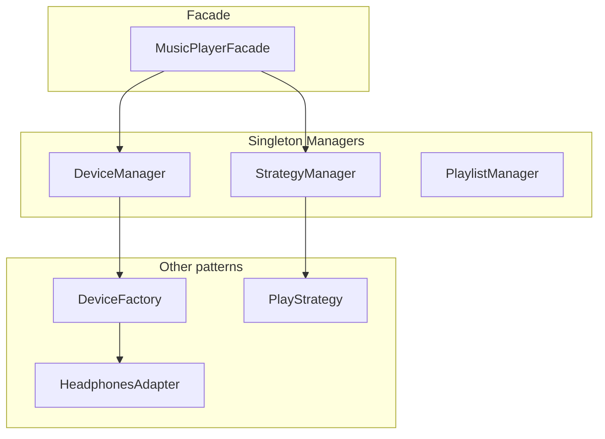
```mermaid
graph TB
    subgraph facade [Facade]
        MF[MusicPlayerFacade]
    end
    subgraph managers [Singleton Managers]
        DM[DeviceManager]
        SM[StrategyManager]
        PM[PlaylistManager]
    end
    subgraph patterns [Other patterns]
        DF[DeviceFactory]
        PS[PlayStrategy]
        AD[HeadphonesAdapter]
    end
    MF --> DM
    MF --> SM
    DM --> DF
    DF --> AD
    SM --> PS
```

| Pattern | Class / file |
|---------|----------------|
| Facade | `MusicPlayerFacade` |
| Singleton | `MusicPlayerApplication`, `DeviceManager`, `StrategyManager`, `PlaylistManager` |
| Strategy | `PlayStrategy`, `RandomPlayStrategy`, `CustomQueueStrategy` |
| Factory | `DeviceFactory` |
| Adapter | `HeadphonesAdapter`, `WiredSpeakerAdapter` |

### L19 — Composite
| Pattern | Class / file |
|---------|----------------|
| Composite | `File`, `Directory`, `getSize()` recursive |

### L20 — Template Method
| Pattern | Class / file |
|---------|----------------|
| Template Method | Base class skeleton + subclass hooks |

### L21 — Proxy
| Pattern | Class / file |
|---------|----------------|
| Virtual Proxy | Lazy image load |
| Protection Proxy | Premium document access |
| Remote Proxy | Remote data stand-in |

### L22 — Chain of Responsibility
| Pattern | Class / file |
|---------|----------------|
| Chain | `MoneyHandler`, `ThousandHandler`, `FiveHundredHandler`, … |

### L23 — Payment Gateway

| | |
|---|---|
| **Path** | [`L23 Payment_gateway_system_LLD/`](../L23%20Payment_gateway_system_LLD/) |
| **Problem** | Multiple gateways (Paytm, Razorpay) — same flow, different steps; retry on failure |
| **Patterns** | **Template Method**, **Strategy**, **Proxy**, **Factory**, **Singleton** |

| Pattern | Kyun yahan? | Class |
|---------|-------------|-------|
| **Template Method** | Har gateway: validate → initiate → confirm **fixed order** | `PaymentGateway::processPayment()` |
| **Strategy** | Razorpay banking API ≠ Paytm — pluggable backend | `BankingSystem` |
| **Proxy** | Retry / logging bina real gateway change | `PaymentGatewayProxy` |
| **Factory** | Client ko `new PaytmGateway()` nahi | `GatewayFactory` |
| **Singleton** | Single entry `handlePayment()` | `PaymentController` |

**Main flow:** `PaymentController` → `GatewayFactory` → proxied gateway → template steps → banking strategy.

**Extension bolna:** “Add Stripe = `StripeGateway` subclass + factory branch — `processPayment` skeleton same.”

**Razorpay-only lifecycle:** [`Razorpay_LLD/`](../Razorpay_LLD/) — orders, capture, webhooks, refunds (not a second gateway in L23).

### L24 — Discount Coupon Engine

| | |
|---|---|
| **Path** | [`L24 Discount_coupon_engine_LLD/`](../L24%20Discount_coupon_engine_LLD/) |
| **Problem** | Multiple offers (seasonal, loyalty, bank) — sequential apply, alag eligibility |
| **Patterns** | **Strategy**, **Chain of Responsibility**, **Singleton**, **Factory** |

| Pattern | Kyun? | Class |
|---------|-------|-------|
| **Strategy** | Discount math alag (flat / % / cap) | `IDiscountStrategy`, `FlatDiscountStrategy`, … |
| **Chain** | Coupons chain mein apply — combinable flag | `Coupon` → `SeasonalOffer` → … |
| **Singleton** | Thread-safe coupon registry | `CouponManager` |
| **Factory** | Strategy creation ek jagah | `DiscountStrategyManager::createStrategy()` |

**Demo output:** ₹25000 cart → multiple coupons → ~₹22865 final.

### L25 — Bridge
| Pattern | Class / file |
|---------|----------------|
| Bridge | `Car` × `Engine` (petrol/diesel variants) |

### L26 — Blinkit
| Pattern | Class / file |
|---------|----------------|
| Facade | `BlinkitSystem` |
| Factory | `ProductFactory` |
| Strategy | Replenish strategies (in `ZeptoClone.cpp` / inventory) |
| State (enum) | Order: PLACED → DELIVERED / CANCELLED |

### L27 — Tinder
| Pattern | Class / file |
|---------|----------------|
| Facade | `TinderSystem` |
| Service layer | `MatchingService`, swipe limits, chat |

### L28 — Builder *(pattern-only lesson)*
| Pattern | Class / file |
|---------|----------------|
| Builder | `HttpRequestBuilder` |
| Director | `BuilderWithDirector` |
| Step Builder | `StepBuilder` |

### L29 — Iterator *(pattern-only lesson)*
| Pattern | Class / file |
|---------|----------------|
| Iterator | `Iterator<T>`, linked list / tree / playlist |

### L30 — Flyweight *(pattern-only lesson)*
| Pattern | Class / file |
|---------|----------------|
| Flyweight | `WithFlyWeight.cpp` vs `WithoutFlyWeight.cpp` |

### L31 — Splitwise

| | |
|---|---|
| **Path** | [`L31 Splitwise_LLD/`](../L31%20Splitwise_LLD/) |
| **Problem** | Group expenses, unequal splits, balances, debt simplify, notify members |
| **Patterns** | **Facade**, **Singleton**, **Strategy**, **Factory**, **Observer** |

| Pattern | Kyun? | Class |
|---------|-------|-------|
| **Facade** | Client sirf `addExpense`, `showBalances` — andar ka graph hide | `Splitwise` |
| **Strategy** | Equal / exact amount / percent split alag algorithm | `SplitStrategy`, `EqualSplit`, … |
| **Factory** | `SplitType::EQUAL` se strategy — switch ek jagah | `SplitFactory` |
| **Observer** | Naya expense → group ko notification | Observer on group |
| **Singleton** | Demo-style single app instance | `getInstance()` |

**Algo highlight (non-GoF):** `DebtSimplifier` — minimum cash flow settle karna — interview differentiator.

**APIs yaad rakho:** `createUser`, `createGroup`, `addExpenseToGroup`, `simplifyGroupDebts`, `showGroupBalances`.

### L32 — State
| Pattern | Class / file |
|---------|----------------|
| State | `VendingState`, `NoCoinState`, `HasCoinState`, `DispenseState`, `SoldOutState` |

### L33 — Tic-Tac-Toe
| Pattern | Class / file |
|---------|----------------|
| Strategy | `TicTacToeRules` / standard rules |
| Observer | `ConsoleNotifier` |
| Factory | `TicTacToeGameFactory` |

### L34 — Snake & Ladder
| Pattern | Class / file |
|---------|----------------|
| Bridge | `BoardSetupBridge` |
| Strategy | `BoardSetupStrategy` (standard / random / custom) |
| Factory | `SnakeAndLadderGameFactory` |
| Observer | `SnakeAndLadderConsoleNotifier` |

### L35 — Mediator
| Pattern | Class / file |
|---------|----------------|
| Mediator | Chat room — `WithoutMediator` vs with mediator |

### L36 — Prototype
| Pattern | Class / file |
|---------|----------------|
| Prototype | `PrototypePattern.cpp` — `clone()` on NPC |

### L37 — Chess
| Pattern | Class / file |
|---------|----------------|
| Singleton | `GameManager` |
| Strategy | `MatchingStrategy`, `ChessRules` |
| Mediator | `ChatMediator` in `Match` |
| Factory | `PieceFactory` |

### L38 — Visitor
| Pattern | Class / file |
|---------|----------------|
| Visitor | `FileSystemVisitor`, `SizeCalculationVisitor`, `CompressionVisitor` |

### L39 — Memento
| Pattern | Class / file |
|---------|----------------|
| Memento | `Database`, `DatabaseMemento`, `TransactionManager` |

### L40 — Null Object
| Pattern | Class / file |
|---------|----------------|
| Null Object | Notes / PDF — concept + antipatterns |

---

## 3. Standalone System Projects

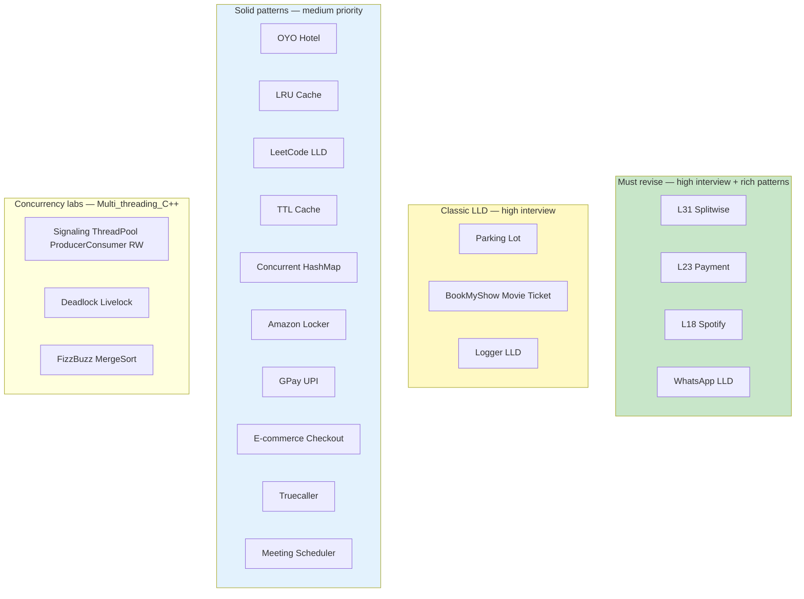
```mermaid
flowchart TB
    subgraph must [Must revise — high interview + rich patterns]
        SW[L31 Splitwise]
        PAY[L23 Payment]
        SP[L18 Spotify]
        WA[WhatsApp LLD]
    end

    subgraph classic [Classic LLD — high interview]
        PK[Parking Lot]
        BK[BookMyShow Movie Ticket]
        LOG[Logger LLD]
    end

    subgraph solid [Solid patterns — medium priority]
        OYO[OYO Hotel]
        LRU[LRU Cache]
        LC[LeetCode LLD]
        TTL[TTL Cache]
        CHM[Concurrent HashMap]
        LOCKER[Amazon Locker]
        GPAY[GPay UPI]
        ECOMM[E-commerce Checkout]
        TC[Truecaller]
        MSCH[Meeting Scheduler]
    end

    subgraph concurrency [Concurrency labs — Multi_threading_C++]
        PAT[Signaling ThreadPool ProducerConsumer RW]
        CHL[Deadlock Livelock]
        INT[FizzBuzz MergeSort]
    end

    style must fill:#c8e6c9
    style classic fill:#fff9c4
    style solid fill:#e3f2fd
```

### Parking Lot

| | |
|---|---|
| **Path** | [`Parking_lot_system_LLD/`](../Parking_lot_system_LLD/) |
| **Priority** | ⭐⭐⭐ (sabse common LLD interview) |
| **Problem** | Multi vehicle type, entry ticket, exit par fee — pricing rule badal sakti hai |
| **Patterns** | **Strategy** (pricing), Facade-like **ParkingLot** |

| Pattern | Kyun? | File |
|---------|-------|------|
| **Strategy** | Car vs bike vs truck alag rate; festival pricing = nayi strategy class | `HourlyPricingStrategy` |
| Facade-like | `park()`, `unpark()`, `calculateFee()` ek entry | `ParkingLot.h` |

```cpp
// main.cpp — Strategy inject at construction
ParkingLot* lot = new ParkingLot(new HourlyPricingStrategy());
```

**Bolna interview mein:** “`ParkingLot` depends on `PricingStrategy*` — OCP; naya `WeekendPricingStrategy` without editing lot logic.”

**Entities:** `Vehicle`, `ParkingSpot`, `Ticket`, `ParkingLot`, `ParkingSpotManager`.

### Logger

| | |
|---|---|
| **Path** | [`Logger_LLD/`](../Logger_LLD/) |
| **Priority** | ⭐⭐⭐ |
| **Problem** | Log levels, multiple outputs, formats — ek pipeline |
| **Patterns** | **Singleton**, **Chain of Responsibility**, **Strategy**, Observer-like **Appenders** |

| Step | Component | Detail |
|------|-----------|--------|
| 1 | `Logger::getInstance()` | Singleton — ek entry point |
| 2 | `DebugHandler → … → FatalHandler` | Chain — level pass/filter |
| 3 | `PlainTextFormatter` / `JsonFormatter` | Strategy — output format |
| 4 | `ConsoleAppender` / `FileAppender` | Multiple sinks (observer-like) |

**Build:** `LogHandlerConfiguration::build()` — chain wire hoti hai startup par.

```bash
cd Logger_LLD && g++ -std=c++17 Main.cpp -o logger_app && ./logger_app
```

### Load Balancer

| | |
|---|---|
| **Path** | [`LoadBalancer_LLD/`](../LoadBalancer_LLD/) |
| **Priority** | ⭐⭐ |
| **Problem** | Distribute requests across servers — algorithm runtime pe swap |
| **Patterns** | **Strategy** |

| Implementation | File | Behaviour |
|----------------|------|-----------|
| Round Robin | `RoundRobinStrategy.h` | Cyclic server pick |
| Least Connections | `LeastConnectionsStrategy.h` | Min active connections |

**Interview:** “`LoadBalancer` holds `LoadBalancingStrategy*` — health check + connection count alag strategy class mein.”

### Rate Limiter
| Pattern | Where |
|---------|-------|
| **Strategy** | Token bucket, sliding window, fixed window |
| **Factory** | Limiter / algorithm creation |

### Movie Ticket Booking (BookMyShow-style)

| | |
|---|---|
| **Path** | [`Movie_Ticket_Booking_System/`](../Movie_Ticket_Booking_System/) |
| **Priority** | ⭐⭐⭐ |
| **Problem** | Movies, shows, seat lock, pricing by seat type, payment |
| **Patterns** | **Facade**, **Strategy**, **Factory** |

| Class | Role |
|-------|------|
| `MovieTicketSystem` | Facade — book, search, pay |
| `PricingStrategy` | VIP vs normal seat pricing |
| `BookingFactory` | Booking object creation |
| `CatalogManager`, `ShowManager` | Domain managers |

**Concurrency topic:** Seat lock during booking — interview mein `mutex` / optimistic lock discuss karo.

### LRU / LFU Cache
| Pattern | Where |
|---------|-------|
| **Facade** | `CacheService` |
| **Decorator** | `ThreadSafeLRUCache` / `ThreadSafeLFUCache` wraps core |
| Interface | `ICache` |

### OYO Hotel Booking

| | |
|---|---|
| **Path** | [`OYO_Hotel_Booking_LLD/`](../OYO_Hotel_Booking_LLD/) |
| **Priority** | ⭐⭐ |
| **Problem** | Search city, date-range availability, book room, pricing, check-in/out |
| **Patterns** | **Facade**, **Strategy**, **Service layer** |

| Layer | Class | Kaam |
|-------|-------|------|
| Facade | `OYOHotelBookingSystem` | `createBooking`, `cancelBooking`, `searchHotelsByCity` |
| Strategy | `StandardPricingStrategy`, `WeekendSurchargePricingStrategy` | Per-night price |
| Service | `AvailabilityService` | Overlap check `[checkIn, checkOut)` |
| Service | `PricingService` | Total = nights × strategy rate |
| Service | `NotificationService` | Console notify on book/cancel |

**Interview constraint:** Integer **days** as dates (simplified) — overlap rule half-open interval explain karna.

**UML:** [Section 21 — SYSTEM_CLASS_AND_SEQUENCE_DIAGRAMS.md](SYSTEM_CLASS_AND_SEQUENCE_DIAGRAMS.md)

### LeetCode LLD

| | |
|---|---|
| **Path** | [`LeetCode_LLD/`](../LeetCode_LLD/) |
| **Priority** | ⭐⭐ |
| **Problem** | Online judge — submit code, run tests, verdict, leaderboard |
| **Patterns** | **Facade**, **Strategy**, **Service layer** |

| Component | Pattern role |
|-----------|--------------|
| `LeetCodeSystem` | Facade — `registerUser`, `submitSolution`, `getLeaderboard` |
| `ICodeRunner` / `MockCodeRunner` | Strategy — real judge vs mock |
| `CatalogService`, `JudgeService`, `LeaderboardService` | Services |

**HARD problem:** `MIN_COST_DIVIDE_ARRAY` — O(n²) DP in repo.

**UML:** [Section 20](SYSTEM_CLASS_AND_SEQUENCE_DIAGRAMS.md)

### WhatsApp LLD
| Pattern | Where |
|---------|-------|
| **Strategy** | `EncryptionService`, `INotificationStrategy` (email/SMS/popup) |
| **Null Object** | `NoOpEncryptionService` |
| **Decorator** | `TimestampDecorator`, `SignatureDecorator` |
| **Observer** | `LoggerObserver`, notification observable |
| Facade-like | `WhatsAppSystem` |

### Amazon Locker Service

| | |
|---|---|
| **Path** | [`Amazon_Locker_Service_LLD/`](../Amazon_Locker_Service_LLD/) |
| **Priority** | ⭐⭐ |
| **Problem** | Courier deposits package → customer picks up with OTP; finite compartments S/M/L |
| **Patterns** | **Facade**, **Strategy**, **Service layer** |

| Pattern | Kyun? | Class / file |
|---------|-------|--------------|
| **Facade** | Single API: `depositPackage`, `pickupPackage`, `registerStation` | `AmazonLockerService` |
| **Strategy** | Swap compartment picker (First-Fit vs Best-Fit later) | `ICompartmentAllocationStrategy`, `FirstFitAllocationStrategy` |
| **Service layer** | OTP generation/validation separate from notify | `AccessCodeService`, `NotificationService` |
| Domain models | Station, compartment, package, access code state | `LockerStation`, `LockerCompartment`, `Package`, `AccessCode` |

**Interview:** “Allocation strategy picks free compartment by size; facade orchestrates deposit → OTP → pickup without god class.”

**UML:** [Section 22 — SYSTEM_CLASS_AND_SEQUENCE_DIAGRAMS.md](SYSTEM_CLASS_AND_SEQUENCE_DIAGRAMS.md#22-amazon-locker-service)

```bash
cd Amazon_Locker_Service_LLD && ./compile.sh && ./amazon_locker_app
```

### Concurrent HashMap

| | |
|---|---|
| **Path** | [`Concurrent_HashMap_LLD/`](../Concurrent_HashMap_LLD/) |
| **Priority** | ⭐⭐ (concurrency + LLD combo) |
| **Problem** | Thread-safe `put`/`get`/`remove` — compare coarse lock vs lock striping |
| **Patterns** | **Strategy**, **Interface segregation** |

| Pattern | Kyun? | Class / file |
|---------|-------|--------------|
| **Interface** | Pluggable map implementations | `IConcurrentMap` |
| **Strategy** | Runtime choice: one global mutex vs per-stripe mutex | `CoarseGrainedHashMap`, `StripedHashMap` |
| Alias / default | Production default = striped | `ConcurrentHashMap` = `StripedHashMap` |
| Stats | Hits/misses for demos | `MapStatistics` |

**Interview:** “Striping reduces contention when keys hash to different stripes; hot key still serializes on one stripe.”

**UML:** [Section 23](SYSTEM_CLASS_AND_SEQUENCE_DIAGRAMS.md#23-concurrent-hashmap)

```bash
cd Concurrent_HashMap_LLD && ./compile.sh && ./concurrent_hashmap_app
```

### Thread-Safe TTL Cache

| | |
|---|---|
| **Path** | [`Thread_Safe_Cache_with_TTL_LLD/`](../Thread_Safe_Cache_with_TTL_LLD/) |
| **Priority** | ⭐⭐ |
| **Problem** | In-memory cache with per-key TTL, lazy expiry, capacity eviction |
| **Patterns** | **Facade-like** entry, **Decorator**-adjacent (compare LRU thread-safe wrapper) |

| Pattern | Kyun? | Class / file |
|---------|-------|--------------|
| Facade-like | One class: `put`, `get`, `contains`, `cleanupExpired`, stats | `ThreadSafeTTLCache` |
| Concurrency | `shared_mutex` — shared reads, exclusive writes | `get()` vs `put()` lock modes |
| Model | Value + expiry timepoint | `CacheEntry` |
| Stats | Hits, misses, evictions | `CacheStatistics` |

**Related:** [`LRU_Cache_LLD/`](../LRU_Cache_LLD/) uses **Decorator** `ThreadSafeLRUCache` on core — TTL project is standalone eviction + expiry focus.

**UML:** [Section 24](SYSTEM_CLASS_AND_SEQUENCE_DIAGRAMS.md#24-thread-safe-ttl-cache)

```bash
cd Thread_Safe_Cache_with_TTL_LLD && ./compile.sh && ./cache_ttl_app
```

### E-commerce Cart + Checkout

| | |
|---|---|
| **Path** | [`Ecommerce_Cart_Checkout_LLD/`](../Ecommerce_Cart_Checkout_LLD/) |
| **Priority** | ⭐⭐⭐ (Flipkart / Amazon — cart, coupon, pay, order) |
| **Problem** | Add to cart, reserve inventory, apply coupon, compute shipping, pay via UPI/Card/COD, confirm or rollback |
| **Patterns** | **Facade**, **Strategy** (discount + payment), **Factory** (payment rails), **Service layer** |

| Pattern | Kyun? | Class / file |
|---------|-------|--------------|
| Facade | Single checkout API for client | `EcommerceCheckoutSystem` |
| Strategy | Pluggable discount rules (`SAVE10`, `FLAT100`) | `IDiscountStrategy`, `PercentageDiscountStrategy`, `FlatDiscountStrategy` |
| Strategy | UPI / Card / COD without `if` chains | `IPaymentStrategy`, `UpiPaymentStrategy`, `CardPaymentStrategy`, `CodPaymentStrategy` |
| Factory | Create payment strategy by enum | `PaymentStrategyFactory` |
| Service layer | Cart, inventory hold, pricing, checkout orchestration | `CartService`, `InventoryService`, `CheckoutService`, `PricingService`, `CouponService` |

**Note:** End-to-end checkout slice — pairs with [`L24 Discount_coupon_engine_LLD`](../L24%20Discount_coupon_engine_LLD/) (coupon math only) and [`L23`](../L23%20Payment_gateway_system_LLD/) (merchant gateway).

**UML:** [Section 31](SYSTEM_CLASS_AND_SEQUENCE_DIAGRAMS.md#31-e-commerce-cart--checkout)

```bash
cd Ecommerce_Cart_Checkout_LLD && ./compile.sh && ./ecommerce_checkout_app
```

### Leave Request System

| | |
|---|---|
| **Path** | [`Leave_Request_System_LLD/`](../Leave_Request_System_LLD/) |
| **Priority** | ⭐⭐⭐ (HR / workforce — approval workflow; classic **Chain of Responsibility** demo) |
| **Problem** | Submit leave, multi-level approval by duration, cancel pending, query history |
| **Patterns** | **Chain of Responsibility**, **Facade**, **Service layer** |

| Pattern | Kyun? | Class / file |
|---------|-------|--------------|
| **Chain of Responsibility** | Team Lead → Manager → HR → Director; first handler with authority approves | `LeaveApprovalHandler`, `TeamLeadHandler`, `ManagerHandler`, `HRHandler`, `DirectorHandler` |
| **Facade** | Single API for register, submit, approve, cancel | `LeaveRequestSystem` |
| Service layer | Registry + run approval chain | `LeaveRegistryService`, `LeaveApprovalService` |
| Manager | Wire handler chain at startup | `LeaveApprovalChainManager` |

**Note:** Pairs with [`L22 Chain (ATM)`](../L22%20Chain_of_responsiblity_patten(ATM_Cash_Dispenser%20LLD)/) (dispense notes) and [`Logger_LLD`](../Logger_LLD/) (log level chain) — same CoR pattern, different domain.

**UML:** [Section 32](SYSTEM_CLASS_AND_SEQUENCE_DIAGRAMS.md#32-leave-request-system)

```bash
cd Leave_Request_System_LLD && ./compile.sh && ./leave_request_app
```

### Razorpay Payment Gateway

| | |
|---|---|
| **Path** | [`Razorpay_LLD/`](../Razorpay_LLD/) |
| **Priority** | ⭐⭐⭐ (Fintech — **dedicated Razorpay** order → pay → capture → webhook → refund) |
| **Problem** | Merchant Razorpay integration: orders (paise), payments, capture, signature verify, refunds |
| **Patterns** | **Facade**, **Template Method**, **Strategy**, **Factory**, **Service layer** |

| Pattern | Kyun? | Class / file |
|---------|-------|--------------|
| **Facade** | Single merchant API | `RazorpayPaymentSystem` |
| **Template Method** | Fixed checkout skeleton with hooks | `CheckoutFlowTemplate` |
| **Strategy** | UPI / Card / Wallet validation | `IPaymentMethodValidator`, `*Validator` |
| **Factory** | `order_` / `pay_` / `rfnd_` ids, validator pick | `EntityIdFactory`, `PaymentMethodValidatorFactory` |
| Service layer | Order, payment, capture, refund, webhook, idempotency | `OrderService`, `PaymentService`, `CaptureService`, `RefundService`, `WebhookService`, `IdempotencyService` |

**Note:** [`L23`](../L23%20Payment_gateway_system_LLD/) = multi-gateway **patterns** demo (Paytm + Razorpay). **Razorpay_LLD** = Razorpay-only production-shaped lifecycle.

**UML:** [Section 33](SYSTEM_CLASS_AND_SEQUENCE_DIAGRAMS.md#33-razorpay-payment-gateway)

```bash
cd Razorpay_LLD && ./compile.sh && ./razorpay_app
```

### GPay (UPI P2P)

| | |
|---|---|
| **Path** | [`GPay_LLD/`](../GPay_LLD/) |
| **Priority** | ⭐⭐⭐ (fintech / UPI — Google Pay, PhonePe style) |
| **Problem** | Register UPI ID, link bank, P2P send, QR scan-and-pay, request money, ledger |
| **Patterns** | **Facade**, **Strategy** (payment rail), **Factory**, **Service layer** |

| Pattern | Kyun? | Class / file |
|---------|-------|--------------|
| Facade | Single entry for all user flows | `GPaySystem` |
| Strategy | Bank debit/credit vs GPay wallet without `if` chains | `BankAccountRailStrategy`, `WalletRailStrategy` |
| Factory | Pick rail strategy + build `Transaction` | `PaymentRailFactory`, `TransactionFactory` |
| Service layer | PIN, daily limit, transfer orchestration, ledger | `TransferService`, `PinAuthService`, `DailyLimitService`, `TransactionLedgerService`, `RequestMoneyService` |

**Note:** Consumer UPI app — alag from [`L23 Payment_gateway_system_LLD`](../L23%20Payment_gateway_system_LLD/) (merchant gateway).

**UML:** [Section 25](SYSTEM_CLASS_AND_SEQUENCE_DIAGRAMS.md#25-gpay-upi-p2p)

```bash
cd GPay_LLD && ./compile.sh && ./gpay_app
```

### Truecaller

| | |
|---|---|
| **Path** | [`Truecaller_LLD/`](../Truecaller_LLD/) |
| **Priority** | ⭐⭐ (caller ID, spam, block — mobile utility) |
| **Problem** | Contact sync, incoming caller lookup, spam report, block list, search, call log |
| **Patterns** | **Facade**, **Strategy** (spam score), **Service layer** |

| Pattern | Kyun? | Class / file |
|---------|-------|--------------|
| Facade | One API for register, lookup, sync, block | `TruecallerSystem` |
| Strategy | Pluggable spam scoring (crowd reports + rules) | `ISpamScoringStrategy`, `DefaultSpamScoringStrategy` |
| Service layer | Lookup, sync, block, search, call log | `LookupService`, `ContactSyncService`, `SpamReportService`, `BlockService`, `SearchService`, `CallLogService` |

**UML:** [Section 26](SYSTEM_CLASS_AND_SEQUENCE_DIAGRAMS.md#26-truecaller)

```bash
cd Truecaller_LLD && ./compile.sh && ./truecaller_app
```

### Meeting Scheduler

| | |
|---|---|
| **Path** | [`Meeting_Scheduler_LLD/`](../Meeting_Scheduler_LLD/) |
| **Priority** | ⭐⭐⭐ (Calendly / Google Calendar — Microsoft/Meta favorite) |
| **Problem** | Availability, conflict-safe booking, mutual free-slot discovery |
| **Patterns** | **Facade**, **Strategy**, **Factory**, **Service layer** |

| Pattern | Kyun? | Class / file |
|---------|-------|--------------|
| Facade | One API for users, availability, booking | `MeetingSchedulerSystem` |
| Strategy | Pluggable slot scan (15-min grid) | `EarliestMutualSlotStrategy` |
| Factory | Create `Meeting` consistently | `MeetingFactory` |
| Service layer | Availability, conflict, booking, slot finder | `AvailabilityService`, `ConflictDetectionService`, `BookingService`, `SlotFinderService` |

**UML:** [Section 27](./SYSTEM_CLASS_AND_SEQUENCE_DIAGRAMS.md#27-meeting-scheduler)

```bash
cd Meeting_Scheduler_LLD && ./compile.sh && ./meeting_scheduler_app
```

### Task / Job Scheduler

| | |
|---|---|
| **Path** | [`Task_Scheduler_LLD/`](../Task_Scheduler_LLD/) |
| **Priority** | ⭐⭐ (Amazon/Google — background jobs, retries) |
| **Problem** | Delayed jobs, worker pool, priority, retry, cancel |
| **Patterns** | **Facade**, **Strategy**, **Observer**, **Factory** |

| Pattern | Kyun? | Class / file |
|---------|-------|--------------|
| Facade | Submit/start/stop/cancel API | `TaskSchedulerSystem` |
| Strategy | Priority vs FIFO ready queue | `PrioritySchedulingStrategy`, `FifoSchedulingStrategy` |
| Observer | Job lifecycle notifications | `IJobObserver`, `ConsoleJobObserver` |
| Factory | Validate + create `Job` | `JobFactory` |
| Service layer | Delayed heap, workers, retry | `SchedulerService`, `WorkerPoolService`, `RetryService` |

**UML:** [Section 28](./SYSTEM_CLASS_AND_SEQUENCE_DIAGRAMS.md#28-task--job-scheduler)

```bash
cd Task_Scheduler_LLD && ./compile.sh && ./task_scheduler_app
```

### IRCTC Train Booking

| | |
|---|---|
| **Path** | [`IRCTC_LLD/`](../IRCTC_LLD/) |
| **Priority** | ⭐⭐⭐ (India — MakeMyTrip/IRCTC interviews) |
| **Problem** | Train search, segment seats, concurrent book, cancel |
| **Patterns** | **Facade**, **Factory**, **Service layer** |

| Pattern | Kyun? | Class / file |
|---------|-------|--------------|
| Facade | One API for search/book/cancel | `IRCTCSystem` |
| Factory | PNR / booking creation | `BookingFactory` |
| Service layer | Catalog, allocation, booking mutex | `TrainCatalogService`, `SeatAllocationService`, `BookingService` |

**UML:** [Section 29](./SYSTEM_CLASS_AND_SEQUENCE_DIAGRAMS.md#29-irctc-train-booking)

```bash
cd IRCTC_LLD && ./compile.sh && ./irctc_app
```

### Stock Exchange Order Matching

| | |
|---|---|
| **Path** | [`Stock_Exchange_LLD/`](../Stock_Exchange_LLD/) |
| **Priority** | ⭐⭐⭐ (Fintech — order book + matching) |
| **Problem** | LIMIT/MARKET orders, price-time match, partial fill |
| **Patterns** | **Facade**, **Factory**, **Service layer** |

| Pattern | Kyun? | Class / file |
|---------|-------|--------------|
| Facade | Register, place, cancel, book snapshot | `StockExchangeSystem` |
| Factory | Order validation + id | `OrderFactory` |
| Service layer | Book + match + ledger | `OrderBookService`, `MatchingEngineService`, `TradeLedgerService` |

**UML:** [Section 30](./SYSTEM_CLASS_AND_SEQUENCE_DIAGRAMS.md#30-stock-exchange-order-matching)

```bash
cd Stock_Exchange_LLD && ./compile.sh && ./stock_exchange_app
```

### ATM
| Pattern | Where |
|---------|-------|
| **Facade** | `ATMSystem` |
| Service layer | `AuthenticationService`, `CashDispenser` |

### JSON Parser
| Pattern | Where |
|---------|-------|
| **Composite** | `JsonObject`, `JsonArray`, `JsonValue` tree |

### Projects mainly Service Layer / Facade-style

*(GoF naam kam, lekin LLD structure interview-ready — Facade-like `*System` + services)*

| Project | Core entry | Services / notes | Pattern-ish |
|---------|------------|------------------|-------------|
| [Car Rental](../Car_Rental_System_LLD/) | `CarRentalSystem` | `PricingService`, RESERVED→RENTED states | State enum |
| [Elevator](../Elevator_System_LLD/) | Scheduler | `ElevatorScheduler`, multi-car dispatch | Facade-like |
| [Library](../Library_Management_System_LLD/) | Library core | Issue/return, `FineService` | Service layer |
| [LinkedIn](../Linkedin_LLD/) | User/feed | `FeedService`, connections | Service layer |
| [Ride Sharing](../Ride_sharing_app_LLD/) | Ride app | Matching, fare, `GeoUtils` | Service layer |
| [Uber](../Uber_LLD/) | Uber core | OTP, `FareService`, `PaymentService` | Service layer |
| [URL Shortener](../URL_Shortner_LLD/) | Shortener | `Base62Encoder`, analytics | Service layer |
| [Vending Machine](../vending_machine_LLD/) | Machine | `Inventory` + `MoneyManager` | **Composition** |
| [ATM](../ATM_LLD/) | `ATMSystem` | `AuthenticationService`, `CashDispenser` | **Facade** + services |
| [JSON Parser](../JSON_Parser_LLD/) | `JsonParser` | Recursive descent tree | **Composite** |
| [Amazon Locker](../Amazon_Locker_Service_LLD/) | `AmazonLockerService` | `AccessCodeService`, allocation strategy | **Facade** + **Strategy** |
| [Concurrent HashMap](../Concurrent_HashMap_LLD/) | `IConcurrentMap` | `StripedHashMap`, `CoarseGrainedHashMap` | **Strategy** + interface |
| [TTL Cache](../Thread_Safe_Cache_with_TTL_LLD/) | `ThreadSafeTTLCache` | Lazy TTL, `shared_mutex` | Facade-like |
| [GPay](../GPay_LLD/) | `GPaySystem` | `TransferService`, `PinAuthService`, rail strategies | **Facade** + **Strategy** + **Factory** |
| [Truecaller](../Truecaller_LLD/) | `TruecallerSystem` | `LookupService`, `SpamReportService`, `BlockService` | **Facade** + **Strategy** |
| [Meeting Scheduler](../Meeting_Scheduler_LLD/) | `MeetingSchedulerSystem` | `BookingService`, `ConflictDetectionService`, slot strategy | **Facade** + **Strategy** + **Factory** |
| [Task Scheduler](../Task_Scheduler_LLD/) | `TaskSchedulerSystem` | `WorkerPoolService`, `SchedulerService`, `RetryService` | **Facade** + **Strategy** + **Observer** |
| [IRCTC](../IRCTC_LLD/) | `IRCTCSystem` | `SeatAllocationService`, `BookingService`, segment overlap | **Facade** + **Factory** + services |
| [Stock Exchange](../Stock_Exchange_LLD/) | `StockExchangeSystem` | `MatchingEngineService`, `OrderBookService` | **Facade** + **Factory** + services |
| [E-commerce Checkout](../Ecommerce_Cart_Checkout_LLD/) | `EcommerceCheckoutSystem` | `CheckoutService`, `InventoryService`, payment/discount strategies | **Facade** + **Strategy** + **Factory** |
| [Leave Request](../Leave_Request_System_LLD/) | `LeaveRequestSystem` | `LeaveApprovalService`, `LeaveRegistryService`, approval handler chain | **Chain of Responsibility** + **Facade** |
| [Razorpay](../Razorpay_LLD/) | `RazorpayPaymentSystem` | `OrderService`, `PaymentService`, `CaptureService`, `RefundService`, `WebhookService`, `IdempotencyService` | **Facade** + **Template Method** + **Strategy** |

---

## 3.1 Concurrency Modules (`Multi_threading_C++`)

> **Yeh standalone LLD systems nahi** — learning labs + interview concurrency problems.  
> **Full navigation:** [`Multi_threading_C++/README.md`](../Multi_threading_C++/README.md) · [Root README § Multi-Threading](../README.md#multi-threading-module)

### Subfolder map

| Module | Path | Pattern / topic | Deep guide |
|--------|------|-----------------|------------|
| **Signaling** | [`Concurrency_Patterns/Signaling_Pattern/`](../Multi_threading_C++/02_Concurrency_Patterns/Signaling_Pattern/) | `condition_variable`, notify/wait | [COMPLETE](../Multi_threading_C++/02_Concurrency_Patterns/Signaling_Pattern/SIGNALING_PATTERN_COMPLETE.md) |
| **Thread Pool** | [`Concurrency_Patterns/Thread_Pool_Pattern/`](../Multi_threading_C++/02_Concurrency_Patterns/Thread_Pool_Pattern/) | **Object pool** + task queue (GoF-adjacent) | [COMPLETE](../Multi_threading_C++/02_Concurrency_Patterns/Thread_Pool_Pattern/THREAD_POOL_PATTERN_COMPLETE.md) |
| **Producer-Consumer** | [`Concurrency_Patterns/Producer_Consumer_Pattern/`](../Multi_threading_C++/02_Concurrency_Patterns/Producer_Consumer_Pattern/) | Bounded buffer, backpressure | [COMPLETE](../Multi_threading_C++/02_Concurrency_Patterns/Producer_Consumer_Pattern/PRODUCER_CONSUMER_PATTERN_COMPLETE.md) |
| **Reader-Writer** | [`02_Concurrency_Patterns/Reader_Writer_Pattern/`](../Multi_threading_C++/02_Concurrency_Patterns/Reader_Writer_Pattern/) | `shared_mutex`, custom RW lock | [COMPLETE](../Multi_threading_C++/02_Concurrency_Patterns/Reader_Writer_Pattern/READER_WRITER_PATTERN_COMPLETE.md) |
| **Compare-And-Swap** | [`03_Lock_Free/Compare_And_Swap/`](../Multi_threading_C++/03_Lock_Free/Compare_And_Swap/) | `compare_exchange`, ABA, spin lock | [COMPLETE](../Multi_threading_C++/03_Lock_Free/Compare_And_Swap/COMPARE_AND_SWAP_COMPLETE.md) |
| **Deadlock** | [`04_Concurrency_Challenges/Deadlock/`](../Multi_threading_C++/04_Concurrency_Challenges/Deadlock/) | Coffman, `std::lock`, `scoped_lock` | [COMPLETE](../Multi_threading_C++/04_Concurrency_Challenges/Deadlock/DEADLOCK_COMPLETE.md) |
| **Livelock** | [`Concurrency_Challenges/Livelock/`](../Multi_threading_C++/04_Concurrency_Challenges/Livelock/) | `try_lock`, backoff | [COMPLETE](../Multi_threading_C++/04_Concurrency_Challenges/Livelock/LIVELOCK_COMPLETE.md) |
| **Fizz Buzz** | [`06_Interview_Problems/Fizz_Buzz/`](../Multi_threading_C++/06_Interview_Problems/Fizz_Buzz/) | 4 threads, CV / semaphore / busy-wait | [COMPLETE](../Multi_threading_C++/06_Interview_Problems/Fizz_Buzz/FIZZ_BUZZ_MULTITHREADED_COMPLETE.md) |
| **Merge Sort** | [`06_Interview_Problems/Merge_Sort/`](../Multi_threading_C++/06_Interview_Problems/Merge_Sort/) | Fork-join, thread pool + threshold | [COMPLETE](../Multi_threading_C++/06_Interview_Problems/Merge_Sort/MULTI_THREADED_MERGE_SORT_COMPLETE.md) |

### Concurrency pattern ↔ GoF mapping (interview)

| Lab folder | Bolne ke liye pattern name | Repo tie-in |
|------------|---------------------------|-------------|
| Thread Pool | **Worker pool** / reuse threads | Same idea as `thread_pool.cpp`, richer in `Thread_Pool_Pattern/` |
| Producer-Consumer | **Classic concurrency pattern** (not GoF) | `producer_consumer.cpp` + `BoundedBuffer.h` |
| Reader-Writer | Maps to **shared lock** problem | Links to `ThreadSafeTTLCache` / LRU decorator |
| Fizz Buzz | **Signaling** + turn-taking | LeetCode 411 — `condition_variable` answer |
| Merge Sort | **Divide-and-conquer** + fork-join | Uses pool; watch pool deadlock (documented in COMPLETE) |

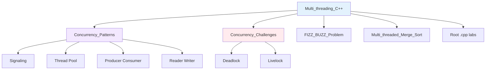
```mermaid
flowchart TB
    MT[Multi_threading_C++]
    MT --> CP[Concurrency_Patterns]
    MT --> CC[Concurrency_Challenges]
    MT --> FB[FIZZ_BUZZ_Problem]
    MT --> MS[Multi_threaded_Merge_Sort]
    MT --> ROOT[Root .cpp labs]

    CP --> S[Signaling]
    CP --> TP[Thread Pool]
    CP --> PC[Producer Consumer]
    CP --> RW[Reader Writer]

    CC --> DL[Deadlock]
    CC --> LL[Livelock]

    style MT fill:#e3f2fd
    style CP fill:#f3e8ff
    style CC fill:#ffebee
```

---

## 4. Pattern → Projects (Reverse Index)

> “Strategy kahan kahan use kiya?” — pehle diagram, phir table.

### 4.1 Pattern hub diagram (interactive map)


```mermaid
flowchart TB
    STR[Strategy]
    FAC[Facade]
    FAC2[Factory]
    SIN[Singleton]
    OBS[Observer]
    DEC[Decorator]
    CHN[Chain of Responsibility]
    TMP[Template Method]

    STR --> P1[Parking Lot]
    STR --> P2[Load Balancer]
    STR --> P3[OYO Hotel]
    STR --> P4[LeetCode]
    STR --> P5[WhatsApp]
    STR --> P6[Amazon Locker allocation]
    STR --> P7[Concurrent HashMap locking]
    STR --> P8[GPay payment rail]
    STR --> P9[Truecaller spam scoring]

    FAC --> F1[Splitwise]
    FAC --> F2[Spotify]
    FAC --> F3[ATM]
    FAC --> F4[LRU Cache]
    FAC --> F5[Amazon Locker]
    FAC --> F6[TTL Cache]
    FAC --> F7[GPay]
    FAC --> F8[Truecaller]

    CHN --> C1[Logger]
    CHN --> C2[L24 Coupons]
    CHN --> C3[L22 ATM demo]
    CHN --> C4[Leave Request]

    TMP --> T1[L23 Payment]
    DEC --> D1[LRU ThreadSafe]
    DEC --> D2[WhatsApp notifications]

    style STR fill:#bbf,stroke:#333
    style FAC fill:#bfb,stroke:#333
    style CHN fill:#fbf,stroke:#333
```

| Pattern | Projects / lessons |
|---------|-------------------|
| **Singleton** | L10, L14, L18, L23, L24, L31, L37, **Logger** |
| **Factory** | L9, L11, L18, L23, L24, L26, L31, L33, L34, L37, **Movie Ticket**, **Rate Limiter**, **GPay** (rail + transaction), **Meeting Scheduler** |
| **Strategy** | L8, L11, L14, L18, L24, L26, L31, L33, L34, L37, **Parking**, **Load Balancer**, **Rate Limiter**, **OYO**, **LeetCode**, **WhatsApp**, **Movie Ticket**, **Amazon Locker** (allocation), **Concurrent HashMap** (locking), **GPay** (bank vs wallet), **Truecaller** (spam score), **Meeting Scheduler** (free slots) |
| **Observer** | L12, L14, L31, L33, L34, **Logger** (appenders), **WhatsApp** |
| **Decorator** | L13, L14, **LRU**, **LFU**, **WhatsApp** |
| **Adapter** | L16, L18 |
| **Facade** | L11, L17, L18, L26, L27, L31, **ATM**, **OYO**, **LeetCode**, **LRU**, **LFU**, **Movie Ticket**, **WhatsApp** (`WhatsAppSystem`), **Amazon Locker**, **TTL Cache** (facade-like), **GPay**, **Truecaller**, **Meeting Scheduler**, **Leave Request**, **Razorpay** |
| **Command** | L15 |
| **Template Method** | L20, L23, **Razorpay** |
| **Chain of Responsibility** | L22, L24, **Logger**, **Leave Request** |
| **State** | L32 (+ order/vehicle **enum** states in L26, Car Rental, Uber) |
| **Bridge** | L25, L34 |
| **Composite** | L7, L19, **JSON Parser** |
| **Proxy** | L21, L23 |
| **Builder** | L28 |
| **Iterator** | L29 |
| **Flyweight** | L30 |
| **Mediator** | L35, L37 |
| **Prototype** | L36 |
| **Visitor** | L38 |
| **Memento** | L39 |
| **Null Object** | L40 (notes), **WhatsApp** (`NoOpEncryptionService`) |

---

## 6. Animated Flow Walkthroughs (Top Projects)

> **Sequence / state diagrams** — interview whiteboard par yahi flow draw karna. Arrows = time order.

### 6.1 L31 Splitwise — expense + notify

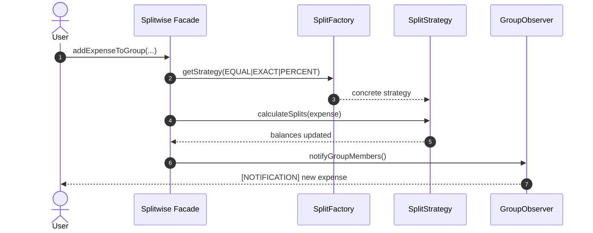
```mermaid
sequenceDiagram
    autonumber
    actor User
    participant SW as Splitwise Facade
    participant SF as SplitFactory
    participant ST as SplitStrategy
    participant OB as GroupObserver

    User->>SW: addExpenseToGroup(...)
    SW->>SF: getStrategy(EQUAL|EXACT|PERCENT)
    SF-->>ST: concrete strategy
    SW->>ST: calculateSplits(expense)
    ST-->>SW: balances updated
    SW->>OB: notifyGroupMembers()
    OB-->>User: [NOTIFICATION] new expense
```

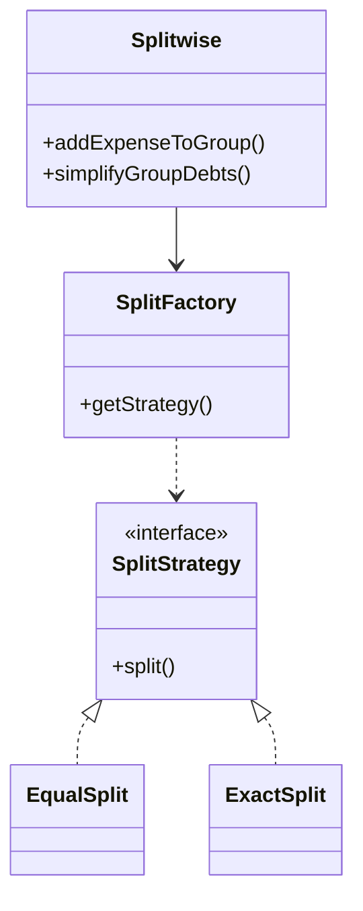
```mermaid
classDiagram
    class Splitwise {
        +addExpenseToGroup()
        +simplifyGroupDebts()
    }
    class SplitFactory {
        +getStrategy()
    }
    class SplitStrategy {
        <<interface>>
        +split()
    }
    class EqualSplit
    class ExactSplit
    Splitwise --> SplitFactory
    SplitFactory ..> SplitStrategy
    SplitStrategy <|.. EqualSplit
    SplitStrategy <|.. ExactSplit
```

---

### 6.2 L23 Payment Gateway — template + proxy

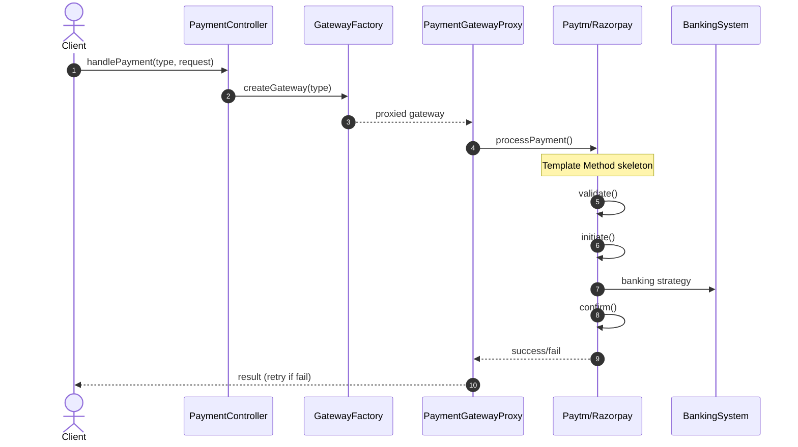
```mermaid
sequenceDiagram
    autonumber
    actor Client
    participant PC as PaymentController
    participant GF as GatewayFactory
    participant PX as PaymentGatewayProxy
    participant GW as Paytm/Razorpay
    participant BK as BankingSystem

    Client->>PC: handlePayment(type, request)
    PC->>GF: createGateway(type)
    GF-->>PX: proxied gateway
    PX->>GW: processPayment()
    Note over GW: Template Method skeleton
    GW->>GW: validate()
    GW->>GW: initiate()
    GW->>BK: banking strategy
    GW->>GW: confirm()
    GW-->>PX: success/fail
    PX-->>Client: result (retry if fail)
```

---

### 6.3 Logger LLD — singleton + chain + format

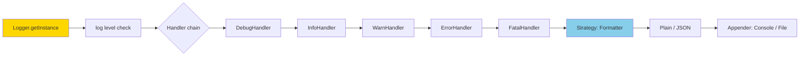
```mermaid
flowchart LR
    A[Logger.getInstance] --> B[log level check]
    B --> C{Handler chain}
    C --> D[DebugHandler]
    D --> E[InfoHandler]
    E --> F[WarnHandler]
    F --> G[ErrorHandler]
    G --> H[FatalHandler]
    H --> I[Strategy: Formatter]
    I --> J[Plain / JSON]
    J --> K[Appender: Console / File]

    style A fill:#ffd700
    style I fill:#87ceeb
```

---

### 6.4 L18 Spotify — play flow

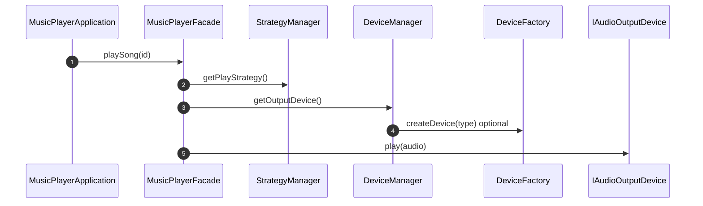
```mermaid
sequenceDiagram
    autonumber
    participant App as MusicPlayerApplication
    participant Facade as MusicPlayerFacade
    participant Strat as StrategyManager
    participant Dev as DeviceManager
    participant Fact as DeviceFactory
    participant Out as IAudioOutputDevice

    App->>Facade: playSong(id)
    Facade->>Strat: getPlayStrategy()
    Facade->>Dev: getOutputDevice()
    Dev->>Fact: createDevice(type) optional
    Facade->>Out: play(audio)
```

---

### 6.5 L24 Discount Coupon — chain + strategy

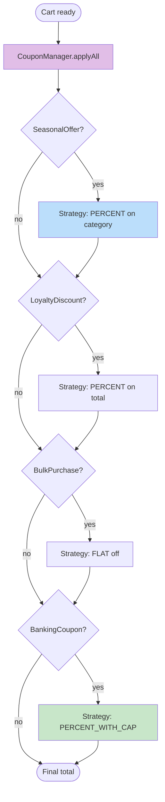
```mermaid
flowchart TD
    Start([Cart ready]) --> M[CouponManager.applyAll]
    M --> C1{SeasonalOffer?}
    C1 -->|yes| S1[Strategy: PERCENT on category]
    C1 -->|no| C2{LoyaltyDiscount?}
    S1 --> C2
    C2 -->|yes| S2[Strategy: PERCENT on total]
    C2 -->|no| C3{BulkPurchase?}
    S2 --> C3
    C3 -->|yes| S3[Strategy: FLAT off]
    C3 -->|no| C4{BankingCoupon?}
    S3 --> C4
    C4 -->|yes| S4[Strategy: PERCENT_WITH_CAP]
    C4 -->|no| End([Final total])
    S4 --> End

    style M fill:#e1bee7
    style S1 fill:#bbdefb
    style S4 fill:#c8e6c9
```

---

### 6.6 WhatsApp LLD — decorator + null object

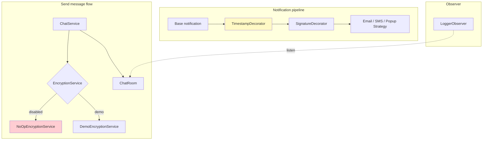
```mermaid
flowchart TB
    subgraph send [Send message flow]
        CS[ChatService] --> ENC{EncryptionService}
        ENC -->|disabled| NOOP[NoOpEncryptionService]
        ENC -->|demo| DEMO[DemoEncryptionService]
        CS --> CH[ChatRoom]
    end

    subgraph notify [Notification pipeline]
        BASE[Base notification] --> TS[TimestampDecorator]
        TS --> SIG[SignatureDecorator]
        SIG --> OUT[Email / SMS / Popup Strategy]
    end

    subgraph obs [Observer]
        O1[LoggerObserver] -.->|listen| CH
    end

    style NOOP fill:#ffcdd2
    style TS fill:#fff9c4
```

---

### 6.7 L32 State — vending machine (state transitions)

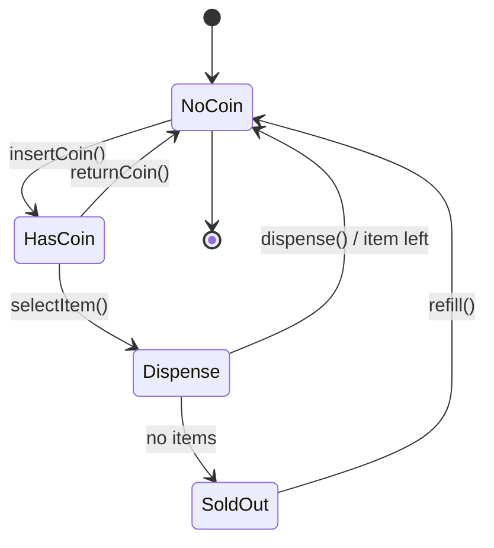
```mermaid
stateDiagram-v2
    [*] --> NoCoin
    NoCoin --> HasCoin : insertCoin()
    HasCoin --> Dispense : selectItem()
    Dispense --> NoCoin : dispense() / item left
    HasCoin --> NoCoin : returnCoin()
    Dispense --> SoldOut : no items
    SoldOut --> NoCoin : refill()
    NoCoin --> [*]
```

---

### 6.8 LRU Cache — decorator layers

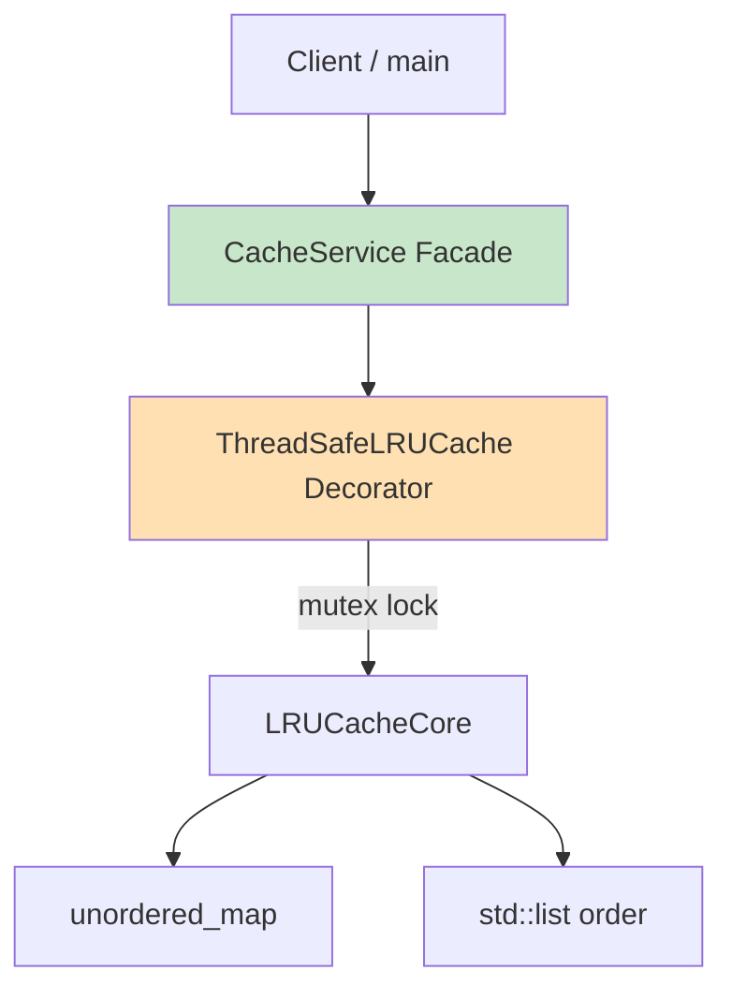
```mermaid
flowchart TB
    Client[Client / main] --> SVC[CacheService Facade]
    SVC --> DEC[ThreadSafeLRUCache Decorator]
    DEC -->|mutex lock| CORE[LRUCacheCore]
    CORE --> MAP[unordered_map]
    CORE --> LIST[std::list order]

    style DEC fill:#ffe0b2
    style SVC fill:#c8e6c9
```

---

### 6.9 Expandable project cards (click to open)

<details>
<summary><strong>L31 Splitwise</strong> — 5 patterns · <a href="./L31%20Splitwise_LLD/">open project</a></summary>

| Pattern | Class |
|---------|-------|
| Facade | `Splitwise` |
| Factory | `SplitFactory` |
| Strategy | `SplitStrategy` |
| Observer | expense notifications |
| Singleton | `getInstance()` |

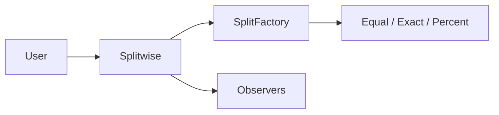
```mermaid
graph LR
    A[User] --> B[Splitwise]
    B --> C[SplitFactory]
    B --> D[Observers]
    C --> E[Equal / Exact / Percent]
```

</details>

<details>
<summary><strong>L23 Payment Gateway</strong> — 5 patterns · <a href="./L23%20Payment_gateway_system_LLD/">open project</a></summary>

| Pattern | Class |
|---------|-------|
| Template Method | `PaymentGateway::processPayment` |
| Proxy | `PaymentGatewayProxy` |
| Factory | `GatewayFactory` |
| Strategy | `BankingSystem` |
| Singleton | `PaymentController` |

</details>

<details>
<summary><strong>Logger LLD</strong> — 4 patterns · <a href="./Logger_LLD/">open project</a></summary>

| Pattern | Role |
|---------|------|
| Singleton | `Logger::getInstance()` |
| Chain | Debug → Fatal handlers |
| Strategy | Plain vs JSON formatter |
| Observer-like | Console + File appenders |

</details>

<details>
<summary><strong>WhatsApp LLD</strong> — 4 patterns · <a href="./WhatsApp_LLD/">open project</a></summary>

| Pattern | Role |
|---------|------|
| Strategy | Encryption + notification channels |
| Null Object | `NoOpEncryptionService` |
| Decorator | Timestamp + Signature |
| Observer | `LoggerObserver` |

</details>

<details>
<summary><strong>Parking Lot</strong> — Strategy · <a href="./Parking_lot_system_LLD/">open project</a></summary>

**Problem:** Vehicle enter → ticket → exit → fee by type & duration.

| Pattern | Why |
|---------|-----|
| Strategy | `HourlyPricingStrategy` — car/bike rates alag |
| Facade-like | `ParkingLot` single API |

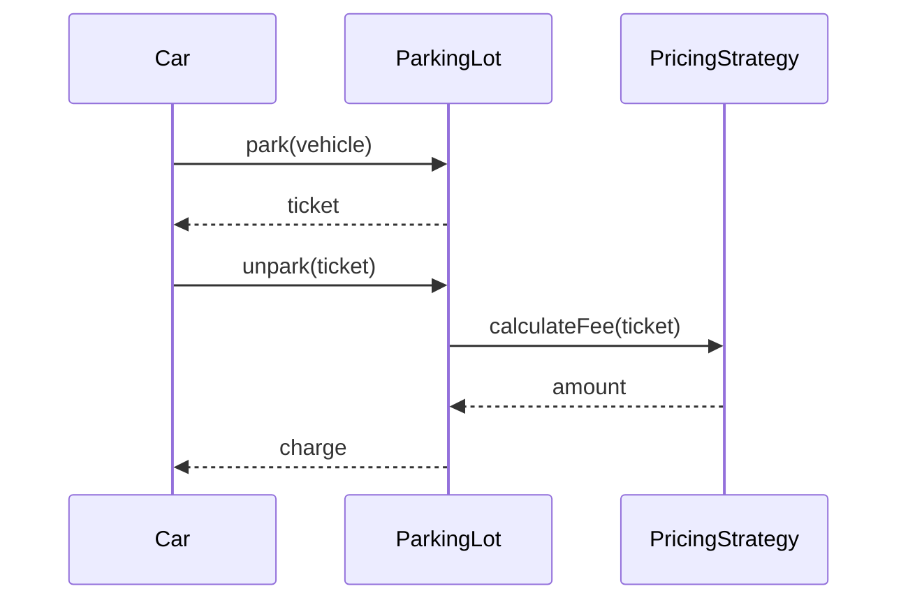
```mermaid
sequenceDiagram
    participant C as Car
    participant PL as ParkingLot
    participant PS as PricingStrategy
    C->>PL: park(vehicle)
    PL-->>C: ticket
    C->>PL: unpark(ticket)
    PL->>PS: calculateFee(ticket)
    PS-->>PL: amount
    PL-->>C: charge
```

</details>

<details>
<summary><strong>OYO Hotel</strong> — Facade + Strategy · <a href="./OYO_Hotel_Booking_LLD/">open project</a></summary>

**Flow:** search city → check availability → `createBooking` → pricing strategy → notify.

| Service | Role |
|---------|------|
| `AvailabilityService` | Date overlap on room |
| `PricingService` | `IPricingStrategy` per night |
| `NotificationService` | Book/cancel events |

</details>

---

## 8. Deep Dive — Kyun Kaunsa Pattern?

> Jab interviewer bole *“Why Strategy here, not if-else?”* — yeh table se jawab do.

| Situation | Pattern | Example in repo |
|-----------|---------|-----------------|
| Algorithm/runtime variant | **Strategy** | Parking fee, load balancer, split type |
| Fixed steps, varying substeps | **Template Method** | Payment validate→initiate→confirm |
| Add behaviour in layers | **Decorator** | Mario power-ups, LRU mutex, WhatsApp timestamp |
| Hide complex subsystem | **Facade** | Splitwise, OYO, LeetCode, TomatoApp |
| One instance global | **Singleton** | Logger (careful use) |
| Notify many on event | **Observer** | L12, Splitwise group, Logger appenders |
| Pipeline of handlers | **Chain** | Logger levels, ATM notes, coupons, leave approval |
| Incompatible legacy API | **Adapter** | XML→JSON L16, Headphones L18 |
| Lazy / retry / access control | **Proxy** | L21 image, Payment retry |
| Part-whole tree | **Composite** | File system L19, JSON parser |
| Two axes vary independently | **Bridge** | Car×Engine L25, Board×Setup L34 |
| Object behaviour = mode | **State** | Vending L32 |
| Undo / queue requests | **Command** | Remote L15 |
| Optional feature off | **Null Object** | `NoOpEncryptionService` |
| Many ops on stable hierarchy | **Visitor** | File system L38 |
| Snapshot rollback | **Memento** | Database L39 |
| Many optional ctor fields | **Builder** | HTTP L28 |
| Expensive object clone | **Prototype** | NPC L36 |

---

## 9. Pattern Combinations Matrix

> Kaunse patterns **ek saath** aksar dikhte hain — yaad rakhna easy hai.

| Combo | Projects | Interview sentence |
|-------|----------|-------------------|
| **Facade + Strategy** | Parking, OYO, LeetCode, Food Delivery | “Facade orchestrates; Strategy for pluggable business rules.” |
| **Facade + Factory + Strategy** | L11 Tomato, Movie Ticket, Spotify | “Factory creates orders/devices; Strategy for payment/play mode.” |
| **Singleton + Chain + Strategy** | Logger | “One logger instance; chain filters level; strategy formats output.” |
| **Template Method + Proxy + Factory** | L23 Payment | “Skeleton in gateway; proxy retries; factory picks provider.” |
| **Chain + Strategy** | L24 Coupons | “Chain decides order of coupons; strategy computes discount amount.” |
| **Decorator + Strategy + Observer** | WhatsApp, L14 | “Stack message decorators; strategy picks channel; observer logs events.” |
| **Facade + Decorator + Interface** | LRU, LFU | “Facade for stats API; decorator adds thread safety on `ICache`.” |
| **Facade + Strategy + Services** | Amazon Locker | “Facade deposit/pickup; strategy picks compartment; OTP/notify services.” |
| **Strategy + Interface** | Concurrent HashMap | “`IConcurrentMap` — swap coarse vs striped locking strategy.” |
| **Facade-like + shared_mutex** | TTL Cache | “Single cache API; readers shared, writers exclusive; lazy TTL.” |
| **Facade + Strategy + Factory + Services** | GPay | “`GPaySystem` facade; rail Strategy bank vs wallet; Factory builds txn + strategy.” |
| **Facade + Strategy + Services** | Truecaller | “`TruecallerSystem` facade; spam Strategy; lookup/sync/block services.” |

```mermaid
flowchart LR
    subgraph payment_stack [L23 Payment Stack]
        F[Factory] --> P[Proxy]
        P --> T[Template Method]
        T --> S[Strategy Banking]
    end

    subgraph logger_stack [Logger Stack]
        SI[Singleton] --> CH[Chain]
        CH --> ST[Strategy Format]
        CH --> AP[Appenders]
    end
```

---

## 7. Interview Quick Lines

### 7.1 One-liners (30 sec)

| Project | Pitch |
|---------|-------|
| **Splitwise** | “Facade `Splitwise` delegates to Strategy splits via `SplitFactory`, Observer notifies group on new expense; `DebtSimplifier` minimizes transactions.” |
| **Payment L23** | “Template Method on `processPayment`, Proxy for retries, Factory for Paytm/Razorpay, Strategy for banking.” |
| **Spotify L18** | “Facade for play/pause, Strategy for queue, Adapter for headphones, Factory for devices, Singleton managers.” |
| **L24 Coupons** | “Coupon chain = Chain of Responsibility; discount math = Strategy per coupon type.” |
| **Logger** | “Singleton entry, handler chain by level, Strategy for JSON/plain, appenders like Observer.” |
| **Parking** | “`ParkingLot` injects `PricingStrategy` — festival pricing = new class, zero change in lot.” |
| **LRU Cache** | “`LRUCacheCore` O(1) DS; `ThreadSafeLRUCache` Decorator; `CacheService` Facade + stats.” |
| **WhatsApp** | “Strategy encryption/channels; Null Object when off; Decorator on notifications.” |
| **OYO** | “Facade booking API; Strategy weekend pricing; AvailabilityService overlap check.” |
| **LeetCode** | “Facade `LeetCodeSystem`; Strategy `ICodeRunner` for mock/real judge.” |
| **Load Balancer** | “Strategy per algorithm — swap round-robin vs least-connections at runtime.” |
| **Movie Ticket** | “Facade + Strategy pricing + Factory for bookings — BookMyShow style.” |
| **Amazon Locker** | “`AmazonLockerService` facade; `FirstFitAllocationStrategy`; `AccessCodeService` for OTP lifecycle.” |
| **Concurrent HashMap** | “`StripedHashMap` = Strategy over `IConcurrentMap`; stripe = less contention than coarse mutex.” |
| **TTL Cache** | “`ThreadSafeTTLCache` with `shared_mutex`; lazy expire on get — like production session cache.” |
| **E-commerce Checkout** | “`EcommerceCheckoutSystem` facade; reserve inventory before pay; `IDiscountStrategy` + `IPaymentStrategy`; rollback on failure; idempotent `clientRequestId`.” |
| **Leave Request** | “`LeaveRequestSystem` facade; `TeamLead → Manager → HR → Director` chain by leave days; first handler with authority approves and stops; >30 days rejected.” |
| **Razorpay** | “`RazorpayPaymentSystem`: order in paise → authorize payment → capture; webhook HMAC verify; idempotency keys; refund on captured — not multi-gateway L23.” |
| **GPay** | “`GPaySystem` facade; `TransferService` + `IPaymentRailStrategy` for bank vs wallet; idempotent `clientRequestId`.” |
| **Truecaller** | “`TruecallerSystem` facade; `ISpamScoringStrategy` for crowd spam; `LookupService` + block list on incoming call.” |
| **Fizz Buzz / Merge Sort** | “Concurrency interview problems under `Multi_threading_C++` — CV + fork-join, not GoF catalog.” |

### 7.2 Common follow-up questions

| Question | Short answer |
|----------|--------------|
| Strategy vs State? | Strategy = client picks algorithm; State = object mode changes allowed ops |
| Facade vs God class? | Facade **delegates** to services; God class implements everything |
| Why Proxy on Payment? | Retry/logging without touching Paytm/Razorpay classes |
| Singleton testability? | Inject interface / pass dependency — avoid hidden `getInstance()` in core logic |
| Decorator vs inheritance? | Stack at runtime; avoid `CoffeeWithMilkAndSugar` class explosion |
| Chain vs Decorator? | Chain: one handler may handle & stop; Decorator: all layers run |

---

## Related files

| File | Purpose |
|------|---------|
| [`Design_Patterns.md`](Design_Patterns.md) | Har pattern ki full theory + 3000+ lines |
| [`SOLID.md`](SOLID.md) | SOLID principles |
| [`README.md`](../README.md) | Poora repo index |
| [`SYSTEM_CLASS_AND_SEQUENCE_DIAGRAMS.md`](SYSTEM_CLASS_AND_SEQUENCE_DIAGRAMS.md) | Full system UML (33 systems — §33 Razorpay) |
| [`Multi_threading_C++/README.md`](../Multi_threading_C++/README.md) | Concurrency labs + subfolder index |

### External animated references (browser)

| Resource | Link |
|----------|------|
| Refactoring Guru — all patterns | https://refactoring.guru/design-patterns |
| Strategy pattern animation | https://refactoring.guru/design-patterns/strategy |
| Observer pattern animation | https://refactoring.guru/design-patterns/observer |
| Factory pattern animation | https://refactoring.guru/design-patterns/abstract-factory |

---

*Last updated: L7–L40 + standalone LLDs (incl. E-commerce Cart + Checkout, GPay, Truecaller, Task Scheduler, IRCTC, Stock Exchange) + `Multi_threading_C++` concurrency modules. Mermaid renders on GitHub & VS Code preview.*
